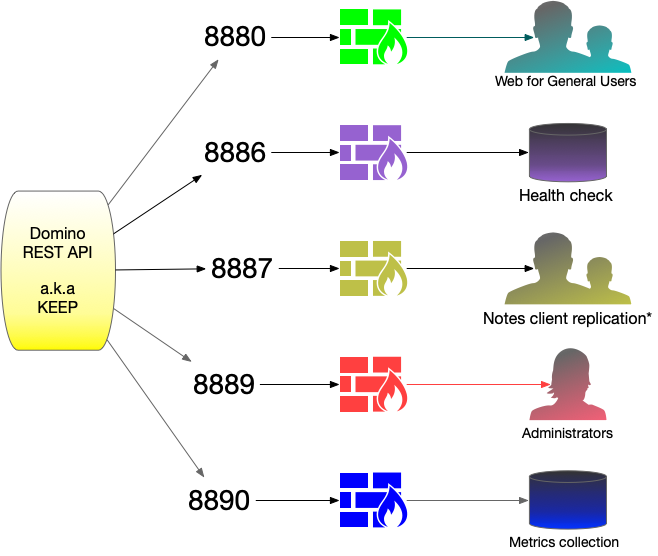

# Web configuration

--8<-- "future.md"

This section provides how-to guides for configuring web access to Domino REST API, including reverse proxy setup and related web security configuration.

## Reverse proxy configuration

The Domino REST API operates on separate ports, enabling you to manage access to sensitive information through a proxy, a firewall, or both. You can configure a proxy on the same machine, on a different machine, or utilize your firewall as a proxy.

{: style="height:60%;width:60%"}

The example procedures provided below guide you in using **nginx** as a proxy, but take note that the Domino REST API is compatible with any type of proxy.

<!--Topics to guide you in completing web configuration goals and tasks related to Domino REST API:-->

- [Configure nginx as HTTPS proxy with subdomains](httpsproxy.md)

- [Configure nginx as HTTPS proxy - single domain](httpsproxy2.md)

## Security configuration

- [Configure CSP for front-end application hosted in the `keepweb.d` directory](csp.md)