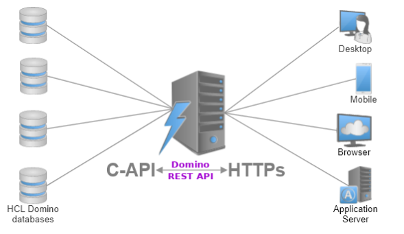

# Welcome to HCL Domino REST API documentation

HCL Domino REST API provides a secure REST API with access to HCL Domino servers and databases while running on HCL Domino and HCL Notes on Windows, Linux, and Mac. Designed to re-establish Domino as a world class, modern, standards-compliant, cloud native and enterprise-level collaboration platform, it adds contemporary REST APIs to Notes and Domino, enabling a modern programming experience with the tools of your choice. For more information, see [Introducing Domino REST API](topicguides/introducingrestapi.md).

---

## What's new

For the latest release information about HCL Domino REST API, see [What's new](references/whatisnew.md).

---

## How the documentation is organized

The HCL Domino REST API documentation is based on the [Diátaxis framework](https://diataxis.fr/), which organizes documentation into the following modes to address users' documentation needs at different times and in different circumstances. Below shows an overview that guides you on where to look for needed information:

**[Tutorials](tutorial/index.md)** - Hands-on introduction to HCL Domino REST API

**[How-to guides](howto/index.md)** - Practical step-by-step guides for performing tasks and operation

**[Topic guides](topicguides/index.md)** - Discussion and explanation of key topics and concepts to give background information

**[References](references/index.md)** - Technical references and descriptions on using HCL Domino REST API

## Let's connect

--8<-- "feedback.md"
