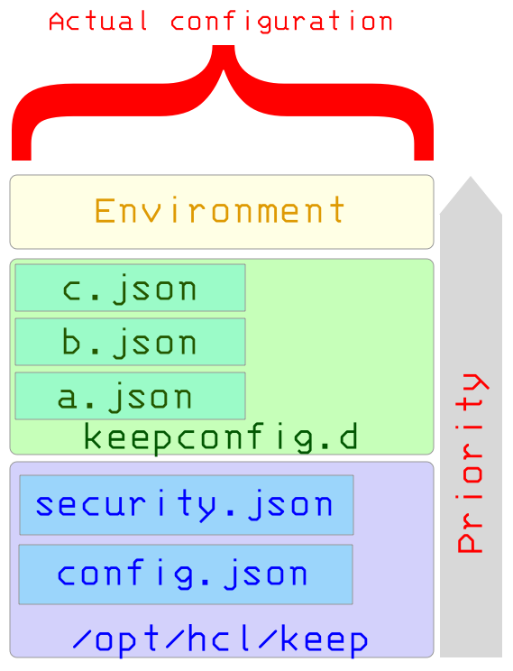

# Configuration management and overlay hierarchy

The Domino REST API comes with default configuration settings. Administrators can override these settings by placing JSON files containing new configurations into the `keepconfig.d` directory. Additionally, environment variables that are particularly useful in containerized environments can be employed to override some settings as well.

The configuration of the Domino REST API follows an **Overlay File System** approach, which merges multiple configuration sources by layering them. This results in a final, effective configuration that combines the base settings, JSON files from `keepconfig.d`, and any applicable environment variables.

## Configuration sources and overlay process

1. **Base configuration**  

    The initial configuration is loaded from the installation directory or inside `jar` files. When a `jar` file contains the resource `/config/config.json`, that file contributes to the base configuration.

    The Domino REST API comes with default settings stored in internal files `config.json` and `security.json`

2. **Overlay from `keepconfig.d` directory**  

    Next, the configuration is overlaid by JSON files located in the `keepconfig.d` directory within the Notes data directory. These files contain new configurations that provide additional or overriding settings.

3. **Environment variables**  

    Finally, environment variables can override any settings from the JSON files.

{: style="height:60%;width:60%"}

## Configuration hierarchy and merge rules

- All configuration sources provide JSON data that gets overlaid on top of each other.
- When two JSON objects contain the same key:
  - The key’s value from the overlay source **replaces** the lower layer’s value.
  - Arrays are **completely replaced**, not merged or appended.
- JSON files in the `keepconfig.d` directory are applied in **alphabetical order**, meaning the last file loaded can override previous ones.
- This order supports use cases like temporarily disabling settings by placing overriding values in a file with a name starting with `z-` to make sure it's processed last.

For more information, see [vert.x overloading rules](https://vertx.io/docs/vertx-config/java/#_overloading_rules).

## Practical example

Suppose you have the following configurations and environment setup:

**config.json**

This is an example of the initial configuration.

```json
{
  "PORT": 8880,
  "AllowJwtMail": true,
  "versions": {
    "basis": {
      "path": "/schema/openapi.basis.json",
      "active": true
    }
  }
}
```

**a.json**

This is an example of a JSON file you save in the `keepconfig.d` directory to overlay and update the initial configuration.

```json
{
  "dance": "tango",
  "PORT": 1234,
  "versions": {
    "basis": {
      "active": false
    },
    "special": {
      "path": "/schema/openapi.special.json",
      "active": true
    }
  }
}
```

**Environment variable**

This is an example of an environment variable.

`PORT=8564`

When the example JSON files are merged and the environment variable is applied, the resulting merged configuration looks like as follows:

```json
{
  "PORT": 8564,
  "AllowJwtMail": true,
  "dance": "tango",
  "versions": {
    "basis": {
      "path": "/schema/openapi.basis.json",
      "active": false
    },
    "special": {
      "path": "/schema/openapi.special.json",
      "active": true
    }
  }
}
```

## Additional information

- The overlay system does **not** allow removal of keys or objects from lower layers.  
- To disable or deactivate settings, use the `"active": false` flag or equivalent indicators without deleting keys.
- The current configuration can be retrieved, with sensitive information masked, on the Management Port such as `https://keep.yourserver.io:8889/config`.
