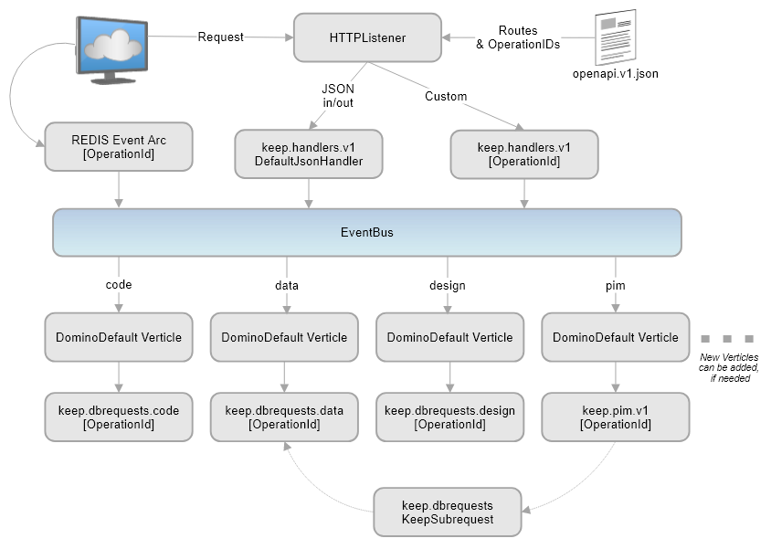

# How HCL Domino REST API works

The Domino REST API has a layered architecture. An HTTP listener receives incoming requests and forwards them to a handler. The handler sends the requests to the EventBus, which distributes them to worker verticles. The _dbrequests_ classes handle the processing of these requests.

{: style="height:80%;width:80%"}

- Requests arrive at the HTTP listener.
- Based on OpenAPI specification, the listener loads routes and the required classes are derived from the OperationId of the OpenAPI specification.
- Most requests and responses are JSON data and the HTTP listener identifies it based on OpenAPI specification.
- Requests that provide and expect JSON are handled by the default code, such as the _defaultJsonHandler class_. When the content-type is different, an HTTP side handler is provided. This handler is named after the operationID from the OpenAPI specification. The runtime indicates which handler classes are missing.
- These classes then send the message to EventBus.
- The EventBus then distributes the work to worker verticles, the _DominoDefaultVerticle_ class.
- The basic configuration of the Domino REST API system has worker verticles for code, data, design and personal information management (PIM). Since Domino REST API is extensible, you can add worker verticles, if needed.
- The _DominoDefault Verticle_ class knows which handler class to load.
- The appropriate _dbrequests_ handler class then takes over and processes the request, for example, talking to the Notes database, retrieving or updating information, and so forth.

The following diagram shows how Domino REST API handles different errors.

{: style="height:80%;width:80%"}
