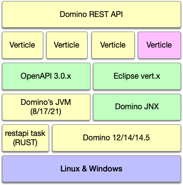

# Extensibility

The Domino REST API has been designed from ground up to be extensible. While effort has been spend to ease extensibility, some fundamental understanding of the architecture, the tooling and the extension points is required. This page will serve as the introduction.

## Components involved

DRAPI is written in [Java](https://www.java.com/en/) running on the [JVM that is part](https://support.hcl-software.com/csm?id=kb_article&sysparm_article=KB0037886) of your Domino installation: Java8 for Domino 12, Java17 for Domino 14 and Java 21 for Domino 14.5.

It connects to Domino's core C libraries using [DominoJNX](https://opensource.hcltechsw.com/domino-jnx/) and a server task `restapi` written in RUST.

Network connectivity, application logic, access control and eventing are provided by the [Eclipse vert.x](https://vertx.io/) framework (which also underpins [Quarkus](https://quarkus.io/)). Important concepts to understand are [Verticles](https://vertx.io/docs/vertx-core/java/#_verticles), [The Event Bus](https://vertx.io/docs/vertx-core/java/#event_bus) and asynchronous programming with [Futures](https://vertx.io/docs/vertx-core/java/#_future_results).

!!! note "Domino's C API is strictly synchronous"

    We solved the transition between the event loop based high performance
    asynchronous model of vert.x to and from synchronous calls into the Domino API for you

The code style used leans heavily on modern Java, using [functional interfaces](https://www.baeldung.com/java-8-functional-interfaces), [Optional](https://www.baeldung.com/java-optional) and the [Stream API](https://www.baeldung.com/java-8-streams)

Testing is done using [JUnit5](https://www.baeldung.com/junit-5), [Mockito](https://site.mockito.org/), the vert.x test extensions and [Rest-assured](https://rest-assured.io/)

Last, not least, all interface definitions are maintained as [OpenAPI 3.0.x](https://spec.openapis.org/oas/v3.0.4.html) specification in JSON format.

## Skills and tools you need

- Java skills, good ones
- Understanding of OpenAPI (I like [APIGit](https://apigit.com/) as tool)
- Familiarity with Domino
- An IDE. Our team works with VSCode, IntelliJ or Eclipse
- Optional, but strongly recommended: Container (a.k.a Docker) skills

## Planning your extension

There are three starting poin to write an extension (with increasing complexity):

- Create a custom [RichText processor](../../references/richtextension.md) (everyone has their own view on RichText, so we built an extension point)
- create your own API endpoints. E.g. you want an endpoint for approvals `/api/v1-workflow/approve`.
- create a custom [Verticle](https://vertx.io/docs/vertx-core/java/#_verticles) that could do anything, e.g. periodically call a web service.

### RichText processors

TCreating your own RichText processor is covered in [this reference entry](../../references/richtextension.md). In a nutshell: you create a `jar` file to be placed into DRAPI's `libs/` directory implementing the interfaces `IncomingRichtextProcessor` and `OutgoingRichtextProcessor` and declaring them in `resources/META-INF/services`

### API Endpoints

Creating your own API Endpoints requires more planning and a few more steps:

1. Create your OpenAPI 3.0.x specification in JSON format. Be careful, the latest version of the OpenAPI specification is 3.1.x, which is due to Java8 limitations currently not supported in DRAPI 1.1.x. You need to save the specification in JSON format, we don't support YAML. Details about file location and naming can be found [in the tutorial](../../tutorial/extensibility/index.md).
2. Create a Java [Maven](https://maven.apache.org/) project following the standard Maven layout. You will use the [parent module provided by JNX](https://central.sonatype.com/artifact/com.hcl.domino/domino-jnx-parent). Details can be found [in the tutorial](../../tutorial/extensibility/index.md)
3. Create `src/main/resources/config/config.json`. In that file you point to your OpenAPI file, specify how endpoints get processed. While you can overwrite the configuration later in `keepconfig.d`, you want sensible defaults in that `config.json`. Make sure you understand [how configuration works](../../references/configuration/understandingconfig.md). Details can be found [in the tutorial](../../tutorial/extensibility/index.md)
4. Implement the class(es) that execute your business logic. As long as your API only sends JSON in and out, you will need to implement just one class that extends the abstract class `AsyncDominoJNXJson` and in that class a single method `process` which gives you access to a session, the database and the incoming request. You can use `@Annotations` to define access requirements. Details can be found [in the tutorial](../../tutorial/extensibility/index.md)
5. Deployment is as simple as putting your jar into the `libs/` directory. For containerized deployments you can use a custom Domino container leveraging [jib](https://github.com/GoogleContainerTools/jib). Details can be found [in the tutorial](../../tutorial/extensibility/index.md)

### Custom Verticles

The [vert.x](https://vertx.io/) runtime allows to deploy your own [verticles](https://vertx.io/docs/vertx-core/java/#_verticles) as unit of compute. You can implement functionality that is even unrelated to core REST capabilities. A few examples:

- Custom caches
- Scheduled processing like Agtmgr
- Calling web services (REST / SOAP)
- Websocket based functions

## Tutorial

The [tutorial](../../tutorial/extensibility/index.md) walks you through the example of a foundational approval service that can work on multiple, data compatible, databases.

<!--## Let's connect

"feedback.md"-->
