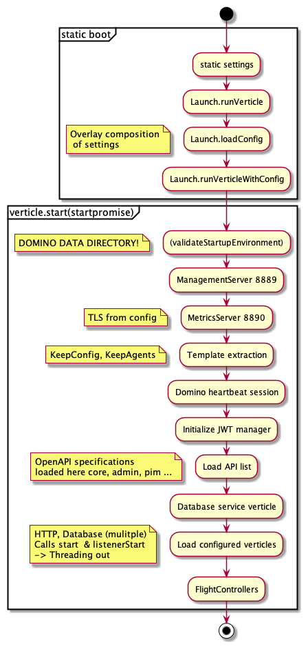
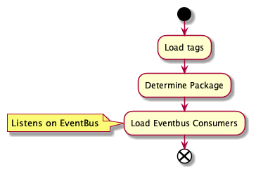
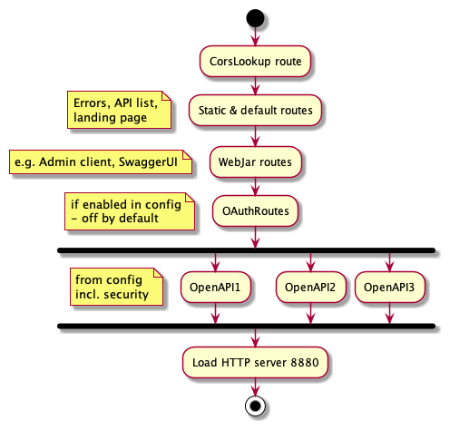
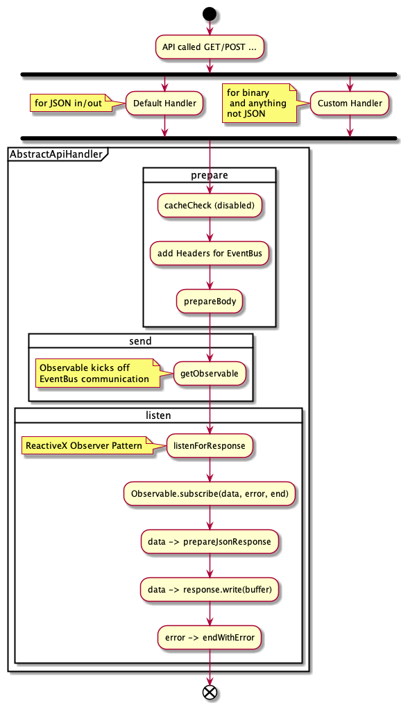
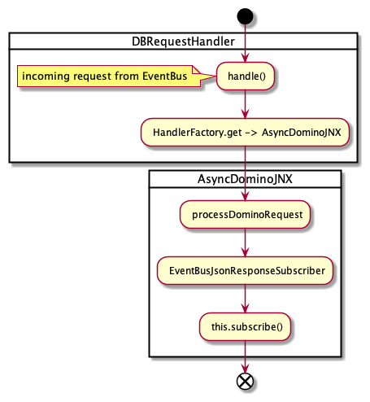
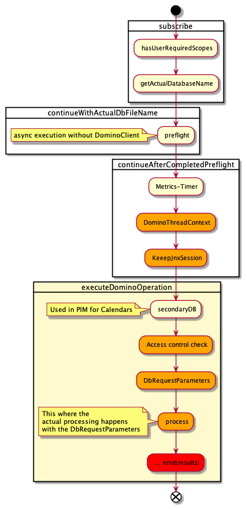

## Selected Flows in the Domino REST API Architecture

To fully understand Domino REST API, it's helpful to know the main flows, Domino REST API has three of them:

- Domino REST API Boot
- Loading of OpenAPI defined routes
- Serving requests on the loaded routes

## Domino REST API Boot

[{: style="height:40%;width:40%"}](../../assets/images/LaunchFlow.png){: target="_blank" rel="noopener noreferrer"}

[{: style="height:40%;width:40%"}](../../assets/images/DBVerticleFlow.png){: target="_blank" rel="noopener noreferrer"}

## Loading of OpenAPI defined routes

[{: style="height:40%;width:40%"}](../../assets/images/HttpLaunchFlow.png){: target="_blank" rel="noopener noreferrer"}

## Serving requests on the loaded routes

### Accepting requests on HTTP

Request get put on the EventBus after successful acceptance.

[{: style="height:40%;width:40%"}](../../assets/images/HttpRequestFlow.png){: target="_blank" rel="noopener noreferrer"}

### Processing requests from EventBus

Actual database communication happens here:

[{: style="height:40%;width:40%"}](../../assets/images/DBRequestFlow.png){: target="_blank" rel="noopener noreferrer"}

[{: style="height:40%;width:40%"}](../../assets/images/DBRequestFlow2.png){: target="_blank" rel="noopener noreferrer"}
