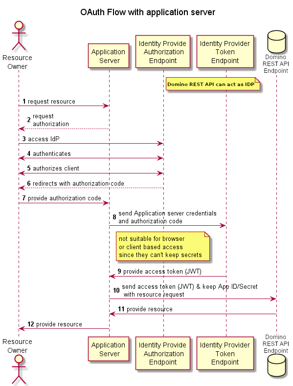
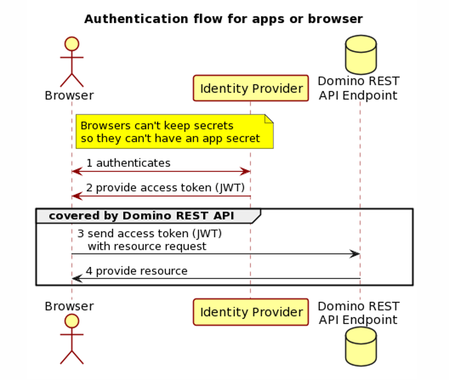

# Auth\*

--8<-- "keepmngtURLcaution1.md"

Domino REST API offers a built-in endpoint to exchange your Domino credentials for a valid JSON Web Token (JWT). This page describes the setup of **external JWT identity providers** (IdP).

## JWT Authorization

All actions in Domino REST API are secured with JWT. For starters, Domino provides a login endpoint that issues a valid JWT token to access Domino REST API in exchange for Domino credentials (user name and http password).

The Domino generated JWT:

- Uses a random symmetric key that changes on every Domino REST API restart and is stored only in memory.
- Works with one Domino server.
- Can be disabled in Domino REST API configuration with `"disableDominoLogin" :true` .

Should Domino use a permanent JWT Key, we can use a public/private key pair and add it to the Domino REST API configuration:

```json
{
  "JwtUsePubPrivKey": true,
  "JwtUsePemFile": true,
  "JwtIssuer": "DominoKeep",
  "JwtPrivateKeyFile": "path-to-private.key.pem",
  "JwtPublicKeyFile": "path-to-.public.key.pem",
  "JwtAlgorithm": "RSA"
}
```

!!!tip "Pro tip"
    The management UI (Port 8889) provides a one click option to create such key pairs and configuration entry stored in `keepconfig.d`

These keys can be shared between Domino servers, allowing, for example, redirects to a different mail server.

## External JWT provider

This is the configuration we would strongly suggest for outward facing Domino servers. Domino REST API can accept JWT tokens from multiple external providers.

To enable an external provider, Domino REST API requires access to the provider’s public key, which can be configured in two ways.

If your provider supports the [`/.well-known/openid-configuration` endpoint](https://ldapwiki.com/wiki/Wiki.jsp?page=Openid-configuration){: target="_blank"}, you can provide the base URI or the full URI to that endpoint in the configuration:

```json
{
  "jwt": {
    "some-name": {
      "active": true,
      "providerUrl": "https://auth.example.com/auth/realms/master"
    }
  }
}
```

During initialization, Domino REST API will query this endpoint for issuer and key information to trust public keys from that service.

Some IdP, such as [Azure](../../howto/IdP/configuringAD.md), don't provide full information, missing algorithm or accurate issuer info. For them, additional parameters `aud`, `iss` and `algoritm` can be specified.

```json
{
  "jwt": {
    "AzureAD01": {
      "active": true,
      "providerUrl": "https://login.microsoftonline.com/[your-tennantid-here]/v2.0/.well-known/openid-configuration",
      "aud": "api://dominorest",
      "iss": "https://sts.windows.net/[your-tennantid-here]/",
      "algorithm": "RS256"
    }
  }
}
```

Alternatively, the public key and issuer information can be added to the configuration directly:

```json
{
  "jwt": {
    "some-name": {
      "active": true,
      "algorithm": "RS256",
      "iss": "https://auth.example.com/auth/realms/master",
      "kid": "id-matching-expected-key",
      "keyFile": "path-to-jwt.pubkey"
    }
  }
}
```

It's the responsibility of the administrator to save key files in secure locations.

**Note**: We have a ticket in our backlog to support the R12 certmanager feature for enhanced security and ease of cert distribution.
{: .alert .alert-info}

## JWT Payload

The JWT requires the following format (Additional entries get ignored):

```json
{
  "iss": "Issuer Name",
  "sub": "CN=Common Name/O=Org",
  "scopes": "MAIL $DATA",
  "iat": 1618506339,
  "exp": 1618509939,
  "aud": "Domino"
}
```

All elements need to be present. “Audience” must be set to “Domino” and “scope” must be a space-separated list of database aliases, MAIL, and/or $DATA.

- MAIL allows a request to attempt to access the mail file of a given user. Access is limited by Domino’s ACL entries.
- $DATA allows a request to attempt to access any database configured for Domino REST API access. Access is limited by Domino’s ACL entries. Users can only access databases that grant them access in the ACL.
<!-- - $DECRYPT (WIP) Allow to decrypt documents secured with encryption. Without that parameter no access to an ID in the ID vault is attempted. -->
- [KeepDBAliasName] allows a request to attempt to access a database configured under that alias name. Access is limited by Domino’s ACL.

## Distinguished Names

By default, Domino REST API will expect that incoming tokens contain a Domino-format distinguished name (e.g. "CN=John Doe/O=SomeOrg") in either the `CN` or `sub` claims of the token payload. This can be configured in Domino REST API's JWT configuration to use an alternative property and to accept LDAP-format (e.g. "cn=John Doe,o=SomeOrg") names:

```json
{
  "jwt": {
    "some-name": {
      "active": true,
      "providerUrl": "https://auth.example.com/auth/realms/master",
      "userIdentifier": "dn",
      "userIdentifierInLdapFormat": true
    }
  }
}
```
 To know more about `oidc` and `oidc-idpcat` configuration see [oidc and oidc-idpcat](../../references/security/oicd.md).

## Name resolution

The Domino REST API probes for the existence of various claims in the JWT token to determine the user name. The claims are probed in the following sequence. On the first available claim, the probing stops.

1. keep.user.attr.dominoDn
2. CN
3. upn
4. preferred_username
5. email
6. sub

## Domino REST API and OAuth

Domino REST API is designed to consume an access token. This token can be the result of an OAuth dance or simply the result of an exchange of Domino credentials. The Domino REST API provides an IdP that does the OAuth dance.




