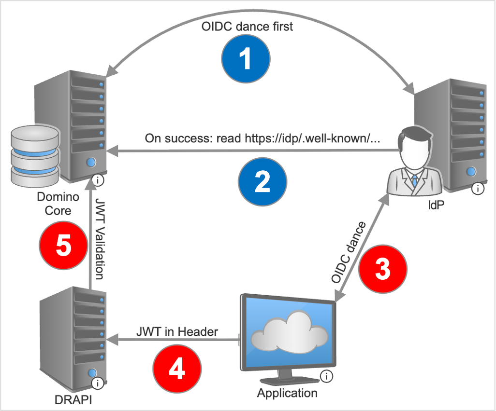
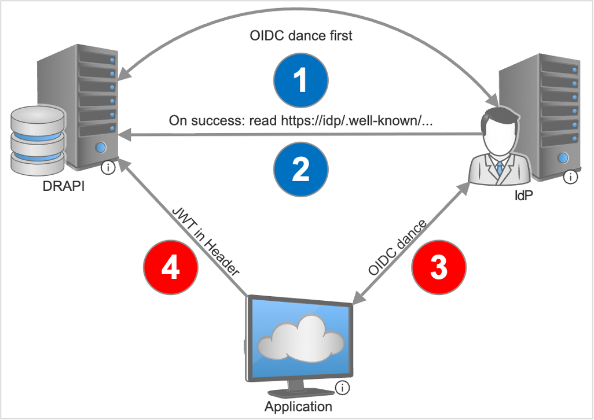
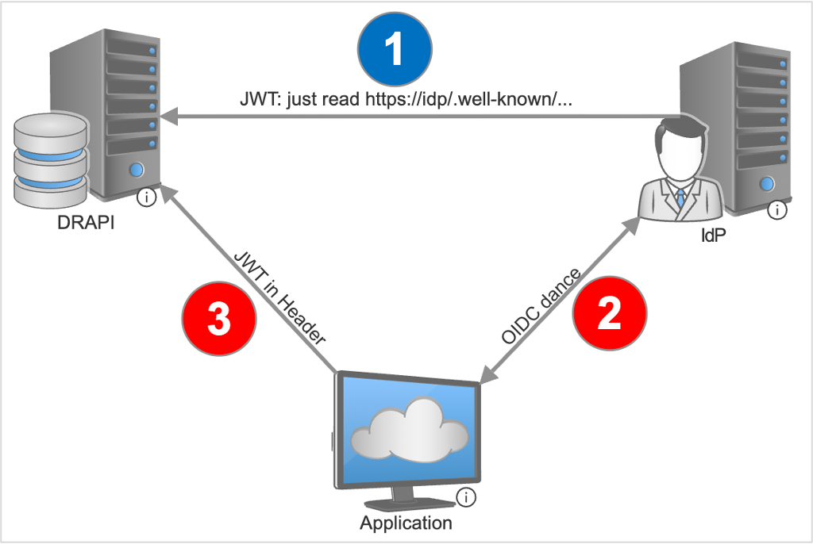
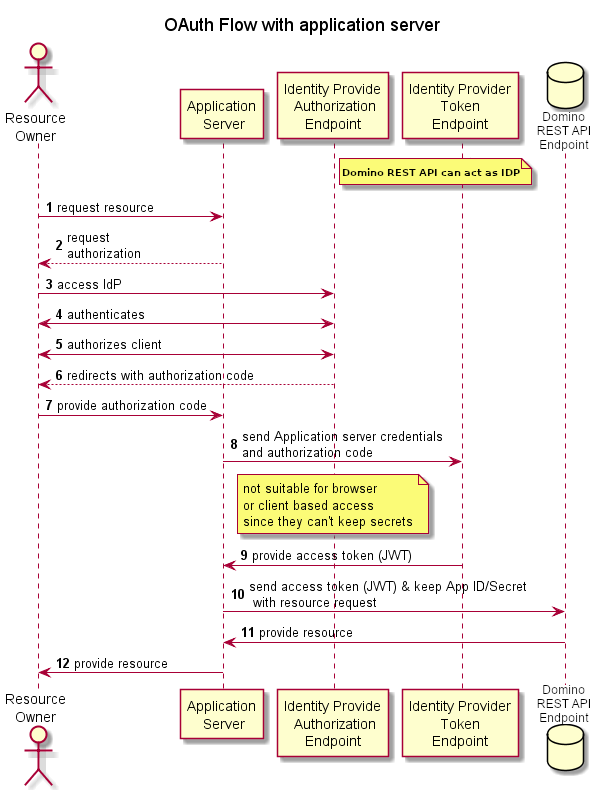
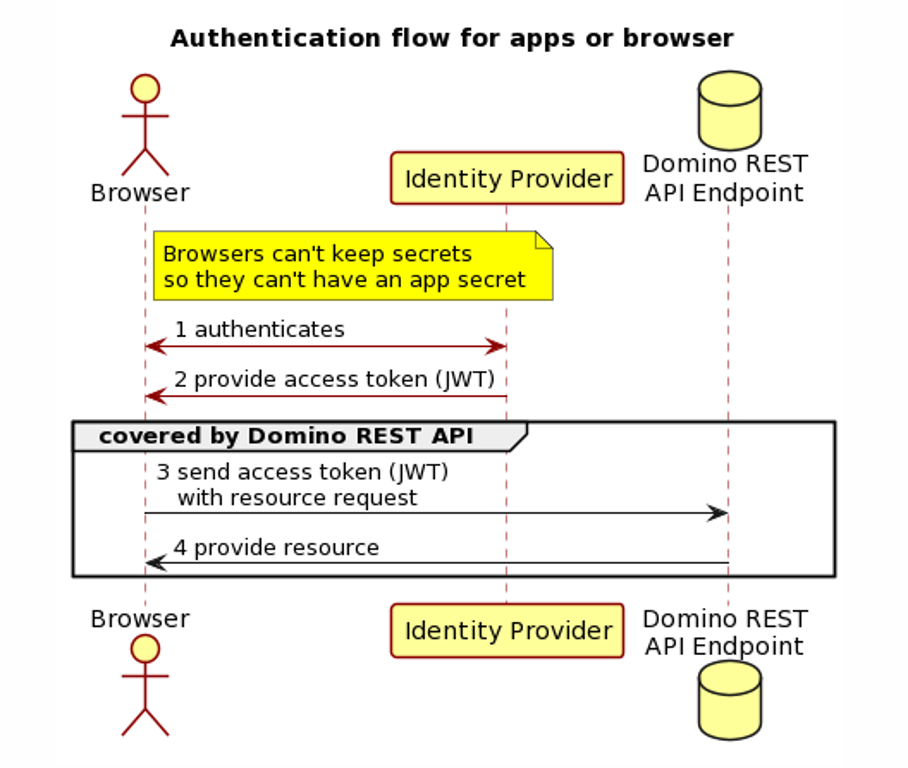

# Auth\*

## Overview

There are many ways to configure an external IdP in the Domino REST API. Refer to the following table for details and refer to the [comparison](#compare-idp-options) for more information.

In all options, a JWT token gets validated and authorized access based on its claims, including user identity, roles, and scopes.

|Authentication option|Description|When to use|
|:---|:---|:---|
|[OIDC with idpcat authentication](#oidc-with-idpcat-authentication)|Uses Domino's own `idpcat.nsf` to provide access to the IdP keys. Requires a `clientId` and a `clientSecret`. Configuration is in IDPCAT. |**All of Domino**<br/>Use this option when your Domino environment is configured with IDPCAT. Enjoy one configuration for all of Domino.|
|[OIDC](#oidc)|A similar approach to `jwt`, with an additional check. DRAPI logs into the IdP to ensure it gets the right one and retrieves the keys upon successful login. The login ensures reaching the intended IdP.|**DRAPI only** <br/>Use when you have a `clientId` and a `clientSecret`, and like the additional correctness assurance the login provided.|
|[JWT Authorization](#jwt-authorization)|Uses the `.well-known/openid-configuration` to obtain the `jwks_uri` with the IdP's public key(s). The keys are used to validate the JSON Web Token (JWT).|**DRAPI only** <br/> Use when you can trust that the `.well-known` URL can't be compromised, or you don't have yet a `clientId` and a `clientSecret`.|

## OIDC with idpcat authentication

!!! tip "We strongly recommend this option"

    The `OIDC idpcat` support lets you use providers configured in `idpcat.nsf` ("IdP Catalog") starting with Domino 14. To know more about creating `idpcat.nsf`, see [Configuring trusted OIDC providers](https://help.hcltechsw.com/domino/14.5.0/admin/secu_config_http_bearer_auth_t.html?hl=idp%2Ccatalog)

{: style="height:70%;width:70%"}

Process flow:

- Step 1: The Domino Core initiates and completes the initial OIDC authentication flow with an external Identity Provider (IdP).
- Step 2: Upon a successful handshake, the Domino Core fetches the IdP configuration, endpoints, and public keys from the OpenID discovery endpoint (https://idp/.well-known/...). It stores these details centrally in Domino's IdP Catalog database (idpcat.nsf).
- Step 3: The client application carries out its standard OIDC handshake with the external IdP to authenticate the end user and receive a signed JWT access token.
- Step 4: The client application sends a request to the Domino REST API, providing the obtained token via the request header.
- Step 5: Instead of communicating directly with the external IdP, the Domino REST API delegates token verification (JWT Validation) locally to Domino Core. Domino Core uses the central `idpcat.nsf` configuration and cached public keys to validate the JWT signature on Domino REST API’s behalf.

### OIDC with idpcat configuration

The configuration is as follows in Domino REST API:

```json
{
  "oidc-idpcat": {
    "any-name": {
      "active": true,
      "providerUrl": "https://some.keycloak.server/auth/realms/some-realm",
      "scope": "$DATA",
      "aud": "account",
      "additionalClientIds": ["keep-local"],
      "userIdentifier": "dn",
      "userIdentifierInLdapFormat": true,
      "microsoft": false,
      "allowExpired": false
    }
  }
}
```

| Items | Description |
| :--- | :--- |
| `active` | **Optional** - Can be useful for setting to `false` to temporarily disable something without deleting the config entirely. |
| `providerUrl` | It's the OIDC-provider-specific URL. It's in a form common for Keycloak, but Azure and others look different. |
| `scope` | A scope that is expected to be included in the token from the OIDC provider. |
| `aud` | A string or an array of strings that specifies audiences expected to be included in the token. |
| `additionalClientIds` | **Optional** - A string or an array of strings that specifies additional valid client IDs beyond the client ID configured in `idpcat.nsf`. |
| `userIdentifier` and `userIdentifierInLdapFormat` | **Optional** |
| `microsoft` | **Optional** - Can be used to enable MS-Azure-specific workarounds internally |
| `allowExpired` | **Optional**- Can be used to consider even expired tokens valid. This should generally only be used during development. |

!!! note

    - You can use `oidc-idpcat` authentication in the same places that "JWT" config blocks were used previously, just with some coordination with core Domino. 
    - "JWT" will work the same on Domino 14. There's no conflict if Domino REST API and Domino have completely distinct authentication providers. 
    - "oidc-idpcat" comes into play if you:

        - want both Domino REST API and core Domino to use the same provider.
        - are on Domino 14 or greater. There's no harm if you use "jwt" or "oidc" without configuring Domino, or even if they happen to point to the same location.

### Domino as an OIDC provider

!!! note "This feature is available starting in the Domino REST API v1.1.4 release and applies only to HCL Domino v14.5 or later."

Starting with HCL Domino v14.5, the Domino HTTP task can act as an OIDC identity provider. This feature allows administrators to leverage their existing Domino HTTP authentication experience to authenticate end users with applications, servers, and services that support OIDC. For more information, see [Configure Domino REST API to use Domino 14.5 as OIDC provider](../../howto/IdP/configdomino145oidc.md).

The following configuration allows Domino REST API to use Domino as an OIDC provider:

```json
{
  "oidc-idpcat": {
    "domino-oidc-idpcat": {
        "active": true,
        "providerUrl": "https://<domino oidc server>/auth/protocol/oidc",
        "scope": "$DATA",
        "aud": "some-audience"
    }
  }
}
```

| Items | Description |
| :--- | :--- |
| `active` | **Optional** - Can be set to `false` to temporarily disable the configuration without deleting the configuration. |
| `providerUrl` | The base URL that includes the name of the OIDC Domino server.<br/><br/>For example: `https://auth.mydomains.com/auth/protocol/oidc`|
| `scope` | A scope that is expected to be included in the token from the OIDC provider. For example, `$DATA`,`email`, etc.<!--The scopes are `openid`, `email`, `profile`, `$DATA`, `Domino.user.all`. `Domino.user.all` is used for Domino HTTP.--> |
| `aud` | A string or an array of strings that specifies audiences expected to be included in the token. The value of the `aud` property can be set to `https://<Domino REST API DNS name>` to match what Domino HTTP expects.|
| `additionalClientIds` | **Optional** - A string or an array of strings that specifies all valid client IDs. Any client ID not listed in this property is rejected.|

!!! caution

    The `additionalClientIds` property can now be used in the Domino REST API configuration **only** when using HCL Domino 14.5.1 or later. The property is not supported in HCL Domino 14.5.
    
    When using `additionalClientIds`, every client ID that should be accepted as valid must be included in the `additionalClientIds` array. 

## OIDC

OIDC (OpenID Connect) support lets you point at a standard OIDC provider like [Microsoft Entra ID formerly Azure Active Directory](../../howto/IdP/configuringAD.md) or [Keycloak](../../howto/IdP/configuringKeycloak.md). It's similar to the [External JWT/OIDC provider configuration](#external-jwtoidc-providers) when using `providerUrl`, but follows OIDC semantics a bit more internally - namely, it needs a client ID and client secret.

{: style="height:70%;width:70%"}

Process flow:

- Step 1: The Domino REST API performs an initial OIDC authentication flow with the external IdP to authenticate itself and verify connectivity.
- Step 2: Upon successful handshake completion, the Domino REST API reads and stores the configuration and public key certificates from the IdP discovery endpoint (https://idp/.well-known/...).
- Step 3: The client application conducts its own OIDC handshake with the IdP to authenticate the end user and receive a signed JWT.
- Step 4: The client application sends a request to Domino REST API, including the JWT in the header. Domino REST API validates the incoming token using the IdP keys established during Steps 1 and 2 to authorize access.

### OIDC configuration

The configuration looks like the following:

```json
{
  "oidc": {
    "any-name": {
      "active": true,
      "providerUrl": "https://some.keycloak.server/auth/realms/some-realm",
      "clientId": "some-clientid",
      "clientSecret": "some-clientsecret",
      "userIdentifier": "dn",
      "userIdentifierInLdapFormat": true
    }
  }
}
```

The "oidc" is similar to "oidc-idpcat" or "jwt". The keys can be anything, like "any-name". This is the same idea as documented in [External JWT Provider configuration](#external-jwtoidc-providers).

| Items | Description |
| :--- | :--- |
| `active` | **Optional** Can be set to `false` to temporarily disable something without deleting the config entirely. |
| `providerURL` | It's the OIDC-provider-specific URL. It's in a form common for Keycloak, but Azure and others look different. |
| `clientId` | It's the configured client ID from the OIDC provider. It is strongly recommended to use `Domino` as client name. |
| `clientSecret` | It's the generated client secret from the OIDC provider, usually a randomly-generated hex string. |
| `userIdentifier` and `userIdentifierInLdapFormat` | **Optional**  |

### Differences between `oidc` and `oidc-idpcat`

In general, `oidc` and `oidc-idpcat` achieve the same goal, which is to use a complete OIDC provider. The advantages of using the "oidc-idpcat" variation are as follows:

- If you've previously configured OIDC for standard Domino, you may reuse parts of the configuration, such as putting the client ID and client secret in a single location.
- Since Domino handles contacting the OIDC provider and caching keys, you benefit from that shared cache as well as shared diagnostics (for example, using notes.ini options for extra logging on the console).

!!! note

    In general, you'd use any of these ("jwt", "oidc", "oidc-idpcat") when you either want to or have to have an external identity provider like Keycloak or Microsoft Entra ID, formerly Azure Active Directory, and have those tokens be usable for Domino REST API calls. Using either "jwt"-with-providerUrl or either of the "oidc" ones will let Domino REST API use standard OIDC endpoints to handle key lookup, avoiding the need to copy and paste signer keys into the Domino REST API config.

Check [Configure Domino REST API to use an OIDC provider](../../howto/IdP/configureoidc.md).

## JWT Authorization

All actions in Domino REST API are secured with JWT. For starters, Domino provides a login endpoint that issues a valid JWT token to access Domino REST API in exchange for Domino credentials (username and HTTP password).

The Domino generated JWT:

- Uses a random symmetric key that changes on every Domino REST API restart and is stored only in memory.
- Works with one Domino server.
- Can be disabled in Domino REST API configuration with `"disableDominoLogin" :true`.

Should Domino use a permanent JWT Key, we can use a public/private key pair and add it to the Domino REST API configuration:

```json
{
  "JwtUsePubPrivKey": true,
  "JwtUsePemFile": true,
  "JwtIssuer": "DominoKeep",
  "JwtPrivateKeyFile": "path-to-private.key.pem",
  "JwtPublicKeyFile": "path-to-.public.key.pem",
  "JwtAlgorithm": "RSA"
}
```

!!! tip

    The **Management console** UI (port 8889) offers a one-click option to generate key pairs and configuration entry, which are stored in `keepconfig.d`.

    These keys can be shared across Domino servers, enabling, for example, redirects to a different mail server.

### External JWT/OIDC providers

This is the configuration suggested for outward facing Domino servers. Domino REST API can accept JWT tokens from multiple external providers.

#### Process flow

{: style="height:70%;width:70%"}

- Step 1: The Domino REST API directly reads the OpenID Connect discovery metadata and JSON Web Key Sets (JWKS) from the external IdP endpoint (https://idp/.well-known/...) to fetch public keys for token signature verification.
- Step 2: The client application performs the standard OIDC flow with the IdP to authenticate the user and receive an identity/access JWT.
- Step 3: The application sends a request to the Domino REST API with the JWT as a bearer token. The Domino REST API then directly validates the token's signature and claims using the keys fetched in Step 1.

#### Configuration

To enable an external provider, Domino REST API requires access to the provider’s public key, which can be configured in two ways.

If your provider supports the [`/.well-known/openid-configuration` endpoint](https://ldapwiki.com/wiki/Wiki.jsp?page=Openid-configuration "Opens a new tab"){: target="_blank" rel="noopener noreferrer"}&nbsp;{: style="height:13px;width:13px"}, you can provide the base URI or the full URI to that endpoint in the configuration:

```json
{
  "jwt": {
    "some-name": {
      "active": true,
      "providerUrl": "https://auth.example.com/auth/realms/master"
    }
  }
}
```

During initialization, Domino REST API will query this endpoint for issuer and key information to trust public keys from that service.

Some IdP, such as [Microsoft Entra ID formerly Azure Active Directory](../../howto/IdP/configuringAD.md), don't provide full information, missing algorithm or accurate issuer info. For them, additional parameters `aud`, `iss` and `algorithm` can be specified.

```json
{
  "jwt": {
    "AzureAD01": {
      "active": true,
      "providerUrl": "https://login.microsoftonline.com/[your-tennantid-here]/v2.0/.well-known/openid-configuration",
      "aud": "api://dominorest",
      "iss": "https://sts.windows.net/[your-tennantid-here]/",
      "algorithm": "RS256"
    }
  }
}
```

Alternatively, the public key and issuer information can be added to the configuration directly:

```json
{
  "jwt": {
    "some-name": {
      "active": true,
      "algorithm": "RS256",
      "iss": "https://auth.example.com/auth/realms/master",
      "kid": "id-matching-expected-key",
      "keyFile": "path-to-jwt.pubkey"
    }
  }
}
```

!!! warning

    **Keep certificates secure.**

    Administrators must store key files in secure locations. For the best approach, [use the certstore.nsf](../../howto/install/multiserver.md#shared-jwt-keys-to-login-to-drapi).

### JWT Payload

The JWT requires the following format (Additional entries get ignored):

```json
{
  "iss": "Issuer Name",
  "sub": "CN=Common Name/O=Org",
  "scopes": "MAIL $DATA",
  "iat": 1618506339,
  "exp": 1618509939,
  "aud": "Domino"
}
```

All elements need to be present. “Audience” must be set to “Domino” and “scope” must be a space-separated list of database aliases, MAIL, and/or $DATA.

- MAIL allows a request to attempt to access the mail file of a given user. Access is limited by Domino’s ACL entries.
- $DATA allows a request to attempt to access any database configured for Domino REST API access. Access is limited by Domino’s ACL entries. Users can only access databases that grant them access in the ACL.
<!-- - $DECRYPT (WIP) Allow to decrypt documents secured with encryption. Without that parameter no access to an ID in the ID vault is attempted. -->
- `KeepDBAliasName` allows a request to attempt to access a database configured under that alias name. Access is limited by Domino’s ACL.

### Distinguished Names

By default, Domino REST API will expect that incoming tokens contain a Domino-format distinguished name, for example `CN=John Doe/O=SomeOrg`, in either the `CN` or `sub` claims of the token payload. This can be configured in Domino REST API's JWT configuration to use an alternative property and to accept LDAP-format, for example `cn=John Doe,o=SomeOrg` names:

```json
{
  "jwt": {
    "some-name": {
      "active": true,
      "providerUrl": "https://auth.example.com/auth/realms/master",
      "userIdentifier": "dn",
      "userIdentifierInLdapFormat": true
    }
  }
}
```

### Name resolution

The Domino REST API probes for the existence of various claims in the JWT token to determine the username. The claims are probed in the following sequence. On the first available claim, the probing stops.

1. keep.user.attr.dominoDn
2. CN
3. upn
4. preferred_username
5. email
6. sub

## Compare IdP options

You can refer to the following table to compare your configuration options:

| Topic | [Internal IdP](../../howto/IdP/configuringCertificates.md) | [external (JWT)](../../howto/IdP/configuringIdentityProvider.md#add-your-own-idp) | [external (OIDC)](../../howto/IdP/configureoidc.md) | [external (OIDC-idpcat)](./authentication.md#oidc-with-idpcat-authentication) |
| :--- | :--- | :--- | :--- | :--- |
|Preferred | ./. | ./. | ./. | Yes |
| Single server symmetric keys | Yes | ./. | ./. | ./. |
| Private key | Yes | ./. | ./. | ./. |
| Public key | Yes | Yes | Yes | Yes |
| Local key files | Yes | Yes | ./. | ./. |
| Provider URL | ./. | Yes | Yes | Yes |
| requires `clientId` | ./. | ./. | Yes | Yes |
| requires `clientSecret` | ./. | ./. | Yes | ./. |
| uses secure `idpcat.nsf` | ./. | ./. | ./. | Yes |
| In sync with core Domino | ./. | ./. | ./. | Yes |

--8<-- "onclientids.md"

## Domino REST API and OAuth

Domino REST API is designed to consume an access token. This token can be the result of an OAuth dance or simply the result of an exchange of Domino credentials. The Domino REST API provides an IdP that does the OAuth dance.

??? tip "OAuth flow with application server"

    {: style="height:80%;width:80%"}

??? tip "OAuth flow for apps or browsers"

    {: style="height:80%;width:80%"}
