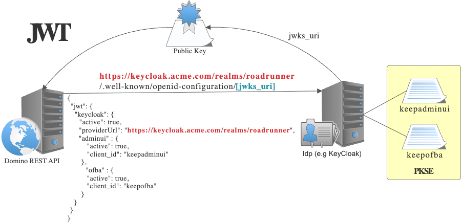
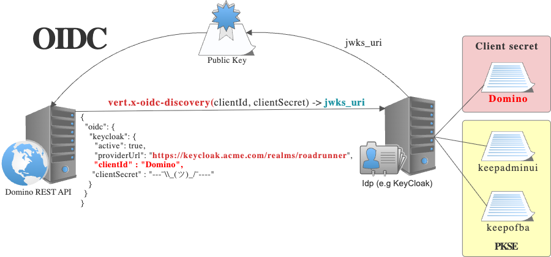
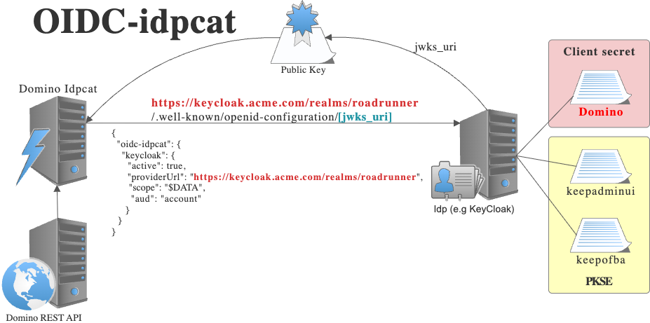

# Comparing IdP Options

You can use the [build-in IdP](./authentication.md) or an [external IdP](./authentication.md#oidc). Compare your configuration options:

| Topic                        | [Internal IdP](../../howto/IdP/configuringCertificates.md) | [external (JWT)](../../howto/IdP/configuringIdentityProvider.md#add-your-own-idp) | [external (OIDC)](../../howto/IdP/configureoidc.md) | [external (OIDC-idpcat)](./authentication.md#oidc-with-idpcat-authentication) |
| :--------------------------- | :--------------------------------------------------------- | :-------------------------------------------------------------------------------- | :-------------------------------------------------- | :---------------------------------------------------------------------------- |
| Preferred                    | ./.                                                        | ./.                                                                               | ./.                                                 | Yes                                                                           |
| Single server symmetric keys | Yes                                                        | ./.                                                                               | ./.                                                 | ./.                                                                           |
| Private key                  | Yes                                                        | ./.                                                                               | ./.                                                 | ./.                                                                           |
| Public key                   | Yes                                                        | Yes                                                                               | Yes                                                 | Yes                                                                           |
| Local key files              | Yes                                                        | Yes                                                                               | ./.                                                 | ./.                                                                           |
| Provider URL                 | ./.                                                        | Yes                                                                               | Yes                                                 | Yes                                                                           |
| requires `clientId`          | ./.                                                        | ./.                                                                               | Yes                                                 | Yes                                                                           |
| requires `clientSecret`      | ./.                                                        | ./.                                                                               | Yes                                                 | ./.                                                                           |
| uses secure `idpcat.nsf`     | ./.                                                        | ./.                                                                               | ./.                                                 | Yes                                                                           |
| In sync with core Domino     | ./.                                                        | ./.                                                                               | ./.                                                 | Yes                                                                           |

## External IdP config using `jwt`

## External IdP config using `oicd`

## External IdP config using `oicd-idpcat`

