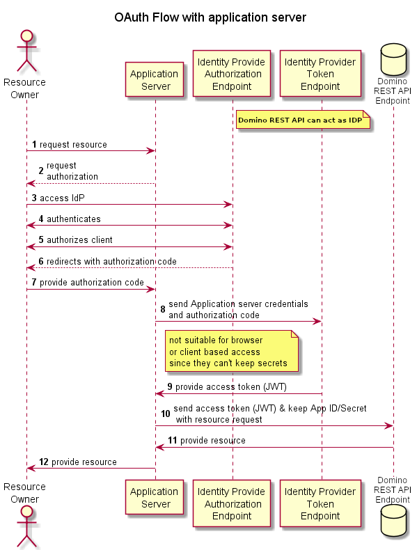

# Security overview

Good security isn't a one-trick pony, but a combination of factors.

--8<-- "pickYourAuth.md"

Here are what we implemented:

- [Open Standards](../standards.md#standards) are used wherever appropriate. Standards enjoy more scrutiny from more eyeballs.

- Domino REST API uses the [Eclipse Vert.x Framework](https://vertx.io), which supports many different versions of [SSL certificates](https://vertx.io/docs/vertx-core/java/#ssl) such as:

    - [PEM](https://en.wikipedia.org/wiki/Privacy-Enhanced_Mail)

    - [PKS](https://en.wikipedia.org/wiki/PKCS_12)

    - [JKS](https://en.wikipedia.org/wiki/Java_KeyStore)

- All Domino REST API access is authorized using a signed [JWT](https://jwt.io) claim. [Access control](../accesscontrol.md) settings are completely observed and honored.

- We support public/private keys for identity provider setup.
- Databases aren't automatically exposed on REST when you run Domino REST API. Only the ones configured by the administrators.
- No anonymous access is granted for REST data.
- Access to sensitive information can be limited to servers that present additional credentials.

- Read/Write access is controlled on a per form, field and user basis. See [The Barbican](../../references/extensibility/barbican.md) for details.

Here's a flowchart to show how Domino REST API handles security.

<!--  -->

