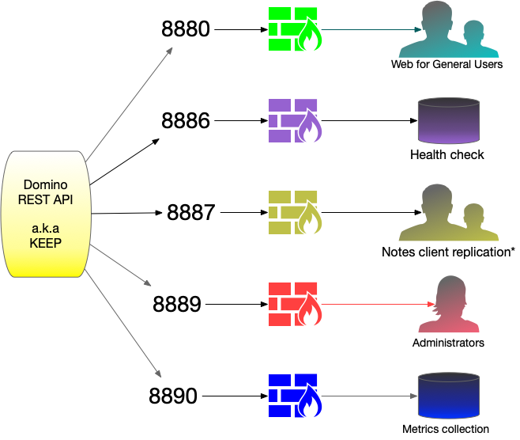

--8<-- "keepmngtURLcaution1.md"

Domino REST API uses three endpoints:

Only one must be reachable by users (humans or servers). Configure your firewall accordingly and eventually use [a proxy](../../howto/web/httpsproxy.md).

To be able to securely and efficiently deploy Domino REST API into a production environment, you must understand how Domino REST API configuration works. See the [configurating section](../security/securityindex.md) for a deeper dive.

The Domino REST API configuration includes the Domino REST API binary directory, `keepconfig.d`, and environment variables.

Examples of the default security settings are here, [security.json](../security/securityjson.md) and the default configuration settings are here, [config.json](../security/configjson.md). Whenever you do a new Domino REST API install, these two files and the projectkeep.jar file are overwritten.

We recommend that you keep your configuration changes in the `config.d` directory so that they persist when you reinstall or update your Domino REST API version.

### Endpoint auth

- The REST API endpoint (8880) is secured, requiring a valid JWT token for access. This token needs to be obtained from an IdP. For easy configuration Domino can act as this IdP.
- The metrics endpoint (8890) uses BASIC authentication with the user name set in the configuration variable `metrics/metricsUser` and the salted and encrypted password in the configuration variable `metrics/metricsPassword`. It is strongly recommended to update these values and only share with the metrics owner. The metrics endpoint is read only.
- The management endpoint (8889) uses basic authentication. it can serve multiple users configured in the `managementAPI` key of the configuration.

The credentials for the management endpoint are **deliberately NOT** retrieved from a directory service (Domino or otherwise) to be able to access the management API on failure of individual components (last code standing). Trying to link this API to a directory service would defeat the purpose of the management endpoint.
{: .alert .alert-danger}

### Areas of security to assess and implement

- Which ports to open and close:

    - You must secure your admin port, 8889 and metrics port, 8890 from the outside world.

- How to handle HTTPS (via proxy or let Domino REST API handle it):

    - For configuring HTTPS via proxy, see the example under [HTTPS via Proxy](../../howto/web/httpsproxy.md).
    - Domino REST API supports three different types of certificates: PEM, JKS, and PKS.

- How to handle JWT authentication token:

    - Single server built-in, where each server issues and uses their own JWT token.
    - Multi-server built-in, where a multi-server environment reacts to the same JWT token.
    - External identify provider, for example, Active Directory, [Keycloak](https://www.keycloak.org/), etc.

- Domino REST API can access encrypted resources when Domino's ID vault is deployed and the [KEEP SAML](../../howto/IdP/keepsaml.md) configuration is set up correctly.
    - Details are still being ironed out on how to do this. This will be updated as soon as we have a solution.
