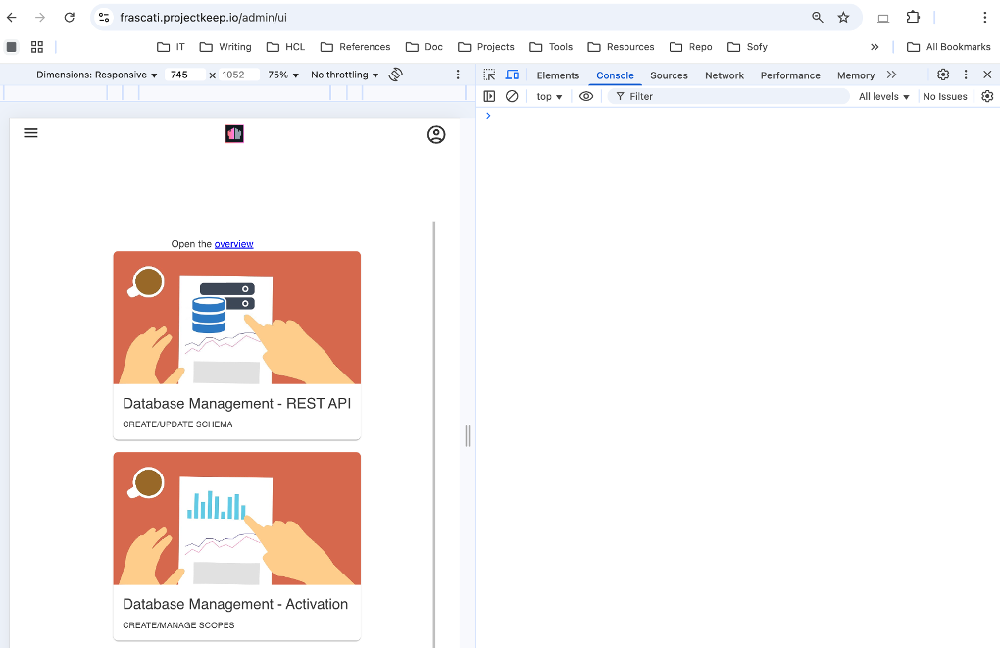

# Contact support

## Overview

The topic helps you understand what information to provide to ensure that your support needs are addressed effectively. This is in addition to the standard details required when [creating a support case](https://support.hcl-software.com/csm?id=kb_article&sysparm_article=KB0010164 "Opens a new tab"){: target="_blank" rel="noopener noreferrer"}&nbsp;{: style="height:15px;width:15px"}.

## Details to provide

### Issue summary

Provide a clear and concise description that captures the main point of the issue you're experiencing. This enables the customer support team to better understand the nature of the issue.

You usually provide the issue summary in the Subject field of the support case ticket.

Example:

Users can't log in to the Admin UI after upgrading from Domino REST API v1.1.2 to Domino REST API v1.1.3.

### Detailed description

Provide a detailed explanation of the issue including:

- What you were doing when the issue occurred?

    You should provide a detailed account of your actions leading up to the issue. Describe what you were doing at the time you encountered the issue and clarify the result you anticipated from those actions. Additionally, explain the actual outcome you experienced, including any errors or unexpected results that arose during the process. This information helps in diagnosing the problem accurately.

- Exact steps you took to encounter the issue

    You should provide an account of the specific steps you undertook before encountering the issue. By detailing each step, you enable the customer support team to analyze whether any of these steps may have inadvertently caused or contributed to the problem you are experiencing.

- Environment details

    You should provide the details of the environment you are using when you experienced the issue. Details include operating system version, Domino version, Domino REST API version, and any other relevant information.

    !!! note

        Support might require additional information aside from the environment details you provided as needed.

- Changes/updates done before the issue

    You should detail any environmental changes or updates made before experiencing the issue. This information helps the customer support team determine if those changes or updates may have caused or contributed to the issue.

- Attempts at self-resolution

    You should clearly outline the efforts you made to resolve the issue you encountered. For each attempt, provide an account of the steps you took, including any specific actions, tools, or resources you utilized, and the outcomes of those actions. This helps the customer support team to better understand the situation, identify any improvements in your approach, and focus on other solutions that you haven't tried.

    If applicable, **use your browser's developer tools** to inspect and debug the error you encountered, and then share the errors and log messages you found. For more information on using your browser's developer tools, see [Additional information](#additional-information).

### Desired outcome

Providing a clear, specific, and actionable description of your desired outcome when submitting a support ticket is essential. This clarity helps the customer support team understand exactly what resolution or result you expect, ultimately speeding up the resolution process.

When stating your needs, specify what you want to achieve or fix, include any particular requirements or conditions to take into account, and describe how you want the software to behave after the issue resolution. Additionally, indicate if the customer support request is urgent or critical to your operations.

### Support package

It's essential that the **support package** be provided to the customer support team when requesting assistance to resolve an encountered issue. The support package can help the customer support team to better identify, troubleshoot, and resolve encountered issues. For more information on what's included in the support package and how to create it, see [Create support package](../howto/management/supportpackage.md).

## Additional information

You can use your browser's developer tools to inspect and debug the error you encountered, and then you can share the errors and log messages to the customer support team.

**To use the developer tools:**

1. Access the developer tools.

    On your browser, right-click anywhere on the webpage and choose **Inspect** or **Inspect Element** from the context menu. Alternatively, you can use keyboard shortcuts: press **F12** or **Ctrl+Shift+I** on Windows or Linux, or **Cmd+Option+I** on a Mac.

    The following image shows an example of the developer tools open when inspecting the **Admin UI** and with the **Console** tab selected.

    

2. Examine the **Console**.

    Navigate to the **Console** tab within the developer tools. Here, you'll encounter error messages generated by the website's code, warnings, and other crucial information. The **Console** details the type of error, its location, and the specific line number, allowing you to identify the source of the problem. Typically, errors are highlighted in red text for quick recognition.

3. (Optional) Investigate network errors.

    In cases where you suspect that errors may be linked to network requests, it can be helpful to access the **Network** tab within the developer tools. This enables you to filter the displayed requests by their status, making it easier to identify any issues. By clicking on the name of a request that has failed, you can view additional details regarding the error, including the specifics of the response.

## Customer Support portal

To open support tickets, go to the [Customer Support](https://support.hcl-software.com/csm "Opens a new tab"){: target="_blank" rel="noopener noreferrer"}&nbsp;{: style="height:15px;width:15px"} portal.
