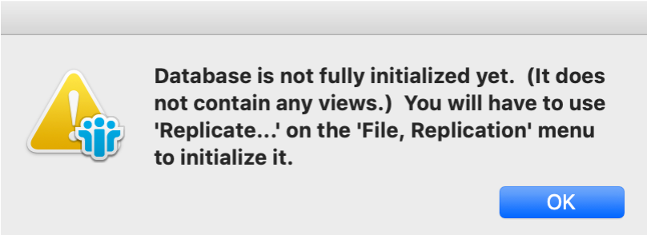

# Troubleshooting

This reference intends to guide you in addressing common errors in installing and running the Domino REST API service. Common errors and their corresponding resolutions are described below:

## Domino Not Running (First-Time Setup)

If Domino isn't up and running, see [Troubleshooting one-touch Domino Setup](https://help.hcltechsw.com/domino/14.0.0/admin/inst_onetouch_troubleshooting.html).

## REST API not responding

You get a timeout error when trying to access `http://yourserver:8880`, wherein `yourserver` is the DNS name of your Domino server. 

**Solution**

You need to check if the REST API is loaded. 

1. In the Domino server console, type `show tasks`. 
2. If there is no `restapi` entry in the list, load it using `load restapi` in the Domino console. 
3. If it's listed, shut it down with `tell restapi quit` before trying `load restapi`. 
4. Take note of any messages in case you need more support.

--8<-- "iskeeprunning.md"

## Address already in use error

You get this error when you run the [sample script](../references/downloads.md) with the sample Notes database:

> 2021-01-28 15:39:07 ERROR Launch:707 - Management server failed to launch on 0.0.0.0:8889
> 2021-01-28 15:39:07 ERROR Launch:258 - Fatal
> java.net.BindException: Address already in use

**Solution** 

Stop the process that's using the jar file. Use the Windows Task Manager, or on a Mac/Linux, do this:

```bash
ps -eaf | grep launch.class
kill -9 [pid number]
```

## Unable to start the Domino REST API Domino task after updating configuration to use https

The `KeepManagementURL` setting in your `notes.ini` is the URL needed for the Domino REST API Domino task to talk to the Java side of Domino REST API. By default this is set to `http`. 

**Solution**

After updating the URL to `https`, run `load restapi`. For more information, see [Domino REST API task](../references/usingdominorestapi/restapitask.md).

## Database is not fully initialized error

You get this error when you go to your Notes client and:

1. Select **File** &rarr; **Open** &rarr; **HCL Notes Application**.
2. Select `KeepConfig.nsf` file to open.

The following error is shown:

{: style="height:80%;width:80%"}

**Solution** 

Delete the `KeepConfig.nsf` from the Notes data directory and restart the [sample script](../references/downloads.md).

<!-- prettier-ignore -->
!!! tip
    On Mac, the data directory path is `/Users/[userid]/Library/Application Support/HCL Notes Data/`.

## User ID and password being requested repeatedly when using Notes for Domino REST API testing

Sometimes on the initial starting up of the Domino REST API or creation of KeepConfig and KeepAgents databases, or doing things like creating a folder in mail database, you are prompted for user ID and password repeatedly. This happens if the **Don't prompt for a password** checkbox under **User Security** isn't selected or if it gets reset based on the organization's policy.

**Solution**:

1. Stop your Domino REST API debugging session.
2. Go into Notes, and then select **File** &rarr; **Security** &rarr; **User Security**.
3. Select the **Don't prompt for a password from other Notes-based programs (reduces security)** checkbox.
4. Exit Notes and restart your Domino REST API debugging session.

This setting can get reset each time you start Notes depending upon your organization's Policy, in which case, you'll need to enable it again.

## Getting an empty response when executing an API request method after a server upgrade

Check if the schema and the scope still exist. The schema is stored in the database the schema is for, while the scope is stored in `KeepConfig.nsf`. There is a probability that the schema is missing. One possible reason for this is that the server upgrade replaced the design of the database, as opposed to just refreshing the design. Replacing the design removes all the design elements in the database, including the schema, and updates it with the latest design from a template. It can happen to both the system and non-system databases. 

**Solution**:

- You can create a new schema and scope and repeat the API request method.  
- You can then protect the individual design elements of your database, including the new schema you created. For more information, see the [related topic](https://help.hcl-software.com/dom_designer/14.0.0/basic/H_TO_COPY_AN_INDIVIDUAL_DESIGN_ELEMENT_STEPS_MIDTOPIC_182746832029234956.html) in the *Domino Designer* documentation. 


