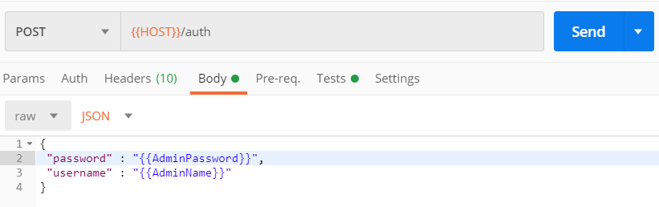

# User tools

## Overview

This topic introduces the tools you can use for interacting with and testing the HCL Domino REST API. These tools include command-line clients, API testing platforms, data generators, and version-control systems. They support various workflows that enhance your development and integration experience.

## Tool list

These tools are recommended for individual developers and are not installed on the Domino REST API server. Choose the tool that best fits your workflow and preferences.

### Command-line tools

| Tool Name | Description |
|:---|:---|
|[curl](https://curl.haxx.se/ "Opens a new tab"){: target="_blank" rel="noopener noreferrer"}&nbsp;{: style="height:15px;width:15px"}|A versatile command-line tool for transferring data with URLs. Ideal for scripting REST API calls and quick testing from terminals.  For more information, see [Additional information](#curl).|
|[jq](https://stedolan.github.io/jq/ "Opens a new tab"){: target="_blank" rel="noopener noreferrer"}&nbsp;{: style="height:15px;width:15px"}|A command-line JSON processor that works well with curl for filtering, parsing, and manipulating JSON data.|

### API clients

| Tool Name | Description |
|:---|:---|
|[Postman](https://www.postman.com/ "Opens a new tab"){: target="_blank" rel="noopener noreferrer"}&nbsp;{: style="height:15px;width:15px"}|Cross-platform graphical API client for exploring and testing APIs interactively.  Sample Domino REST API collections are available. For more information, see [Additional information](#postman).|
|[Bruno](https://www.usebruno.com/ "Opens a new tab"){: target="_blank" rel="noopener noreferrer"}&nbsp;{: style="height:15px;width:15px"}|An open-source, Git-integrated, fully offline API client supporting REST interactions. Available on macOS, Windows, and Linux.  To learn more about Bruno, check the [Bruno documentation](https://docs.usebruno.com/ "Opens a new tab"){: target="_blank" rel="noopener noreferrer"}&nbsp;{: style="height:15px;width:15px"}.  Bruno is available as a native desktop app for macOS, Windows, and Linux. For more information, see [Download Bruno's Desktop Application](https://docs.usebruno.com/get-started/bruno-basics/download "Opens a new tab"){: target="_blank" rel="noopener noreferrer"}&nbsp;{: style="height:15px;width:15px"}.|

### Debugging and proxy tools

| Tool Name | Description |
|:---|:---|
|[Charles Proxy](https://www.charlesproxy.com/ "Opens a new tab"){: target="_blank" rel="noopener noreferrer"}&nbsp;{: style="height:15px;width:15px"}|An HTTP(S) proxy for debugging API traffic, especially useful when the client applications are not browsers.|

### Data generation and security

| Tool Name | Description |
|:---|:---|
|[Mockaroo](https://www.mockaroo.com/ "Opens a new tab"){: target="_blank" rel="noopener noreferrer"}&nbsp;{: style="height:15px;width:15px"}|Online tool for generating sample JSON or CSV data for API testing.|
|[Let's Encrypt](https://letsencrypt.org/ "Opens a new tab"){: target="_blank" rel="noopener noreferrer"}&nbsp;{: style="height:15px;width:15px"}|Provides free SSL certificates to secure your API endpoints.|

### Version control

| Tool Name | Description |
|:---|:---|
|[SourceTree for GIT](https://www.sourcetreeapp.com/ "Opens a new tab"){: target="_blank" rel="noopener noreferrer"}&nbsp;{: style="height:15px;width:15px"}|Graphical Git version control client to manage code repositories.|

### Documentation and supporting tools

The Domino REST API documentation is rendered using [Markdown](https://en.wikipedia.org/wiki/Markdown "Opens a new tab"){: target="_blank" rel="noopener noreferrer"}&nbsp;{: style="height:15px;width:15px"} on [GitHub Pages](https://pages.github.com/ "Opens a new tab"){: target="_blank" rel="noopener noreferrer"}&nbsp;{: style="height:15px;width:15px"}, styled with [Material for MkDocs](https://squidfunk.github.io/mkdocs-material/ "Opens a new tab"){: target="_blank" rel="noopener noreferrer"}&nbsp;{: style="height:15px;width:15px"}, and enhanced by several plugins. Images are created with various visualization tools such as [OmniGraffle](https://www.omnigroup.com/omnigraffle/ "Opens a new tab"){: target="_blank" rel="noopener noreferrer"}&nbsp;{: style="height:15px;width:15px"}, [SmartDraw](https://www.smartdraw.com/ "Opens a new tab"){: target="_blank" rel="noopener noreferrer"}&nbsp;{: style="height:15px;width:15px"}, [PlantUML](https://plantuml.com/ "Opens a new tab"){: target="_blank" rel="noopener noreferrer"}&nbsp;{: style="height:15px;width:15px"}, [Balsamiq](https://balsamiq.com/ "Opens a new tab"){: target="_blank" rel="noopener noreferrer"}&nbsp;{: style="height:15px;width:15px"}, and [GIMP](https://www.gimp.org/ "Opens a new tab"){: target="_blank" rel="noopener noreferrer"}&nbsp;{: style="height:15px;width:15px"}.

## Additional information

### curl

curl can be used to interact with the Domino REST APIs for hands-on practice. Additionally, the [JSONPlaceholder](https://jsonplaceholder.typicode.com/ "Opens a new tab"){: target="_blank" rel="noopener noreferrer"}&nbsp;{: style="height:15px;width:15px"} site offers a safe, online REST API with fake data, allowing you to test and hone your curl skills without any risk.

curl is installed by default in the latest Mac and Windows systems. If you have installed **Git Bash** on your system, you can run curl commands directly from the Git Bash window without installing any other applications. In case you need to download curl for Windows, check the [curl download site](https://curl.haxx.se/windows/).

The basic layout of a curl command is `curl [options] [URL]`, where:

- `[options]` - Optional flags that modify the behavior of the curl command.
- `[URL]` - Specifies one or more URLs from which to retrieve or send data.

To see all the options, use `curl --help`.

??? tip "Commonly-used options"

    | Command Option               | Description                                                           |
    | :--------------------------- | :-------------------------------------------------------------------- |
    | -d, --data \<data\>          | HTTP POST data (that is the data payload for a post request)          |
    | -i, --include                | Include response headers in the output                                |
    | -I, --head                   | Show document info only (that is just the header)                     |
    | -K, --config \<file\>        | Read config from a file (that is to get options from a file)          |
    | -o, --output \<file\>        | Write response to a file instead of stdout                            |
    | -O, --remote-name            | Write output to a file named as the remote file (that is to download a file) |
    | -u, --user \<user:password\> | Server user and password (authentication)                             |
    | -v, --verbose                | Make the operation more talkative                                     |
    | -X, --request \<command\>    | Specify request command to use (that is a PUT command is: -X PUT)     |

You can also check the following links to learn more about curl:

- [curl Home Page](https://curl.se/)

- [curl Documentation Page](https://curl.se/docs/)

- [Basic cURL Tutorial](https://www.youtube.com/watch?v=7XUibDYw4mc)

- [Testing APIs with the cURL Command](https://www.youtube.com/watch?v=iLVoA1DTE60)

### Postman

After installing Postman, you need to configure it to use the Domino REST APIs by importing the Collection and the Environment files.

Download the Collection and Environment files from the [Downloads](downloads.md#postman) page, and then import them into Postman. For more information on importing to Postman, see [Data import and export in Postman](https://learning.postman.com/docs/getting-started/importing-and-exporting/importing-and-exporting-overview/ "Opens a new tab"){: target="_blank" rel="noopener noreferrer"}&nbsp;{: style="height:15px;width:15px"}. After importing the files, you need to get authenticated as most Domino REST API calls require authentication. To do that:

- Go to the **Collections** tab, and then select **Domino REST API** &rarr; **Authentication** &rarr; **Admin Login**.

    

- In the **Body** section, enter *John Doe* as the value of `"username"` and *password* as the value of `"password"`, then click **Send** to log in.

Alternatively, you can set your credentials using the environment variables `AdminName` and `AdminPassword`. For more information on, see [Reuse data with variables and environments in Postman](https://learning.postman.com/docs/sending-requests/variables/variables-intro/ "Opens a new tab"){: target="_blank" rel="noopener noreferrer"}&nbsp;{: style="height:15px;width:15px"}.

You can also check the following links to learn more about Postman:

- [Postman Homepage](https://www.postman.com/)

- [Postman Learning Center](https://learning.postman.com/)

- [Postman Key Concepts](https://learning.postman.com/concepts/)

- [The Basics of Using Postman for API Testing](https://www.youtube.com/watch?v=t5n07Ybz7yI)