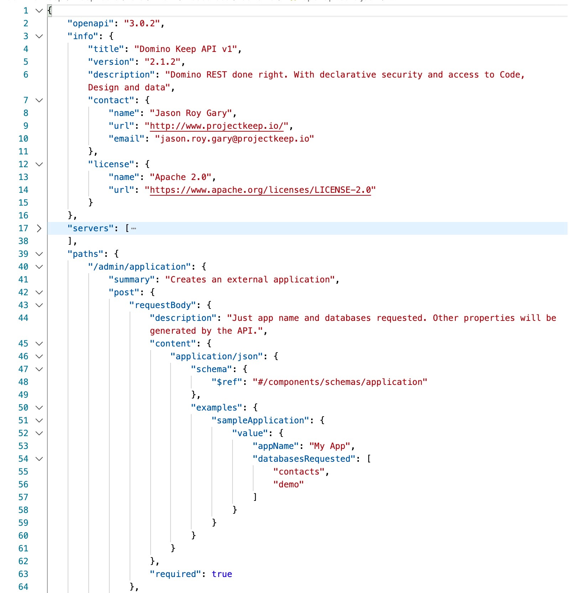
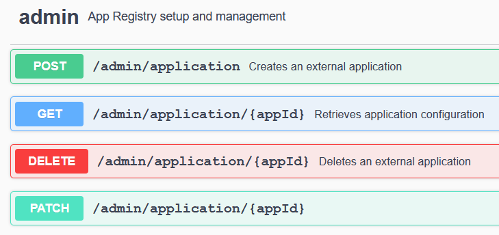

# Swagger UI

## Introduction

Swagger UI allows to visualize and interact with APIs without having any of the actual implementation logic in place. The APIs are automatically generated from the [OpenAPI (formerly Swagger) Specification](https://swagger.io/specification/), with the visual documentation making it easier to implement the backend code at a later stage.

## The OpenAPI Specification

The OpenAPI Specification is a set of rules that semantically describes APIs. It is written either in YAML or JSON and hence, is both human- and machine-readable. Here is a simple JSON description of the Domino REST API:

## Swagger UI

The OpenAPI Specification provides us a complete interactive user interface. The user interface for Domino REST API can be found here: **<http://localhost:8880>\*** and it looks like this:

## References

Domino REST API Swagger UI: <http://localhost:8880>

Swagger UI Homepage: <https://swagger.io/tools/swagger-ui/>

<!-- prettier-ignore -->
!!! note
    You need a Domino REST API server running to open localhost links.
