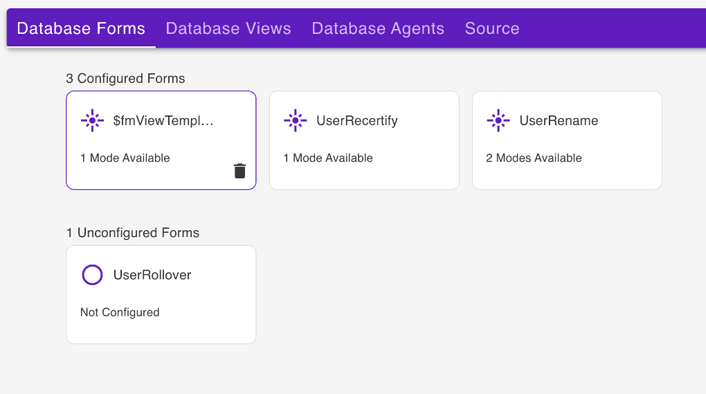

# Using Web UI

The Admin UI provides a user interface to a number of Domino REST APIs. It thus serves an example what a [React](https://reactjs.org/) application using the Domino REST APIs is capable of. It covers schema, scope, and app management. Anything that can be done using the WebUI can also be done using Postman, curl, SwaggerUI, or similar tools. There are [tutorials](../../tutorial/index.md) to walk you through the same.

<!-- prettier-ignore -->
!!! note
    The screenshots may vary. The screenshots are based on the latest Domino REST API snapshots. Make sure you're up-to-date

This is what the login page looks like.

(Image: Castle [Johannisburg](https://en.wikipedia.org/wiki/Schloss_Johannisburg), Aschaffeburg, Germany)

You'll need the administrator username and password to access the server.

To use a Domino database in Domino REST API, it must be configured for use in the API. Download `Demo.nsf` from [Resources](../../references/downloads.md) and save it in the Notes data directory. Then login to the Domino REST API Admin UI using the administrator user name and password.

For more information on logging in to the Domino REST API Admin UI:

- see [Login](../../tutorial/adminui.md#login)
- see [Use passkey to login to Admin UI](../../howto/install/passkey.md) 

## Database Management - REST API

Select **Database Management - REST API** from the home page.

### List available database schemas

The **Schema Management** page shows the list of all available schemas.

You can arrange the schemas in **Stack View**, **Card View**, **Alphabetical View**, or **NSF View**. There is also a provision to search through the list either via **Schema Name** or **NSF Name**.

### Add a schema

1. On the **Schema Management** page, click **Add Schema** to add a database schema.

      

      The shape of data available is referred to as a schema. The schema is a JSON file in the design resources of the database. It gets created by a developer with Designer access to the NSF.

      This creates the Alias. You can use this to access the database via the Domino REST API. One NSF can be available under more than one alias, such as with different security settings.

      

2. Under **Available Databases**, select a database from the list of databases available to the Domino REST API.
3. Under **Add New Schema**, enter details in the **Schema Name** and **Description**, and then select the **Formula Engine** for the schema you want to create.
4. Click **Add**.

### List available forms

1. Select a schema from the list of schemas and the details for it will load.
2. Select **Database Forms** from the menu bar to show the list of all the Forms for the selected database.

      

### Configure a form

1. From the list of **Unconfigured Forms**, select the Form that you would like to configure.
2. In the **Configure** dialog, select **Yes**.

The selected form is now configured with default settings and listed under **Configured Forms**.

To make changes to the configuration:

1. Select the Form. This loads the `default` Access Mode for the Form.

      

2. Set the Read or Write access formula for each of the fields in the Form.

### List available views

1. Select a schema from the list of schemas and the details for it will load.
2. Select **Database Views** from the menu bar. This lists all the views for the selected schema.

      

### Activate a view

**To activate a specific view or views**:

1. Select the view that you want to activate, and then click the corresponding **Active** option under **Status**.
2. Click **Save**.

!!!tip
    Clicking the **Inactive** option corresponding to a view, and then clicking **Save** deactivates the view.  

**To activate all views**:

- Click **Activate All**, and then click **Save**.

!!!tip
    Clicking **Deactivate All**, and then clicking **Save** deactivates all active Views.

**To edit a view**

- See [Edit a database view of a schema](../../howto/database/editviewcolumn.md) for more information. 

### List available agents

1. Select a schema from the list of schemas and the details for it will load.
2. Select **Database Agents** from the menu bar. This lists all the Agents for the selected database.

      

### Activate an Agent

1. Click an Agent that you would like to activate to move it to **Activated Agents**.
2. Click **Save**.

<!-- prettier-ignore -->
!!! tip
    Clicking on an Agent from the **Activated Agents** section undos the selection.

## Database Management - Activation

Select **Database Management - Activation** from the home page.

### Add a scope

1. On the **Scope Management** page, click **Add Scope** to add a database.

      

2. Under **Available Schema**, select the schema that the scope will belong to.
3. Under **Add New Scope**, fill in the form and click **Add**.

!!!note
    You can set the **Maximum Access Level** of the scope to control the maximum access anyone using the scope should have to prevent applications from inheriting a user's access rights when that user grants app access on their behalf. By default, the set maximum access level is **Editor**. To know more about what each access level allows and to whom the access level is assigned, see [Access levels in the ACL](https://help.hcltechsw.com/domino/12.0.2/admin/conf_accesslevelsintheacl_c.html){: target="_blank" rel="noopener noreferrer"}.     

A scope points to a schema that's contained in a database. A database can have many schemas for different use cases and a schema can be pointed to by more than one scope.

## Application Management - OAuth

Select **Application Management - OAuth** from the home page.

### List available applications

The **Application Management** page shows the list of all available applications.

### Add an application

1. On the **Application Management** page, click **Add Application** to add an application.

      

2. Under **Add New Application**, fill in the form and click **Add**.

      

3. Hover over the application tile to access options to generate Application Secret, and edit and delete the application.

      
