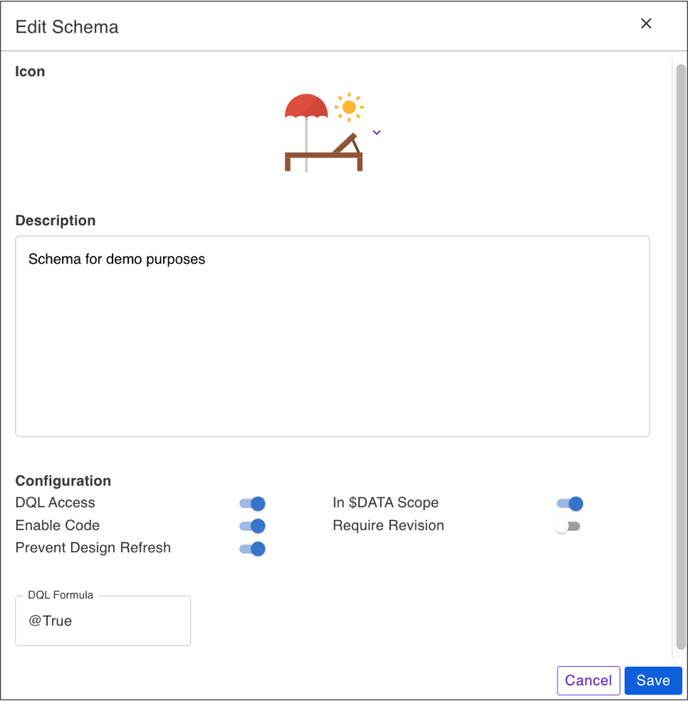
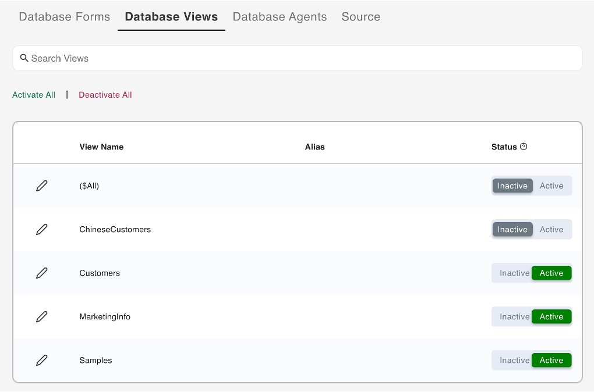
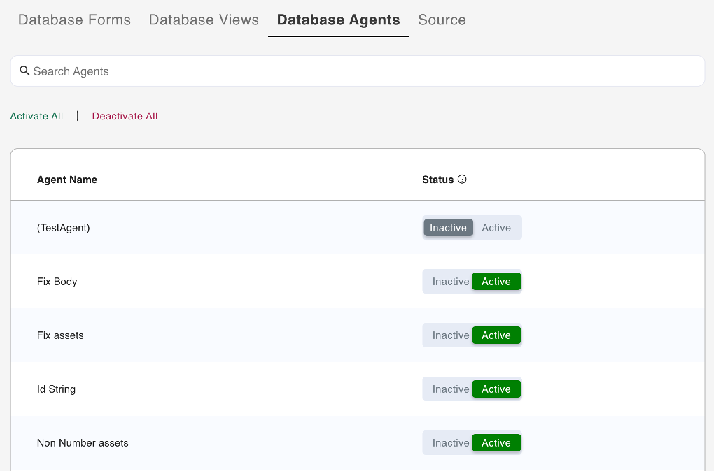
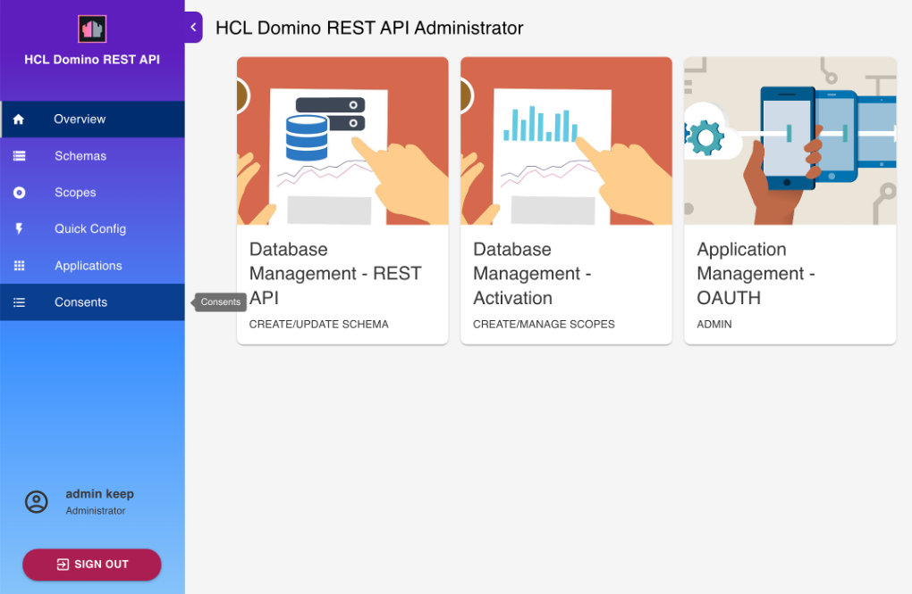

# Using Web UI

The Admin UI provides a user interface to a number of Domino REST APIs. It thus serves an example what a [React](https://reactjs.org/) application using the Domino REST APIs is capable of. It covers schema, scope, and app management. Anything that can be done using the WebUI can also be done using Postman, curl, SwaggerUI, or similar tools. There are [tutorials](../../tutorial/index.md) to walk you through the same.

<!-- prettier-ignore -->
!!! note
    The screenshots may vary. The screenshots are based on the latest Domino REST API snapshots. Make sure you're up-to-date

This is what the login page looks like.

(Image: Castle [Johannisburg](https://en.wikipedia.org/wiki/Schloss_Johannisburg), Aschaffeburg, Germany)

You'll need the administrator username and password to access the server.

To use a Domino database in Domino REST API, it must be configured for use in the API. Download `Demo.nsf` from [Resources](../../references/downloads.md) and save it in the Notes data directory. Then login to the Domino REST API Admin UI using the administrator user name and password.

For more information on logging in to the Domino REST API Admin UI:

- see [Login](../../tutorial/adminui.md#login)
- see [Use passkey to login to Admin UI](../../howto/install/passkey.md) 

## Database Management - REST API

Select **Database Management - REST API** from the home page.

### List available database schemas

Click the **Schemas** navigation pane and the  **Schema Management** page shows the list of all available schemas.

You can arrange the schemas in **Stack View**, **Card View**, **Alphabetical View**, or **NSF View**. There is also a provision to search through the list either via **Schema Name** or **NSF Name**.

### Add a schema

The shape of data available is referred to as a schema. The schema is a JSON file in the design resources of the database. It gets created by a developer with Designer access to the NSF.

This creates an alias to the schema. This, along with a scope, provides access to the database via the Domino REST API. One NSF can have multiple schemas, which is useful to provide different data sets or different levels of access to data.

You can add a schema by [creating your own schema](#create-a-schema) or [importing a schema](#import-a-schema).

#### Create a schema

1. On the **Schema Management** page, click **Add Schema**.

      

2. In the **Add New Schema** dialog, click **Create Schema**.

      {: style="height:80%;width:80%"}   

3. Under **Available Databases**, select a database from the list of databases available to the Domino REST API.

      

      You can search for a database by clicking **Search Databases** and entering the database name. This filters the list of available databases based on the entered database name. Click the clear icon to remove the entered database name. 

4. Under **Add New Schema**, enter details in the **Schema Name** and **Description**, and then select the **Formula Engine** and **Schema Icon** for the schema you want to create.
5. Click **Add**.

#### Import a schema <!--to a database-->

Use this option if you want to import a new schema from a JSON file produced by [exporting database schema as JSON file](../../howto/database/exportsourcejson.md).

<!--Use this option if you have a schema that you want to share across multiple databases or even into the same database. Follow the procedure of exporting a schema here [Export database schema as JSON file ](../../howto/database/exportsourcejson.md).-->

1. On the **Schema management page**, click **Add Schema**.
2. In the **Add New Schema** dialog, click **Import Schema**.
      
      <!---->

3. Select the JSON database file and click **Open**. The JSON database file is the exported file from another database or within your server.

4. In the **Import Schema** dialog:
      1. Choose the `.nsf` database from the **Import Into Database** dropdown list. The default `.nsf` is from the imported database JSON file.
      2. Update the **Icon**, **Schema Name**, **Schema Description**, and **Formula Engine** as needed. 
      3. Click **Save Schema**. 
      
The `nsf` database file and schema are added to the schema list.

!!!note   
    The imported schema name must be unique. You'll be warned if you try to save a schema to a database that already has a schema with the same name.

### Edit a schema

1. On the **Schema Management** page, select the schema you want to edit.
2. On the schema details card, click the edit icon.

      

3. On the **Edit Schema** dialog:
      
      - You can select a new icon from the drop-down icon list.
      - You can update the description of the schema in the **Description**. 
      - You can update the configuration by clicking the toggles to enable or disable the configuration settings. For more information, see *Configuration Settings* table. 

      |Configuration setting|Description|
      |----|----|
      |DQL Access|Enable the setting to allows DQL queries to run against the elements of the schema. A mode named `dql` must be created on each form specifying the fields allowed for that form.|
      |In $DATA Scope|Enable the setting to make schema available in the system `$DATA` scope. Disable the setting to limit access to the schema to those with the specific scope. |
      |Enable Code|*feature under development*|
      |Allow Decryption|*feature under development*|
      |Require Revision|Enable the setting to require the provision of the correct revision version of the document to update the document through an update endpoint.|

      - You can enter a valid Notes formula in **DQL Formula** to limit DQL usage. The formula must evaluate to `@TRUE` for DQL to be allowed. The default is `@TRUE`, which means no limitations.

        {: style="height:80%;width:80%"}

4. Click **Save**. 

### List available forms

1. Select a schema from the list of schemas to load the details.
2. Select **Database Forms** from the menu bar to show the list of all the forms for the selected database schema.

      
      <!---->

### Configure a form

**To configure a specific form or forms**

1. From the available forms under **Unconfigured Forms**, select the form that you would like to configure. 
2. Click the toggle in the form card of the selected form.
3. In the **Configure** dialog, click **Yes**. 

The selected form is now configured with default settings and listed under **Configured Forms**.

**To configure all forms**

- Click **Configure All**.

All forms are now configured with default settings and listed under **Configured Forms**.

**To unconfigure a form**

1. From the available forms under **Configured Forms**, select the form that you would like to unconfigure.
2. Click the toggle in the form card of the selected form.
3. In the **Unconfigure Form** dialog, click **Yes**. 

The selected form is now moved under **Unconfigured Forms**. 

**To unconfigure all forms**

- Click **Unconfigure All**.

!!!note
    Clicking **Unconfigure All** removes all configurations you have made to each of the forms.

### Change form configuration

1. Select a configured form. This loads the `default` Access Mode for the form.
      
      

2. Under **Show fields from**, which shows the fields that can be added to the form, hover over a field item and click the **+** icon. This adds the field in the form. Repeat this for all the fields to be added.

      You can also click **Add All** if you want to add all the available fields to the form. 

3. Set the Read or Write access formula for each of the fields in the Form.
4. Click **Save**.

!!!note
    You can click the trash can icon corresponding to the field to remove the field from the form. 

### Add a mode

1. Select a configured form. This loads the `default` Access Mode for the form.
1. Click **Add Mode**.
2. In the **Add New Mode** dialog, enter the name of the new mode and click **Save**. The new mode has been added to the `Mode`list
      
      

3. Add fields.
4. Click **Save**.

### Clone a mode 

Use **Clone Mode** to add a new mode based on an existing mode in the same schema.

1. Select a configured form. This loads the `default` Access Mode for the form.
2. From the **Mode** dropdown list, choose the mode you want to clone, for example the `default` mode.
3. Click **Clone Mode**.
4. In the **Clone <mode name\>** dialog, enter the name of the mode and click **Save**. 

      The new mode cloned from an existing mode is now available. You can remove or add fields to the new mode.

6. Click **Save**.

      

### Compare modes

Use this function to see the differences between the modes of a selected form. To use this function, you must have at least two modes in your selected form.

1. Select a configured form. This loads the `default` Access Mode for the form.
2. Click **Open Mode Compare**. The **Mode Compare - <form name\>** page opens.
3. Select the modes to compare from the drop-down lists in the comparison columns. The comparison result is displayed. 

 
!!!note 
    - A field available in only one mode is highlighted, and then indicated as **Field not existing** in the other mode. 
    - Fields with differences are highlighted. 

!!!tip
    - Click the **Show only fields with differences** toggle to only show fields with differences.
    - In case there are too many fields, and you want to find a specific field, you can enter the field name in the **Search Field** to only display the specific field if available.
    - Click **Add New Column** to add more modes in the comparison. 
    - Click the close icon to close the **Mode Compare - <form name\>** page.    

### List available views

1. Select a schema from the list of schemas to load the details.
2. Select **Database Views** from the menu bar. This lists all the views for the selected schema.

      

<!--3. Click **Activate All** if you'd like to quickly enable all Views to be available in this schema. Click **Deactivate All** to disable all Views in this schema. 

      !!!warning "Important"
      **Deactivating All** will remove all configurations you have made to each of the Forms.-->

### Activate a view

**To activate a specific view or views**:

- Select the view that you want to activate, and then click the corresponding **Active** option under **Status**.

!!!tip
    Clicking the **Inactive** option corresponding to a view deactivates the view. On the **Reset Views Columns** dialog, click **Yes** to confirm deactivation of the view. 

**To activate all views**:

- Click **Activate All**.

!!!tip
    Clicking **Deactivate All** deactivates all active views. On the **Reset ALL View Columns** dialog, click **Yes** to confirm deactivation of all views. 

!!!note
    Clicking **Deactivate All** removes all configurations you have made to each of the views.

**To edit a view**

- See [Edit a database view of a schema](../../howto/database/editviewcolumn.md) for more information. 

### List available agents

1. Select a schema from the list of schemas to load the details.
2. Select **Database Agents** from the menu bar. This lists all the Agents for the selected database.

      

<!--4. Click **Activate All** if you'd like to quickly enable all Agents to be available in this schema. Click **Deactivate All** to disable all Agents in this schema.-->

### Activate an agent

**To activate a specific agent or agents**

- Select the agent you want to activate, and then click the corresponding **Active** option under **Status**.

!!! tip 
      Clicking the **Inactive** option corresponding to an agent deactivates the agent.

**To activate all agents**

- Click **Activate All**. 

!!! tip
      Clicking **Deactivate All** deactivates all active agents. On the **Reset ALL Agents** dialog, click **Yes** to confirm the deactivation of all agents.

### View Source

The Source tab allows you to view the database schema details in JSON format. 

1. Select a schema from the list of schemas to load the schema details.
2. Select **Source** from the menu bar to show the details for the selected schema in the following view mode:
      
      - **Text Mode** - shows the text view of the details of the selected schema in JSON format
      - **Styled Object** - shows the collapsible view of the details of the selected schema in JSON format 

!!!note
      - The database schema JSON details are editable in the **Styled Object** view mode. For more information, see [Edit database schema JSON](../../howto/database/editsourcejson.md).
      
      - To export the schema in a .json file, see [Export schema as JSON file](../../howto/database/exportsourcejson.md).

## Database Management - Activation

Select **Database Management - Activation** from the home page.

### Add a scope

!!!tip
    A scope points to a schema that's contained in a database. A database can have many schemas for different use cases and a schema can be pointed to by more than one scope.

1. On the **Scope Management** page, click **Add Scope** to add a database.

      

2. Under **Available Schema**, select the schema that the scope will belong to.
3. Under **Add New Scope**, fill in the form and click **Add**.

!!!note
    You can set the **Maximum Access Level** of the scope to control the maximum access anyone using the scope should have. This prevents an app, which has inherited a user's access rights when the user grants app access, from unauthorized altering of schemas or access control lists. By default, the set maximum access level is **Editor**. To know more about what each access level allows and to whom the access level is assigned, see [Access levels in the ACL](https://help.hcltechsw.com/domino/12.0.2/admin/conf_accesslevelsintheacl_c.html){: target="_blank" rel="noopener noreferrer"}.     

## Application Management - OAuth

Select **Application Management - OAuth** from the home page.

### List available applications

The **Application Management** page shows the list of all available applications.

{: style="height:80%;width:80%"}

### Add an application

1. On the **Application Management** page, click **Add Application** to add an application.

      {: style="height:80%;width:80%"}

2. Under **Add New Application**, fill in the form and click **Add**.

      Kindly note that when your app accesses endpoints that run write operations in the `/setup-v1/` URL path, make sure to add the `$SETUP` scope aside from the `$DATA` scope to enhance access control in relation to the app inheriting a user's access rights when the user grants app access. 

      {: style="height:80%;width:80%"}

3. Hover over the application tile to access options to generate Application Secret, and edit and delete the application.

      {: style="height:80%;width:80%"}

## OAuth Consents 

Allows the current user to view and revoke available OAuth consents. 

### View OAuth consent list

Click **OAuth Consents** from the navigation pane. 

{: style="height:80%;width:80%"}

This opens the **OAuth Consents** pane. 

{: style="height:80%;width:80%"}

!!!note
    Users logged into the AdminUI that are in the `LocalKeepAdmins` group or are Managers in the `oauth.nsf` ACL will see all user consents and can revoke them as well.

### View OAuth consent details

Click **View** corresponding to a user in the list to show OAuth consent details, such as scope, app name, URL.

{: style="height:80%;width:80%"}

### Revoke authorized user

1. Click **Revoke** corresponding to a user in the list that you want the authorization revoked.
2. In the **Revoke Consent** dialog, click **Yes**. 

{: style="height:80%;width:80%"}

The user is now removed from the authorized users list.
