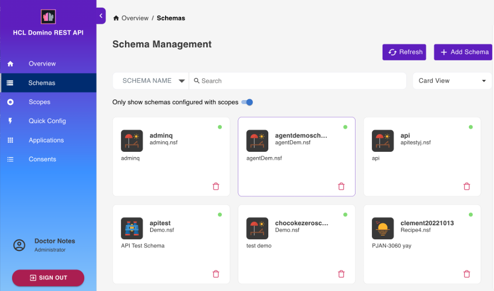
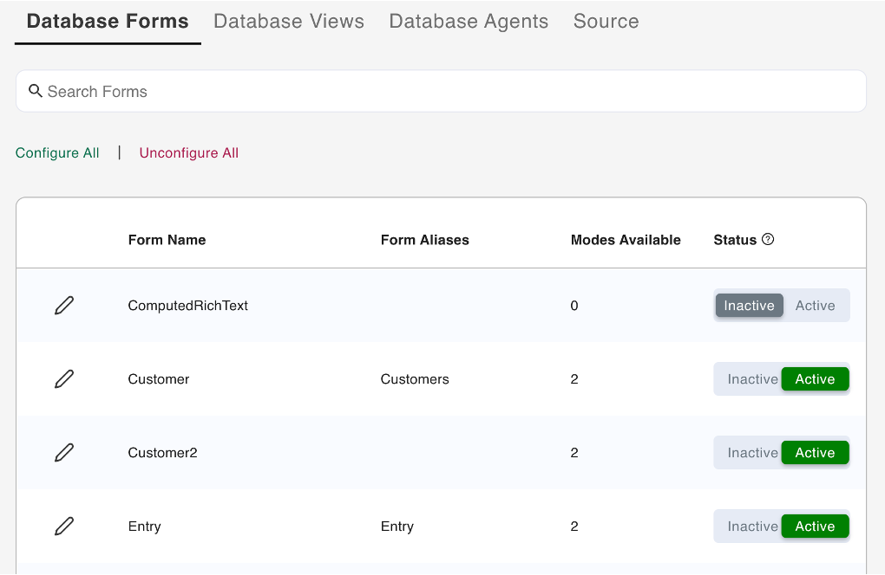
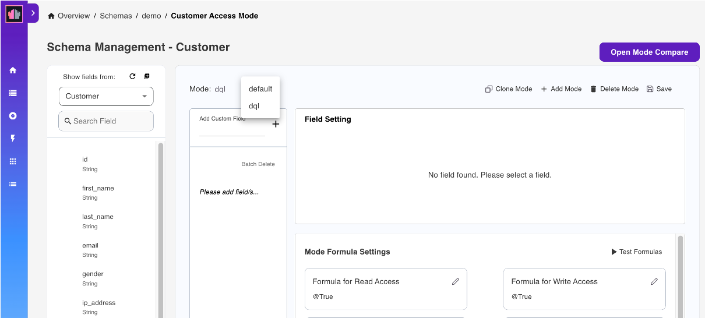
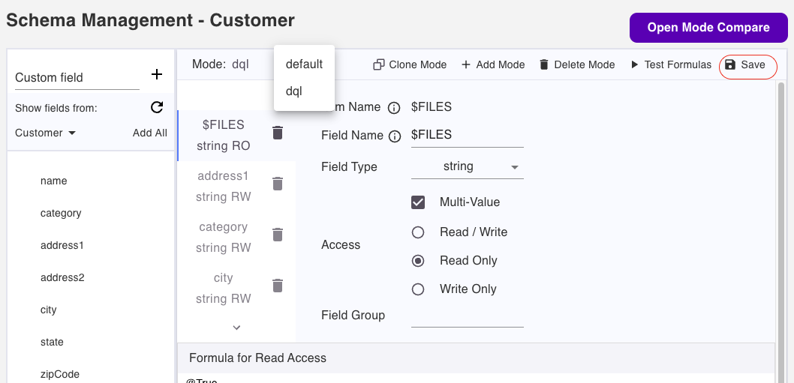

# Using Web UI

The Admin UI provides a user interface to a number of Domino REST APIs. It thus serves an example what a [React](https://reactjs.org/) application using the Domino REST APIs is capable of. It covers schema, scope, and app management. Anything that can be done using the WebUI can also be done using Postman, curl, SwaggerUI, or similar tools. There are [tutorials](../../tutorial/index.md) to walk you through the same.

<!-- prettier-ignore -->
!!! note
    The screenshots may vary. The screenshots are based on the latest Domino REST API snapshots. Make sure you're up-to-date

This is what the login page looks like.

(Image: Castle [Johannisburg](https://en.wikipedia.org/wiki/Schloss_Johannisburg), Aschaffeburg, Germany)

You'll need the administrator username and password to access the server.

To use a Domino database in Domino REST API, it must be configured for use in the API. Download `Demo.nsf` from [Resources](../../references/downloads.md) and save it in the Notes data directory. Then login to the Domino REST API Admin UI using the administrator user name and password.

For more information on logging in to the Domino REST API Admin UI:

- see [Login](../../tutorial/adminui.md#login)
- see [Use passkey to login to Admin UI](../../howto/install/passkey.md) 

## Database Management - REST API

Select **Database Management - REST API** from the home page.

### List available database schemas

The **Schema Management** page shows the list of all available schemas.

You can arrange the schemas in **Stack View**, **Card View**, **Alphabetical View**, or **NSF View**. There is also a provision to search through the list either via **Schema Name** or **NSF Name**.

### Add a schema

1. On the **Schema Management** page, click **Add Schema** to add a database schema.

      

      The shape of data available is referred to as a schema. The schema is a JSON file in the design resources of the database. It gets created by a developer with Designer access to the NSF.

      This creates the Alias. You can use this to access the database via the Domino REST API. One NSF can be available under more than one alias, such as with different security settings.

      

2. Under **Available Databases**, select a database from the list of databases available to the Domino REST API.

      You can search for a database by clicking **Search Databases** and entering the database name. This filters the list of available databases based on the entered database name. Click the clear icon to remove the entered database name. 

3. Under **Add New Schema**, enter details in the **Schema Name** and **Description**, and then select the **Formula Engine** and **Schema Icon** for the schema you want to create.
4. Click **Add**.

### Edit a schema

1. On the **Schema Management** page, select the schema you want to edit.
2. On the schema details card, click the edit icon.

      

3. On the **Edit Schema** dialog:
      
      - You can select a new icon from the drop-down icon list.
      - You can update the description of the schema in the **Description**. 
      - You can update the configuration by clicking the toggles to enable or disable the configuration settings. For more information, see *Configuration Settings* table. 

      |Configuration setting|Description|
      |----|----|
      |DQL Access|Enable the setting to allows DQL queries to run against the elements of the schema. A mode named `dql` must be created on each form specifying the fields allowed for that form.|
      |In $DATA Scope|Enable the setting to make schema available in the system `$DATA` scope. Disable the setting to limit access to the schema to those with the specific scope. |
      |Enable Code|*feature under development*|
      |Allow Decryption|*feature under development*|
      |Require Revision|Enable the setting to require the provision of the correct revision version of the document to update the document through an update endpoint.|

      - You can update the **DQL Formula**. You can use any valid Notes formula to allow or disallow DQL usage depending on the formula.

      {: style="height:80%;width:80%"}

4. Click **Save**. 

### Import a schema from another server

1. On the **Schema management page**, click **Add Schema**.
2. Click **Import** on the **Add New Schema** section.
3. Select the `.json` file and click **Open** from the dialog box. The schema is imported to your server.

!!!warning "Important notice"
      - You can't import schema unless your server contains the same `.nsf` database file.
      - You can't import the same schema name in your server.

### Database schema

1. Select a schema from the list of schemas and the details for it will load.
2. Select **Database Forms** from the navigation pane to show the list of all the Forms for the selected database schema.
3. Search available views. (optional)

      

- You may click **Configure All**, meaning you may include all the list of Form in your App, otherwise, you click **Unconfigure All**, meaning you may NOT include all the list of Form in your App.

   
   
### Configure a form

1. From the available forms under **Unconfigured Forms**, select the form that you would like to configure. 
2. Click the toggle in the form card of the selected form.
3. In the **Configure** dialog, click **Yes**. 

The selected form is now configured with default settings and listed under **Configured Forms**.

**To unconfigure a form**

1. From the available forms under **Configured Forms**, select the form that you would like to unconfigure.
2. Click the toggle in the form card of the selected form.
3. In the **Unconfigure Form** dialog, click **Yes**. 

The selected form is now moved under **Unconfigured Forms**. 

**To make changes to the configuration:**

1. Select the form. This loads the `default` Access Mode for the form.
      
      

2. Under **Show fields from**, which shows the fields that can be added to the form, hover over a field item and click the **+** icon. This adds the field in the form. Repeat this for all the fields to be added.

      You can also click **Add All** if you want to add all the available fields to the form. 

3. Set the Read or Write access formula for each of the fields in the Form.
4. Click **Save**.

!!!note
    You can click the trash can icon corresponding to the field to remove the field from the form. 

### Add Mode

1. Click the **Add Mode**.
2. Fill in the name of the `Mode` and click **Save**. The mode has been added to the `Mode`list
      
      

3. Add fields.
4. Click **Save**.

### Clone Mode

This **clone mode** is necessary for users who replicate the same fields but in a different mode. 

1. Open a database form.
2. From the dropdown menu of the **Mode** fields, choose the mode you want to clone. (for example, you want to clone the Mode:`default`)
3. Click the **Clone Mode**.
4. Fill in the name of the `Mode` and click **Save**. The mode has been cloned or duplicated.
5. The cloned mode has been added to the list of `Modes`.

   !!!note
      In your cloned mode, you can remove or add fields. 

6. Click **Save**.

      

  

### Database Views

1. Select a schema from the list of schemas and the details for it will load.
2. Select **Database Views** from the navigation pane. This lists all the views for the selected schema.
3. Search available views. (optional)

      

- If you like to *activate all* the Views, then click the **Activate All**, otherwise click **Deactivate All** to deactivate all the Views and no longer available on your App.

### Activate a view

**To activate a specific view or views**:

- Select the view that you want to activate, and then click the corresponding **Active** option under **Status**.

!!!tip
    Clicking the **Inactive** option corresponding to a view deactivates the view. On the **Reset Views Columns** dialog, click **Yes** to confirm deactivation of the view. 

**To activate all views**:

- Click **Activate All**.

!!!tip
    Clicking **Deactivate All** deactivates all active views. On the **Reset ALL View Columns** dialog, click **Yes** to confirm deactivation of all views. 

**To edit a view**

- See [Edit a database view of a schema](../../howto/database/editviewcolumn.md) for more information. 

### Database Agents

1. Select a schema from the list of schemas and the details for it will load.
2. Select **Database Agents** from the navigation pane. This lists all the Agents for the selected database.
3. Search available views. (optional)

      

- If you like to *activate all* the Agents, then click the **Activate All**, otherwise click **Deactivate All** to deactivate all the Agents.

### Activate an Agent

**To activate a specific agent or agents**

- Select the agent you want to activate, and then click the corresponding **Active** option under **Status**.

!!! tip 
      Clicking the **Inactive** option corresponding to an agent deactivates the agent.

**To activate all agents**

- Click **Activate All**. 

!!! tip
      Clicking **Deactivate All** deactivates all active agents. On the **Reset ALL Agents** dialog, click **Yes** to confirm the deactivation of all agents.

### View Source

The Source tab allows you to view the database schema details in JSON format. 

1. Select a schema from the list of schemas to load the schema details.
2. Select **Source** from the menu bar to show the details for the selected schema in the following view mode:
      
      - **Text Mode** - shows the text view of the details of the selected schema in JSON format
      - **Styled Object** - shows the collapsible view of the details of the selected schema in JSON format 

!!!note
      - The database schema JSON details are editable in the **Styled Object** view mode. For more information, see [Edit database schema JSON](../../howto/database/editsourcejson.md).
      
      - To export the schema in a .json file, see [Export schema as JSON file](../../howto/database/exportsourcejson.md).

## Database Management - Activation

Select **Database Management - Activation** from the home page.

### Add a scope

1. On the **Scope Management** page, click **Add Scope** to add a database.

      

2. Under **Available Schema**, select the schema that the scope will belong to.
3. Under **Add New Scope**, fill in the form and click **Add**.

!!!note
    You can set the **Maximum Access Level** of the scope to control the maximum access anyone using the scope should have. This prevents an app, which has inherited a user's access rights when the user grants app access, from unauthorized altering of schemas or access control lists. By default, the set maximum access level is **Editor**. To know more about what each access level allows and to whom the access level is assigned, see [Access levels in the ACL](https://help.hcltechsw.com/domino/12.0.2/admin/conf_accesslevelsintheacl_c.html){: target="_blank" rel="noopener noreferrer"}.     

A scope points to a schema that's contained in a database. A database can have many schemas for different use cases and a schema can be pointed to by more than one scope.

## Application Management - OAuth

Select **Application Management - OAuth** from the home page.

### List available applications

The **Application Management** page shows the list of all available applications.

### Add an application

1. On the **Application Management** page, click **Add Application** to add an application.

      

2. Under **Add New Application**, fill in the form and click **Add**.

      Kindly note that when your app accesses endpoints that run write operations in the `/setup-v1/` URL path, make sure to add the `$SETUP` scope aside from the `$DATA` scope to enhance access control in relation to the app inheriting a user's access rights when the user grants app access. 

      

3. Hover over the application tile to access options to generate Application Secret, and edit and delete the application.

      
