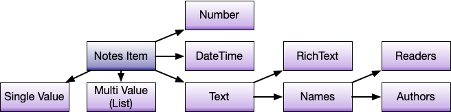

# DataFormats

## Domino and JSON data formats

The Domino REST API translates between native Domino and JSON schema derived data. Since it isn't a 1:1 mapping, refer to the following tables:

### Single Values, JSON to Domino

| Schema       | JSON native | Text[^1] | Number | Date | RichText |
| ------------ | ----------- | -------- | ------ | ---- | -------- |
| String       | String      |          |        |      |          |
| Password     | String      |          |        |      |          |
| int32        | Number      |          |        |      |          |
| int64        | Number      |          |        |      |          |
| Float        | Number      |          |        |      |          |
| Double       | Number      |          |        |      |          |
| Date         | String      |          |        |      |          |
| DateTime     | String      |          |        |      |          |
| Byte         | String      |          |        |      |          |
| Boolean      | Boolean     |          |        |      |          |
| Names        | String      |          |        |      |          |
| Readers      | String      |          |        |      |          |
| Authors      | String      |          |        |      |          |
| RichText[^2] | String      |          |        |      |          |
| RichText[^2] | Object      |          |        |      |          |

[^1]: Text includes Names, Authors, Readers
[^2]: RichText can be MIME in Base64, plain or an Object

### Multi Values JSON to Domino

Incoming JSON data comes as JSON arrays and turned into Multi-Value Notes items. The above table applies.

### Single Values, Domino to JSON

Domino Documents might or might not contain expected items and those items might or might not comply to the expected data format. The following table shows what works:

| Schema       | JSON native | Text | Number | Date | RichText |
| ------------ | ----------- | ---- | ------ | ---- | -------- |
| String       | String      |      |        |      |          |
| Password     | String      |      |        |      |          |
| int32        | Number      |      |        |      |          |
| int64        | Number      |      |        |      |          |
| Float        | Number      |      |        |      |          |
| Double       | Number      |      |        |      |          |
| Date         | String      |      |        |      |          |
| DateTime     | String      |      |        |      |          |
| Byte         | String      |      |        |      |          |
| Boolean      | Boolean     |      |        |      |          |
| Names        | String      |      |        |      |          |
| Readers      | String      |      |        |      |          |
| Authors      | String      |      |        |      |          |
| RichText[^3] | Object      |      |        |      |          |

[^3]: RichText is always returned as JSON object. For more information, see [RichText](./richtext.md).

### Multi Values, Domino to JSON

- Multiple Values are retrieved as a JSON array.
- When defined as single value in the Schema, but contains more than 1 value only first is returned.
