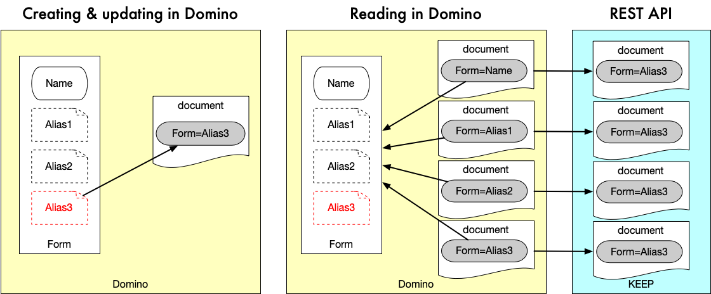
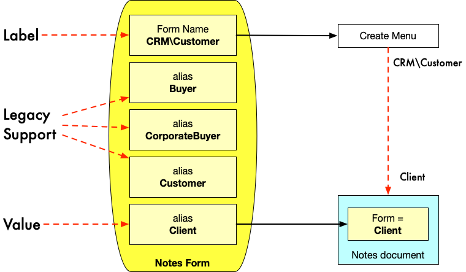

# Form and Alias handling

Notes and Domino use the value of the form item to determine what form to load when displaying a document. The first match of a form item value (or a form formula in a view or folder) with either a form name or any of the 0:n aliases determines what form is used to render a document.

This is in line with [Model-View-Controller](https://en.wikipedia.org/wiki/Model%E2%80%93view%E2%80%93controller) where the document has the role of the model and the form serves as the view (kind of).

## REST API form handling

The REST API uses the information from the document's form item to determine access by looking at the configuration loaded from the active schema accessed through the scope.

The approach follows the same principle as the Notes client or the Domino HTTP task, just the lookup source is the schema and not the list of forms in the design.

!!! warning "Form item normalization"

    The REST API does "normalize" the value of the form item. The returned form item is the (last) alias of the found form configuration. The stored document is not altered.

## The rationale

In contemporary development understanding we have label/value pairs. To normalize Notes documents we follow this pattern with the form name being the label and the last item being the value.

Aliases inbetween are considered "variations" we remove from API use to simplify access for outside developers.
