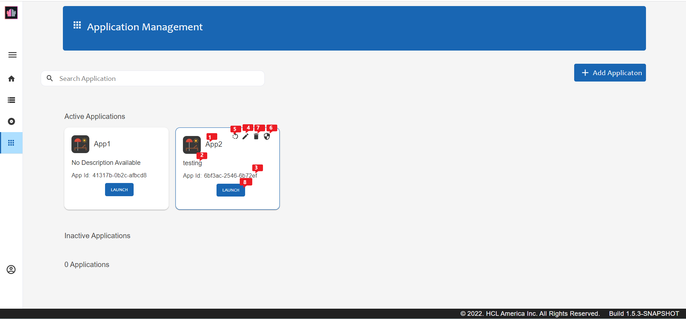

# Domino REST API Applications

## Connecting your application to Domino REST API

Any programming language is able to connect to a REST API.
Depending on your approach, there are some particularities to observe.

We distinguish between client and server based applications.
**Client based applications** can access databases that have been marked for **Open Access**,
while **server based applications** can provide an application id and application secret to get a different level of access.

### Browser based applications

Browser based applications (ReactJS, Angular, Vue, VanillaJS) can be hosted on a different server than the URL of the Domino REST API. To enable access to Domino REST API (besides the user's credential), [CORS](https://developer.mozilla.org/en-US/docs/Web/HTTP/CORS) need to be configured to allow access from the server providing the static files to Domino REST API. This is configured in the `security.json` in the `CORS` section. You need to add your domain and set it to `true`. To simplify corporate deployment, we check domain endings only. Which means that `acme.com` covers `www.acme.com`, `hr.acme.com` or even `one.two.three.acme.com`.

=== "Starting Domino REST API v1.1.3"

    **Starting Domino REST API v1.1.3**, CORS uses Regex. For more information, see [CORS is now using Regex](../../whatsnew/v1.1.3.md#cors-is-now-using-regex).

    The default entry in `security.json` should look like this:

    ```json
    {
      "CORS": {
        "^https?:\\/\\/localhost$": true,
        "^https?:\\/\\/hcl\\.com$": true,
        "^https?:\\/\\/.*\\.local$": true
        
      }
    }
    ```

    If you disable the preset and enable `acme.com`, you create a `security.json` with this content:

    ```json
    {
      "CORS": {
        "^https?:\\/\\/localhost$": false,
        "^https?:\\/\\/hcl\\.com$": false,
        "^https?:\\/\\/.*\\.local$": false,
        "^https?:\\/\\/acme\\.com$": true
      }
    }
    ```

    wherein:

    - `^` &rarr; beginning of the string
    - `http` &rarr; the literal string `http`
    - `s?` &rarr; optional the string `s`
    - `\\/` &rarr; double escape the string `/`
    - `.*` &rarr; one or more characters of any type
    - `\\.` &rarr; double escape the string `.`
    - `$` &rarr; end of string

    !!! note

        Inside JSON, the `\` of Regex gets escaped to `\\`.
        
=== "From Domino REST API v1.0 to v1.1.2"

    The default entry in `security.json` is like this:

    ```json
    {
      "CORS": {
        "localhost": true,
        "hcl.com": true,
        ".local": true
      }
    }   
    ```

    Let's say you want to disable the preset and enable `acme.com`, you create a `security.json` with this content:

    ```json
    {
      "CORS": {
        "localhost": false,
        "hcl.com": false,
        ".local": false,
        "acme.com": true
      }
    }
    ```

### Hosting static applications

A typical use case for the Domino REST API is to create a web user interface using modern web development frameworks like Angular, ReactJS, or Svelte. These frameworks typically generate a `build` directory containing a set of static files.

You can copy this directory to the `keepweb.d` directory within your Domino data directory, and the Domino REST API will serve these files at the `/keepweb/` URL path. This approach eliminates the need for [CORS](#browser-based-applications) configuration.

This functionality is similar to how Domino serves static files from its `domino/html` directory.

### Server based applications

In the Admin UI or the [Admin API](../../references/usingwebui/index.md), you can define an "application" which consists of:

<!--[](../../assets/images/Application.png "CLick to open in a new tab"){: target="_blank" rel="noopener noreferrer"}-->


- App Name or Application Name
- Application description
- App ID or Application ID
- App Secret

In the Admin UI, you can also:

- Edit an application.
- Generate or regenerate an application secret.
- Delete an application.
- Launch an application.

For more information, see [Application Management](../usingwebui/appui.md).

When creating a new Application, enter the application name, application description, the callback URL or URLs, and one or more scopes. The scope provides access to Domino REST API schema that the application wants to get data from.

When the application presents App ID and App Secret in the header of a request, it can access the databases, even when they're not defined as "Open Access". This information is required for an application to use an OAuth flow to gain access to data. Thus, an application server can have more access than a browser application.

Domino REST API offers an OAuth/OIDC controlled access.

### Desktop applications

These are applications designed using Java or .NET, Electron or shell scripts with curl.

Since desktop applications can't keep secrets, we treat them like browser applications. They can only access Domino databases that are flagged for "Open Access". You don't need to worry about CORS setup, unless you are running a local http server. This is why localhost is in the default CORS permission list.
