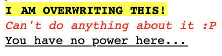

# Outgoing RichText Content as MIME Example

Let's say we want to retrieve the following RichText content as MIME:



We then set the value of `richTextAs` query parameter to `mime` (or leave it as blank because it'll be `mime` by default), and retrieve the document that contains it.

We should get a `multipart/mixed` MIME with its `content` encoded in `BASE64` in the RichText field response. Decoding it should yield the following:

```text
MIME-Version: 1.0
Content-Type: multipart/related; boundary=XXXXboundary text

--XXXXboundary text
Content-type: text/html; charset=UTF-8
Content-Disposition: inline
<html>
 <head></head>
 <body>
  <span style="font-family: monospace ; font-size: 10pt ; font-weight: bold ; color: #000000 ; ">I</span><span style="font-family: monospace ; font-size: 10pt ; font-weight: bold ; color: #000000 ; ">&nbsp;</span><span style="font-family: monospace ; font-size: 10pt ; font-weight: bold ; color: #000000 ; ">AM OVERWRITING THIS!</span>
  <br><span style="font-family: monospace ; font-size: 10pt ; font-style: italic ; color: #FF0000 ; ">Can't do anything about it :P</span>
  <br><span style="font-family: monospace ; font-size: 10pt ; text-decoration: underline ; ">You have no power here...</span>
 </body>
</html>
--XXXXboundary text--
```
