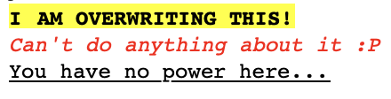

# Outgoing RichText Content as plain Example

Let's say we want to retrieve the following RichText content as plain:



We then set the value of `richTextAs` query parameter to `plain`, and retrieve the document that contains it.

We should get the following in the RichText field response:

```json
{
  "type": "text/plain",
  "encoding": "PLAIN",
  "content": "I AM OVERWRITING THIS!Can't do anything about it :P\n\nYou have no power here..."
}
```
