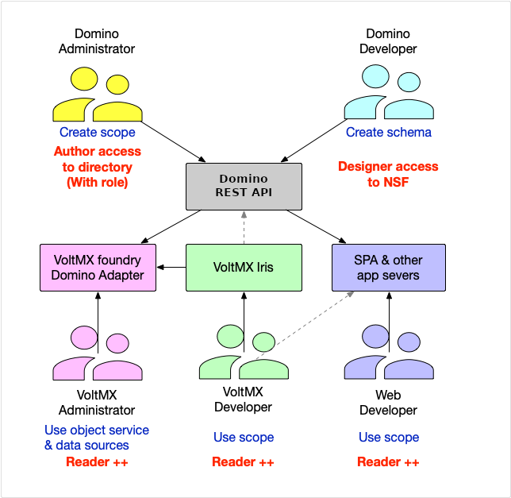

# Domino REST API roles
 
Every organization's size and structure vary and it's up to the organization whether multiple roles can be held by one person or team, or the organization might have specialized teams representing each role (or it's a mix of both).

## Domino developer

This role creates the **schema** that defines what data can be accessed in a nsf database. Schemas can be created using the Domino REST API, the Domino REST API GUI (Admin UI) or Domino designer editing the schema JSON file. Schemas are subject to standard inheritance rules, so a schema in a template will be inherited by databases derived from it.
To create, update, or delete a schema, the Domino developer must have a _Designer_ access or higher roles to the application database.

## Domino/Domino REST API administrator

This role creates and activates the **scope** that defines how the data can be accessed. Also creates (optional) OAuth compatible applications with `client_id` and `client_secret` properties. These activities can be completed using the Domino REST API or the Domino REST API GUI. The administrator needs `Editor` (or at least `Author` with the `[KeepAdmin]` role) to the `KeepConfig.nsf` database.

## Volt MX administrator

This role configures Volt MX's foundry middleware to interact with Domino REST API using the foundry Domino REST API adapter. Needs to be able to read data from a Domino REST API scope, so minimum access is `Reader`. The Domino adapter marshals user permissions to Domino REST API. There is no "database user" that holds all connections, but individual user permission.

## Volt MX developer

This role develops applications leveraging Domino REST API Endpoints, Volt MX services with the Volt Iris IDE. Needs to be able to read data from a Domino REST API scope, so minimum access is `Reader`. When the application wants to update data in Notes, higher access will be required.

You are not limited to Domino and Volt MX specific roles. Classical development is possible too!

<!-- {: .alert .alert-info} -->

## Web developer

This role develops applications leveraging Domino REST API Endpoints, Volt MX services using front-end tools like VSCode, Bootstrap or any tools and framework of choice. Needs to be able to read data from a Domino REST API scope, so minimum access is `Reader`. When the application wants to update data in Notes, higher access will be required.

## Mobile developer

This role develops applications using the SDKs native to the mobile OS like XCode or Android studio. Needs to be able to read data from a Domino REST API scope, so minimum access is `Reader`. When the application wants to update data in Notes, higher access will be required.

The **Volt Iris IDE** allows to create multi-device experiences without getting lost in device specifics.

<!-- {: .alert .alert-danger} -->
