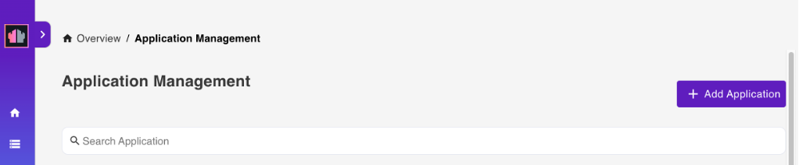
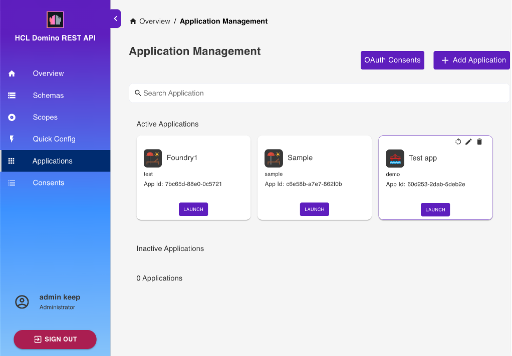

# Application Management

Select **Application Management - OAUTH** from the home page or **Applications** from the side navigation pane to access the **Application Management** page.

## View available applications

The **Application Management** page shows the list of all available applications.

{: style="height:80%;width:80%"}

<!--
The **Application Management** page shows the available applications in a table format.

!!!tip
    - Click the play button to launch the application.
    - Click the edit icon to update the details of the application.
    - Click the delete icon to delete the application. 
    - Click **Click to Generate App Secret** to generate an app secret. 
    - Use the **Search Application** search field to search for an application by name. 
    - Set the number of applications displayed on the page by selecting a value from **Rows per page**.
    - Use the pagination arrows to move back and forth through pages.

-->

## Add an application

1. On the **Application Management** page, click **Add Application** to add an application.

      <!--{: style="height:80%;width:80%"}-->

2. Under **Add New Application**, fill in the form and click **Add**.

      {: style="height:80%;width:80%"}
      
      **When your app accesses endpoints that run write operations in the `/setup-v1/` URL path, make sure to add the `$SETUP` scope aside from the `$DATA` scope** to enhance access control in relation to the app inheriting a user's access rights when the user grants app access. 

3. Click the application tile to access options to generate application secret, to edit, and to delete the application.

      {: style="height:80%;width:80%"}

<!-- ## Filter applications

You can use the filter function to filter which applications to display.

**To use the filter**

1. Click the filter icon. 

-->

## Access OAuth Consents

- On the **Application Management** page, click **OAuth Consents**. The **OAuth Consents** dialog opens.

All the information and features in the **OAuth Consents** dialog are the same to the information and features in the **OAuth Consents** page. For more information, see [OAUth Consents](oauthconsentui.md).