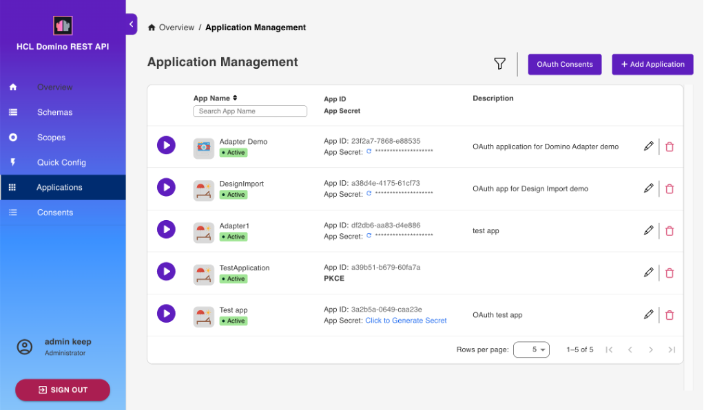

# Application Management

Select **Application Management - OAUTH** from the home page or **Applications** from the side navigation pane to access the **Application Management** page.

## List available applications

The **Application Management** page shows the list of all available applications.

{: style="height:80%;width:80%"}

## Add an application

1. On the **Application Management** page, click **Add Application** to add an application.

      {: style="height:80%;width:80%"}

2. Under **Add New Application**, fill in the form and click **Add**.

      Kindly note that when your app accesses endpoints that run write operations in the `/setup-v1/` URL path, make sure to add the `$SETUP` scope aside from the `$DATA` scope to enhance access control in relation to the app inheriting a user's access rights when the user grants app access. 

      {: style="height:80%;width:80%"}

3. Hover over the application tile to access options to generate Application Secret, and edit and delete the application.

      {: style="height:80%;width:80%"}