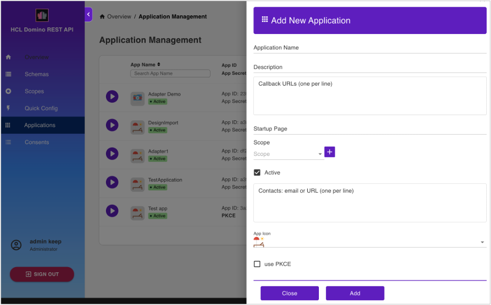

# Application Management

Select **Application Management - OAUTH** from the home page or **Applications** from the side navigation pane to access the **Application Management** page.

## View available applications

The **Application Management** page shows all available applications.

!!! tip

    - Click the play button to launch the application.
    - Click the **Edit Application** icon to update the details of the application.
    - Click the **Delete Application** icon to delete the application. 
    - Use the **Search App Name** search field to search for an application by name. 
    - Set the number of applications displayed on the page by selecting a value from **Rows per page**.
    - Use the pagination arrows to move back and forth through pages.

## Add an application

1. On the **Application Management** page, click **Add Application**.
2. Under **Add New Application**, fill in the form and click **Add**.

      

      The new application is now shown in the **Application Management** page.

!!! note

    - When adding a scope, select the scope from the **Scope** drop-down list and click the **Add Scope** icon.
    - **When your app accesses endpoints that run write operations in the `/setup-v1/` URL path, make sure to add the `$SETUP` scope aside from the `$DATA` scope** to enhance access control in relation to the app inheriting a user's access rights when the user grants app access.
    - Select the **use PKCE** checkbox if you want to use PKCE or Proof Key for Code Exchange, an extension to the authorization code flow to prevent cross-site request forgery and authorization code injection attacks. For more information about how PKCE works and how to implement PKCE, see [Authorization Code Flow with Proof Key for Code Exchange (PKCE)](https://auth0.com/docs/get-started/authentication-and-authorization-flow/authorization-code-flow-with-pkce "Opens a new tab"){: target="_blank" rel="noopener noreferrer"}&nbsp;{: style="height:15px;width:15px"}.

## Generate an app secret

!!! note

    This only applies to applications that use app secret as authentication method. This is not needed if you use PKCE as the authentication method. 

- For applications without a configured app secret, click the **Click to Generate Secret** text.
- For applications with a configured app secret, click the **Click to Generate Secret** icon&nbsp;{: style="height:2%;width:2%"}.

## Filter applications

You can use the filter function to filter which applications to display.

1. Click the filter icon. This opens the **Filter** pane.
2. Use any or all the filters as needed, and then click **Show Results**.

For more information on the filters, refer to the following table:

|Filter|Description|
|:----|:----|
|Status| Select **All** to display active and inactive applications.  Select **Active** to show only active applications.  Select **Inactive** to show only inactive applications.|
|Authentication method|Select **All** to display all applications.  Select **App secret** to show all applications that use app secret as authentication method.  Select **App secret generated** to show all applications that use app secret as authentication method and with the app secret already generated.  Select **App secret not generated** to show all applications that use app secret as authentication method but with the app secret not yet generated.  Select **PKCE** to show all applications that use PKCE.|

!!! tip

    Click **Reset** in the **Filter** pane to clear all filters. 

## Access OAuth Consents

On the **Application Management** page, click **OAuth Consents**. The **OAuth Consents** dialog opens.

All the information and features in the **OAuth Consents** dialog are the same to the information and features in the **OAuth Consents** page. For more information, see [OAUth Consents](oauthconsentui.md).
