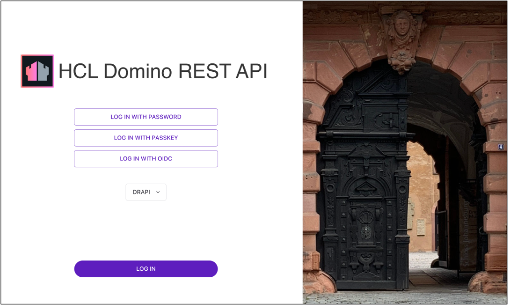
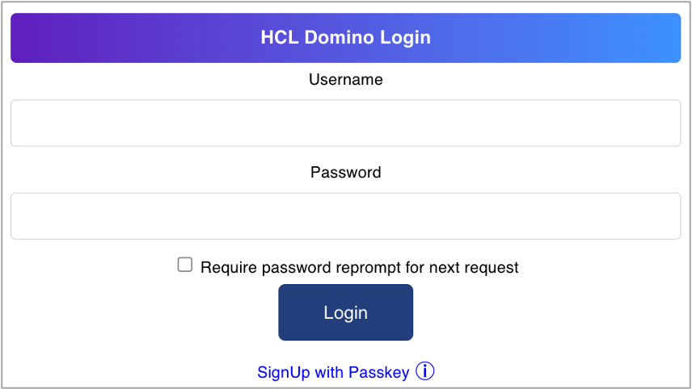

# Using Admin UI

## Overview

The **Admin UI** provides a user interface to several Domino REST APIs. It thus serves as an example of what a [React](https://reactjs.org/) application using the Domino REST APIs is capable of. It covers schema, scope, and app management. Anything that can be done using the Web UI can also be done using Postman, curl, Swagger UI, or similar tools. There are [tutorials](../../tutorial/index.md) to walk you through the same.

<!-- prettier-ignore -->
!!! note

    The screenshots in this section may vary. The screenshots are based on the latest Domino REST API snapshots. Make sure you're up-to-date.

This is what the login page looks like.

{: style="height:70%;width:70%"}

(Image: Castle [Johannisburg](https://en.wikipedia.org/wiki/Schloss_Johannisburg), Aschaffeburg, Germany)

You'll need the administrator username and password to access the server.

To use a Domino database in Domino REST API, it must be configured for use in the API. Download `Demo.nsf` from [Resources](../../references/downloads.md) and save it in the Notes data directory. Then login to the Domino REST API **Admin UI** using the administrator username and password.

## Log in options

There are options for logging in to the Domino REST API **Admin UI**.

### Log in with password

This option uses your Domino administrator username and password. You can log in to the **Admin UI** by entering your administrator username and password in the **Username** and **Password** fields, and clicking **LOG IN**.

!!! note

    If you have set up an external IdP to access the **Admin UI**, the **Username** and **Password** fields will not be visible by default. To display these fields, click **LOG IN WITH PASSWORD**. This allows you to enter your credentials and use the *Log in with password* option.

### Log in with passkey

This option enables users to log in with a passkey that enables signing in to websites without remembering and managing passwords using a biometric sensor, PIN, or pattern. For more information on how to log in with passkey, see [Use passkey to log in to Admin UI](../../howto/install/passkey.md).

### Log in with OIDC

This option uses the Domino REST API IdP by default and implements the OAuth process requiring user consent to log in. You can log in to the **Admin UI** by clicking **LOG IN WITH OIDC**. The **DRAPI** option will be the only one available from the drop-down field. Click **LOG IN**.

{: style="height:70%;width:70%"}

Enter you administrator username and password in the **Username** and **Password** fields in the **HCL Domino Login** page, and then click **Login**.  

{: style="height:70%;width:70%"}

If you have configured an external IdP to log in to the Admin UI, the *Log in with OIDC* will be the default login option. For more information on the needed configuration, see [Set up Admin UI external IdP login configuration](../../howto/IdP/adminuiidp.md).

You can log in to the **Admin UI** by selecting your external IdP from the down-down list, and clicking **LOG IN**. Use your external IdP authentication credentials and follow succeeding login instructions.

<!--If you have configured an external IdP to log in to the **Admin UI** and is only available after performing some configurations. For more information on the needed configurations, see [Set up Admin UI external IdP login configuration](../../howto/IdP/adminuiidp.md).

Once configured, a **LOG IN WITH {configured IdP name}** button is available on the **Admin UI** login page. You can log in to the **Admin UI** by clicking **LOG IN WITH {configured IdP name}**, using your IdP authentication credentials to log in, and following succeeding login instructions.-->

The following image shows an example of the **Admin UI** login page when the user configured their own external IdPs to log in to the **Admin UI**.

{: style="height:70%;width:70%"}

## Links

From the **Admin UI**, you can access the following:

- [Schema Management](schemaui.md)

- [Scope Management](scopeui.md)

- [Quick Config](quickconfigui.md)

- [Application Management](appui.md)

- [OAuth Consents](oauthconsentui.md)

<!--## Database Management - REST API

Select **Database Management - REST API** from the home page.-->