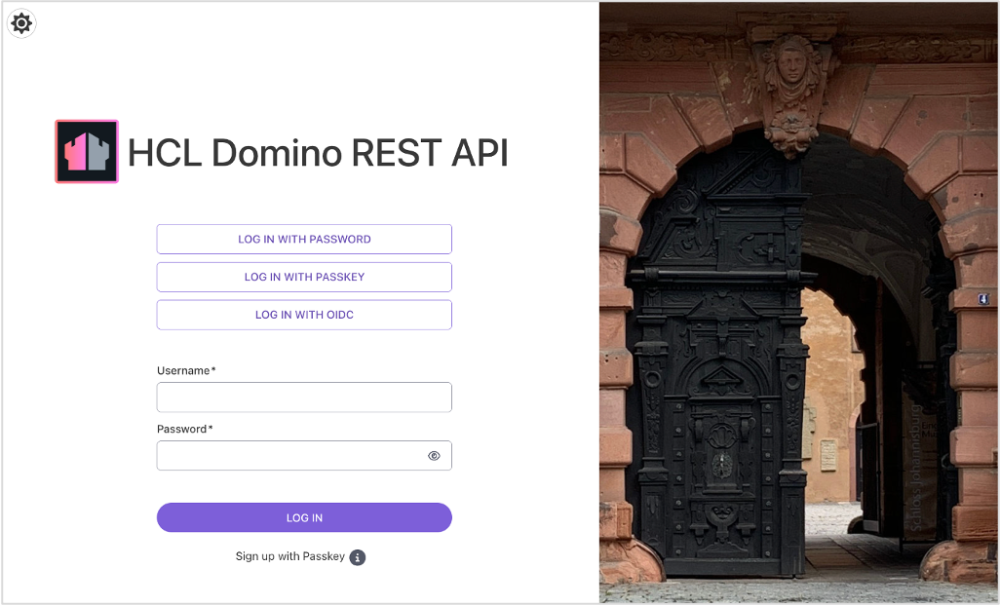
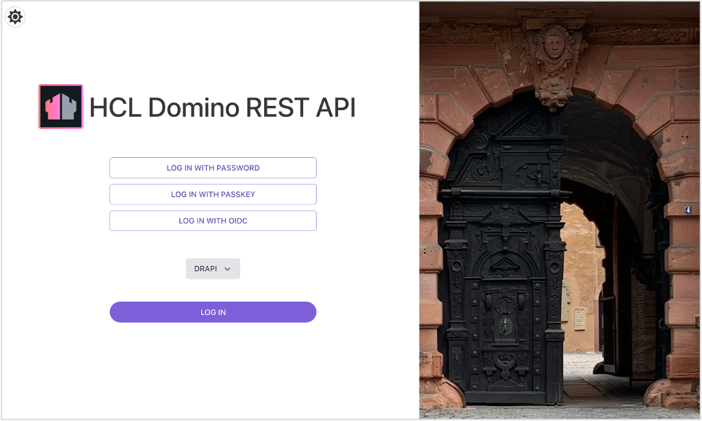
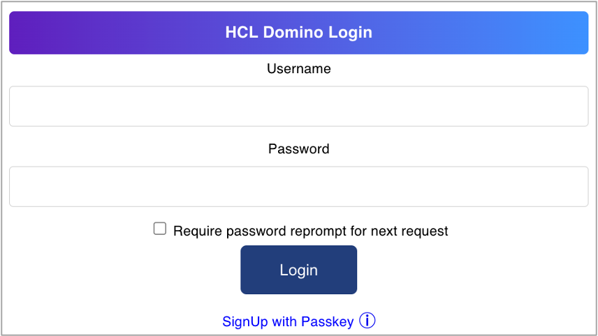
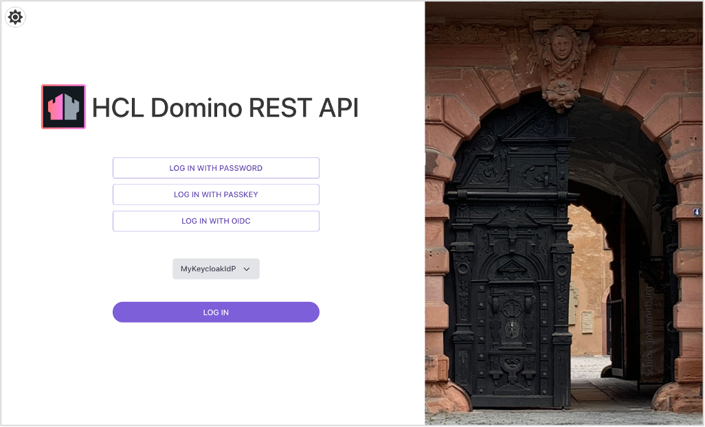

# Using Admin UI

## Overview

The **Admin UI** provides a browser‑based user interface to several Domino REST APIs. It demonstrates what a [React](https://reactjs.org/) application using the Domino REST APIs is capable of and includes functionality for:

- [Schema Management](schemaui.md)

- [Scope Management](scopeui.md)

- [Quick Config](quickconfigui.md)

- [Application Management](appui.md)

- [OAuth Consents](oauthconsentui.md)

Anything you can perform with the **Admin UI** can also be done using tools such as Postman, curl, Swagger UI. [Tutorials](../../tutorial/index.md) are available that walk through performing these tasks using different tools.

To use a Domino database in Domino REST API, it must be configured for use in the API. As an example, download the sample Domino database `Demo.nsf` from [Resources](../../references/downloads.md) and save it in your Domino server's Notes data directory. Then login to the **Admin UI** using an administrator account and configure the Domino database.

## Log in options

There are multiple options for logging in to the Domino REST API **Admin UI**, depending on how the system is configured.

{: style="height:70%;width:70%"}

(Image: Castle [Johannisburg](https://en.wikipedia.org/wiki/Schloss_Johannisburg), Aschaffeburg, Germany)

### Log in with password

To use this option, enter your Domino administrator credentials in the **Username** and **Password** fields, then click **LOG IN**.

!!! note

    If an external identity provider (IdP) has been configured for **Admin UI** access, the **Username** and **Password** fields may not be visible by default. To use this login option, click **LOG IN WITH PASSWORD** to display the fields.

### Log in with passkey

This login option lets you sign in with a passkey instead of a password. Your device authenticates you using methods such as biometrics, a PIN, or a pattern. To learn how to log in with a passkey, see [Use a passkey to log in to the Admin UI](../../howto/install/passkey.md).

### Log in with OIDC

The OIDC login option uses the Domino REST API IdP (identity provider) by default and implements the OAuth login flow requiring user consent.

!!! info

    If an external identity provider has been configured to log in to the Admin UI, the *Log in with OIDC* will be the default login option. For information about configuring an external IdP for Admin UI login, see [Set up Admin UI external IdP login configuration](../../howto/IdP/adminuiidp.md).

**To log in**:

1. Click **LOG IN WITH OIDC**.
2. Select the identity provider.

    - If only the default Domino REST API IdP option is available:

        1. Click **LOG IN**.

            {: style="height:70%;width:70%"}

        2. Enter your administrator username and password on the **HCL Domino Login** screen.

            {: style="height:70%;width:70%"}

        3. Click **Login**.

    - If an external identity provider has been configured:

        1. Select the desired IdP from the drop-down list.

            {: style="height:70%;width:70%"}

        2. Click **LOG IN**.
        3. Use your external IdP authentication credentials and follow the provider’s login instructions.
