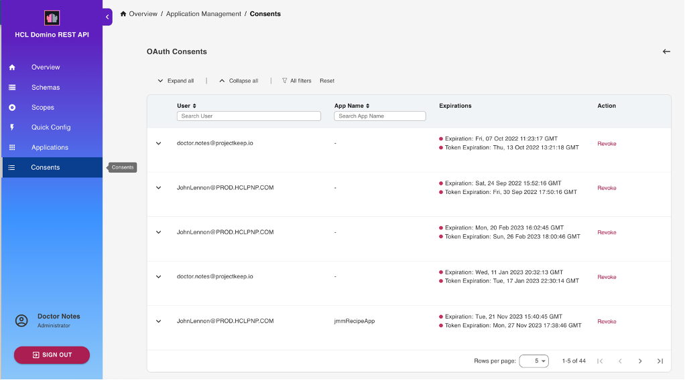

# OAuth Consents

## Overview

The **OAuth Consents** page in the **Admin UI** allows users to view, filter, inspect, and revoke OAuth authorizations granted for applications that integrate with the Domino REST API. It is essential to manage user consent and application permissions effectively.

In the Domino REST API context, an *OAuth consent* is a record that a specific user has authorized an application to access certain Domino resources, using standard OAuth/OIDC authorization flows.

## Access OAuth Consents page

1. Log in to the **Admin UI**.
2. In the side navigation pane, click **Consents** to open the **OAuth Consents** page. The page displays a list of all currently visible OAuth consents.

!!! note

    Users in the `LocalKeepAdmins` group or with *Manager* access level in the `oauth.nsf` ACL can view all consents and revoke them.
    
## View OAuth consents

The **OAuth Consents** page displays existing OAuth consents along with related details such as the user identity, application name, and expiration information.

{: target="_blank" rel="noopener noreferrer"}

You may:

- Use **Search User** to find consents by username.
- Use **Search App Name** to find consents by application name.
- Sort by user or app name in alphabetical/reverse order using the sorting arrow icons.
- Adjust the number of rows shown per page.
- Navigate using pagination arrows.
- Click the expand arrow icon next to an OAuth consent to display its scopes and callback URL.
- Click **Expand all** to display the scopes and callback URLs for all existing OAuth consents, and **Collapse all** to hide them.

## Filter OAuth consents

The **Filter** pane allows you to filter which OAuth consents to display based on the following key attributes:

|Filter|What it controls|
|:----|:----|
|Status| Shows all consents versus only active consents.|
|App name|Shows only consents with application.|
|Expiration|Shows consents regardless of expiration, with expiration, or matching a specific expiration date.|
|Token Expiration|Shows consents regardless of token expiration, with token expiration, or matching a specific token expiration date.|
|Scopes|Shows consents matching selected scopes.|

To use the filters:

1. Click **All filters** to open the **Filter** pane.
2. Set desired conditions.
3. Click **Show Results**.

To clear all filters, click **Reset**.

## Revoke authorized user consent

When an application should no longer have access to a user’s resources:

1. Find the appropriate OAuth consent in the list.
2. Click **Revoke** for that user/app pair.
3. Confirm by clicking **Yes** in the **Revoke Consent** dialog.

The consent is immediately removed, and the app will no longer have ongoing delegated access.

<!--
Select **Consents** from the side navigation pane to access the **OAuth Consents** page, which allows the current user to view and revoke available OAuth consents. 

## View OAuth consents

The **OAuth Consents** page shows available OAuth consents. 

!!! note

    Users logged into the Admin UI that are in the `LocalKeepAdmins` group or are Managers in the `oauth.nsf` ACL will see all user consents and can revoke them as well.

{: target="_blank" rel="noopener noreferrer"}

!!! tip

    - Use the **Search User** or **Search App Name** search fields to search a specific OAuth consent.
    - Use the **User** and **App Name** sorting arrow icons to sort the OAuth consents by user or app name in an alphabetical or reverse alphabetical order. 
    - Set the number of OAuth consents displayed on the page by selecting a value from **Rows per page**.
    - Use the pagination arrows to move back and forth through pages.
    <!-- Click the **Go to Applications** icon on the upper right side of the **OAuth Consents** page to return to the **Application Management** page.

## View OAuth consent details

**To show details of a specific OAuth consent**

- Click the expand arrow icon corresponding to a user in the list to show OAuth consent details, such as scope and URL.

!!! tip

    Clicking the collapse arrow icon corresponding to the user in the list with shown OAuth consent details hides the shown details.

**To show details of all OAuth consents**

- Click **Expand all** to show details of all the OAuth consents.

!!! tip

    Clicking **Collapse all** hides the details of all the OAuth consents. 

## Filter OAuth consents

You can use the filter function to filter which OAuth consents to display.

**To use the filter**

1. Click **All filters**. This opens the **Filter** pane.
2. Use any or all the filters as needed, and then click **Show Results**. 

For more information on the filters, refer to the following table:

|Filter|Description
|:----|:----|
|Status| Select **All** to display active and expired OAuth consents.  Select **Active** to show only active OAuth consents.|
|App name|Click the toggle to show only consents with application.|
|Expiration|Select **All** to display all OAuth consents regardless of expiration.  Select **None** to display OAuth consents without expiration.  Select **Custom** and then select a specific expiration date from the date picker to show only OAuth consents with expiration matching the selected expiration date.|
|Token Expiration|Select All to display all OAuth consents regardless of token expiration.  Select **None** to display OAuth consents without token expiration.  Select **Custom** and then select a specific token expiration date from the date picker to show only OAuth consents with token expiration matching the selected token expiration date.|
|Scopes|Select the scopes to show only OAuth consents with scopes matching the selected scopes.|

!!! tip

    Click **Reset** to clear all filters. 

## Revoke authorized user

1. Click **Revoke** corresponding to the authorized user in the list that you want the authorization revoked.
2. In the **Revoke Consent** dialog, click **Yes**.

The user is now removed from the authorized users list.
-->