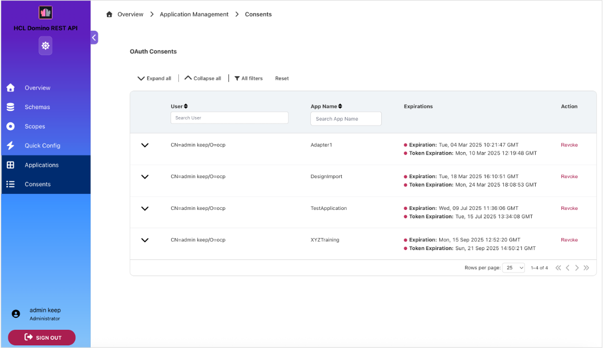

# OAuth Consents

## Overview

The **OAuth Consents** page in the **Admin UI** allows users to view, filter, inspect, and revoke OAuth authorizations granted for applications that integrate with the Domino REST API. It is essential to manage user consent and application permissions effectively.

In the Domino REST API context, an *OAuth consent* is a record that a specific user has authorized an application to access certain Domino resources, using standard OAuth/OIDC authorization flows.

## Access OAuth Consents page

1. Log in to the **Admin UI**.
2. On the home page, select **Consents Management - OAUTH** to open the **OAuth Consents** page. You can also access the **OAuth Consents** page by clicking **Consents** in the side navigation pane.

    The **OAuth Consents** page displays a list of all currently visible OAuth consents.

!!! note

    Users in the `LocalKeepAdmins` group or with *Manager* access level in the `oauth.nsf` ACL can view all consents and revoke them.
    
## View OAuth consents

The **OAuth Consents** page displays existing OAuth consents along with related details such as the user identity, application name, and expiration information.

You may:

- Use **Search User** to find consents by username.
- Use **Search App Name** to find consents by application name.
- Sort by user or app name in alphabetical/reverse order using the sorting arrow icons.
- Adjust the number of rows shown per page.
- Navigate using pagination arrows.
- Click the expand arrow icon next to an OAuth consent to display its scopes and callback URL.
- Click **Expand all** to display the scopes and callback URLs for all existing OAuth consents, and **Collapse all** to hide them.

## Filter OAuth consents

The **Filter** pane allows you to filter which OAuth consents to display based on the following key attributes:

|Filter|What it controls|
|:----|:----|
|Status| Shows all consents versus only active consents.|
|App name|Shows only consents with application.|
|Expiration|Shows consents regardless of expiration, with expiration, or matching a specific expiration date.|
|Token Expiration|Shows consents regardless of token expiration, with token expiration, or matching a specific token expiration date.|
|Scopes|Shows consents matching selected scopes.|

To use the filters:

1. Click **All filters** to open the **Filter** pane.
2. Set desired conditions.
3. Click **Show Results**.

To clear all filters, click **Reset**.

## Revoke authorized user consent

When an application should no longer have access to a user’s resources:

1. Find the appropriate OAuth consent in the list.
2. Click **Revoke** for that user/app pair.
3. Confirm by clicking **Yes** in the **Revoke Consent** dialog.

The consent is immediately removed, and the app will no longer have ongoing delegated access.
