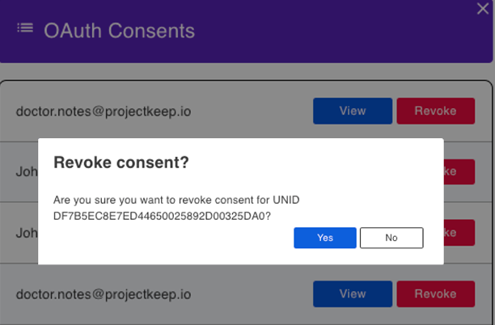

# OAuth Consents

Allows the current user to view and revoke available OAuth consents. 

### View OAuth consent list

Click **OAuth Consents** from the navigation pane. 

{: style="height:80%;width:80%"}

This opens the **OAuth Consents** pane. 

{: style="height:80%;width:80%"}

!!!note
    Users logged into the AdminUI that are in the `LocalKeepAdmins` group or are Managers in the `oauth.nsf` ACL will see all user consents and can revoke them as well.

### View OAuth consent details

Click **View** corresponding to a user in the list to show OAuth consent details, such as scope, app name, URL.

{: style="height:80%;width:80%"}

### Revoke authorized user

1. Click **Revoke** corresponding to a user in the list that you want the authorization revoked.
2. In the **Revoke Consent** dialog, click **Yes**. 

{: style="height:80%;width:80%"}

The user is now removed from the authorized users list.
