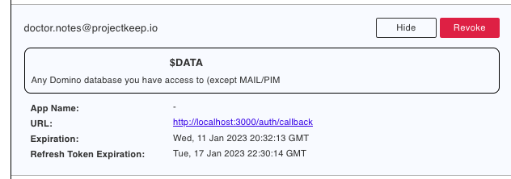

# OAuth Consents

Allows the current user to view and revoke available OAuth consents. 

### View OAuth consent list

<!--

To view the OAuth consent list:

- Click **OAuth Consents** from the navigation pane to open the **OAuth Consents** page.
 
    !!!tip
        Clicking the **Go to Applications** icon on the **OAuth Consents** page returns you to the **Application Management** page. 
 
- Click **OAuth Consents** on the **Application Management** page to open the **OAuth Consents** dialog. 

-->

Click **OAuth Consents** from the navigation pane. 

{: style="height:80%;width:80%"}

This opens the **OAuth Consents** pane. 

{: style="height:80%;width:80%"}

!!!note
    Users logged into the AdminUI that are in the `LocalKeepAdmins` group or are Managers in the `oauth.nsf` ACL will see all user consents and can revoke them as well.

### View OAuth consent details

Click **View** corresponding to a user in the list to show OAuth consent details, such as scope, app name, URL.

{: style="height:80%;width:80%"}

<!--

The **OAuth Consents** page and the **OAuth Consents** dialog show the same information, such as authorized users, the name of their applications if available, and corresponding expiration details.

!!!tip
    - Click the expand arrow icon corresponding to an authorized user to show the callback URL and scope names of the user’s application. Click the collapse arrow icon to hide the details. 
    - Click the Expand all arrow icon to show the callback URL and scope names of the applications of all the users. Click the Collapse all arrow icon to hide the application details for all users. 
    - Select the number of rows displayed per page to regulate the number of displayed users per page. Click the pagination icons to move between pages.    

-->

### Revoke authorized user

1. Click **Revoke** corresponding to a user in the list that you want the authorization revoked.
2. In the **Revoke Consent** dialog, click **Yes**. 

{: style="height:80%;width:80%"}

The user is now removed from the authorized users list.

<!--

To revoke an authorized user:

Click **Revoke** corresponding to the authorized user that you want the authorization revoked.
Click **Yes** in the **Revoke consent** dialog.

-->