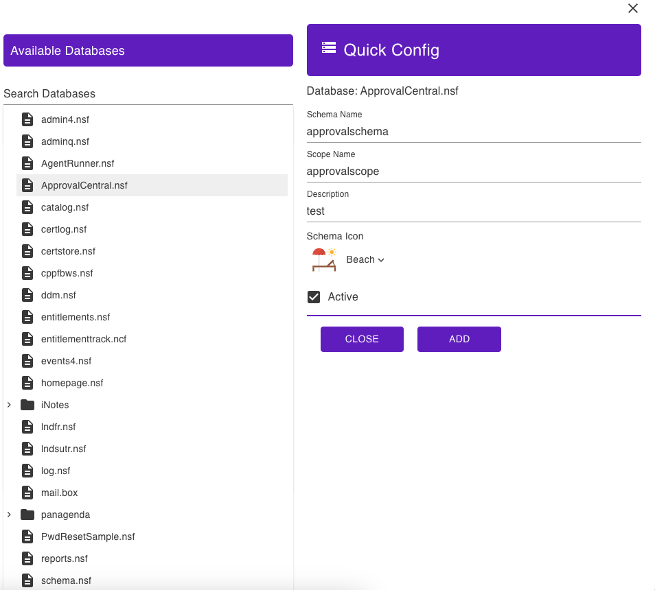

# Quick Config
   
The **Quick Config** icon displays the document's structure by allowing you to choose the `nsf` database file, schema, and scope name from a single window.  

1. Click **Quick Config** icon. **Quick config** window shows.
2. Search and select `.nsf` database file.
3. Fill-in the name of your **schema**, **scope** and **description**.
4. Choose from the list of schema icon.
5. Click **Add**.

    