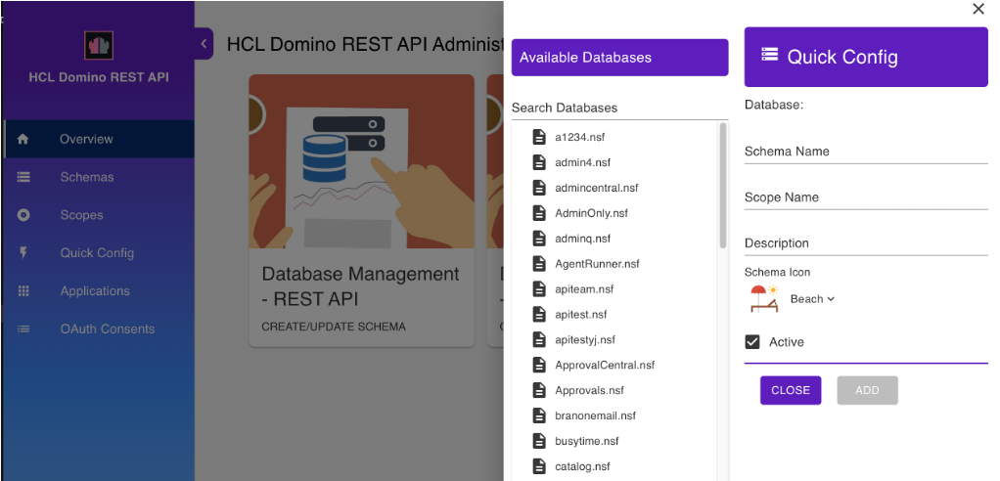

# Quick Config

## Overview

The **Quick Config** page in the **Admin UI** lets you create a schema and an associated scope in one operation.

## Use Quick Config

1. Open the **Admin UI**.
2. From the side navigation pane, choose **Quick Config**. The **Quick Config** pane opens.

    

3. In **Available Databases**, search for and select the target database you want to enable for REST access.
4. Provide the basic details:

    - **Schema Name**: A descriptive name for the schema.
    - **Scope Name**: A unique identifier for this schema’s scope.
    - **Description**: Add notes about what this configuration is for.

5. Choose a **Schema Icon** to help visually identify this schema.
6. Choose **Additional Modes** as required.
7. Click **Add**.

After completing these steps:

- The created schema appears on the **Schema Management** page.
- The created scope appears on the **Scope Management** page.
