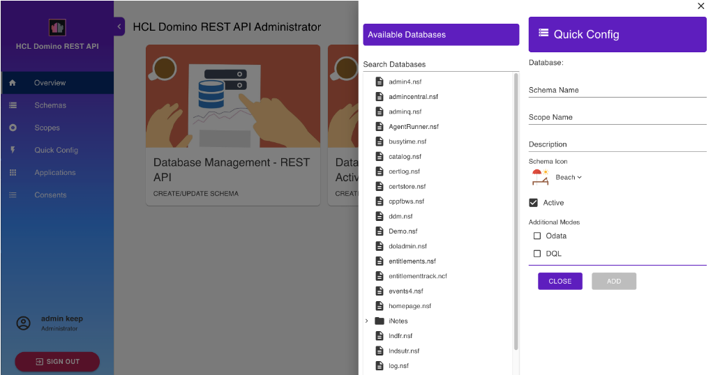

# Quick Config
   
The **Quick Config** enables you to create a schema and a scope at the same time. 

**To quick configure a schema and a scope**:

1. Click **Quick Config** from the side navigation pane. The **Quick Config** pane opens.

    

2. Search and select a database from the list of **Available Databases**.
3. Enter the **Schema Name**, **Scope Name**, and **Description**.
4. Choose a **Schema Icon**.
5. Click **Add**.

After completing the steps, you can now see the created schema on the **Schema Management** page and the created scope on the **Scope Management** page. 