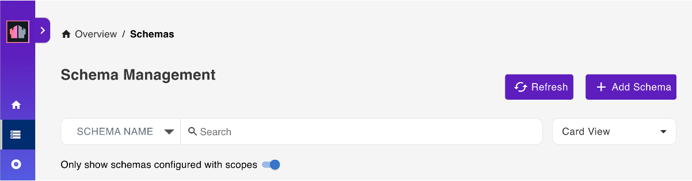
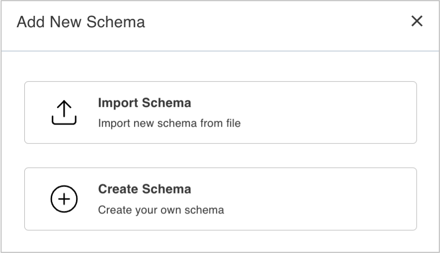
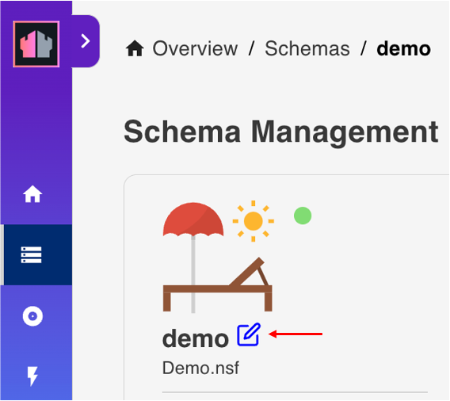
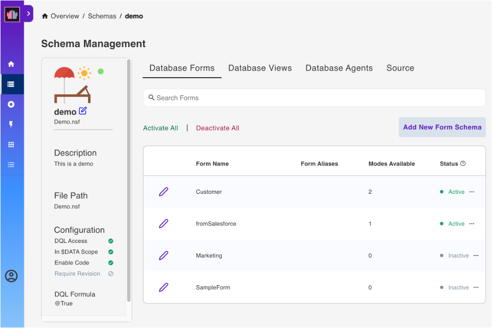
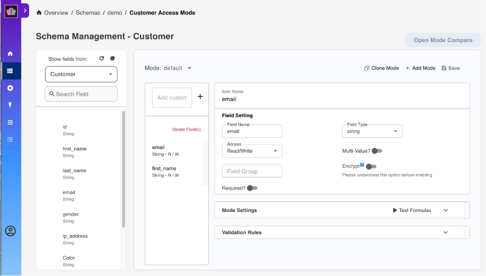
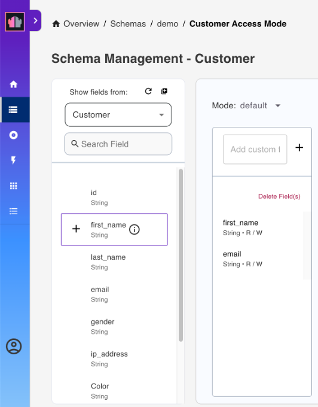
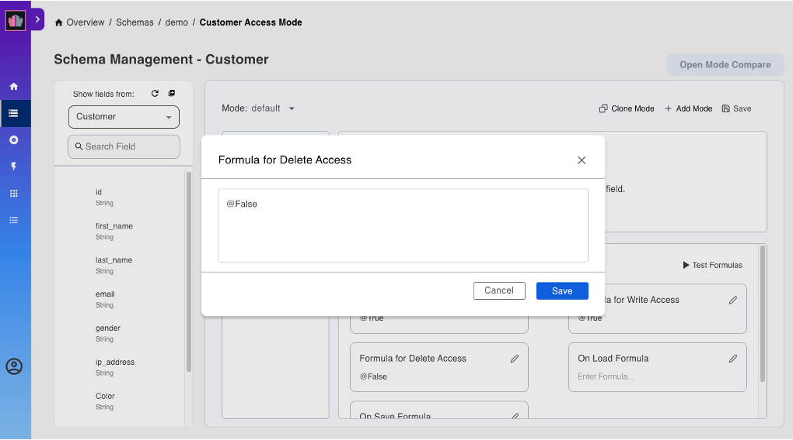
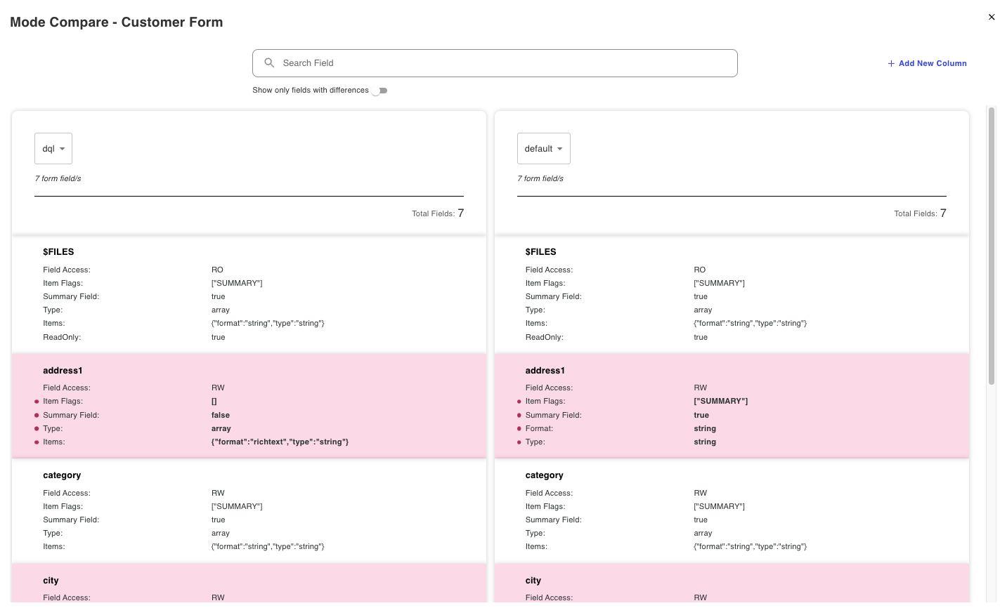

# Schema Management

Select **Database Management - REST API** from the home page or **Schemas** from the side navigation pane to access the **Schema Management** page.

## View available database schemas

The **Schema Management** page shows the available schemas.

You can arrange the schemas in **Stack View**, **Card View**, **Alphabetical View**, or **NSF View**. There is also a provision to search through the list either via **Schema Name** or **NSF Name**.

## Add a schema

The shape of data available is referred to as a schema. The schema is a JSON file in the design resources of the database. It gets created by a developer with Designer access to the NSF.

This creates an alias to the schema. This, along with a scope, provides access to the database via the Domino REST API. One NSF can have multiple schemas, which is useful to provide different data sets or different levels of access to data.

You can add a schema by [creating your own schema](#create-a-schema) or [importing a schema](#import-a-schema).

### Create a schema

1. On the **Schema Management** page, click **Add Schema**.

      

2. In the **Add New Schema** dialog, click **Create Schema**.

      {: style="height:80%;width:80%"}

3. In the **Create Schema** dialog:

      1. Select a database from the **Database** drop-down list.

         You can also enter the database name in the **Database** field to filter the list of available databases.

      2. Select an **Icon**.
      3. Enter a **Schema Name** and a **Schema Description**.
      4. Click **Save Schema**.

### Import a schema

Use this option if you want to import a new schema from a JSON file produced by [exporting database schema as JSON file](../../howto/database/exportsourcejson.md).

1. On the **Schema management page**, click **Add Schema**.
2. In the **Add New Schema** dialog, click **Import Schema**.
3. Select the JSON database file and click **Open**. The JSON database file is the exported file from another database or within your server.

4. In the **Import Schema** dialog:
      1. Choose the `.nsf` database from the **Import Into Database** dropdown list. The default `.nsf` is from the imported database JSON file.
      2. Update the **Icon**, **Schema Name**, **Schema Description**, and **Formula Engine** as needed. 
      3. Click **Save Schema**. 

The `nsf` database file and schema are added to the schema list.

!!! note

    The imported schema name must be unique. You'll be warned if you try to save a schema to a database that already has a schema with the same name.

## Edit a schema

1. On the **Schema Management** page, select the schema you want to edit.
2. In the schema details card, click the edit icon.

      {: style="height:50%;width:50%"}

3. In the **Edit Schema** dialog:

      - You can select a new icon from the drop-down icon list.
      - You can update the description of the schema in the **Description**.
      - You can update the configuration by clicking the toggles to enable or disable the configuration settings. For more information, refer to the following table:

      |Configuration setting|Description|
      |----|----|
      |DQL Access|Enable the setting to allows DQL queries to run against the elements of the schema. A mode named `dql` must be created on each form specifying the fields allowed for that form.|
      |In $DATA Scope|Enable the setting to make schema available in the system `$DATA` scope. Disable the setting to limit access to the schema to those with the specific scope. |
      |Enable Code|*feature under development*|
      |Require Revision|Enable the setting to require the provision of the correct revision version of the document to update the document through an update endpoint.|
      |Prevent Design Refresh|Enable the setting to flag the schema written to the database, so the Domino design task won't replace or delete the schema.|

      <!--|Allow Decryption|*feature under development*|-->

      - You can enter a valid Notes formula in **DQL Formula** to limit DQL usage. The formula must evaluate to `@True` for DQL to be allowed. The default is `@True`, which means no limitations.

        {: style="height:80%;width:80%"}

4. Click **Save**.

## List available database forms

1. Select a schema from the list of schemas to load the details.
2. Select **Database Forms** from the menu bar to show the list of all the forms for the selected database schema.

      

## Add new form schema

The **Add New Form Schema** feature enables the creation of a new custom form through which you can set up a schema. The feature doesn't create a new form on the backend, so it won't exist in the database. Everything related to the new form is contained within the schema. Therefore, if you delete the form, it's only removed from the list of forms on the **Database Forms** tab.

1. Click **Add New Form Schema**.
2. In the **Add New Form Schema** dialog, enter your schema name and click **Create**.
3. On the **Schema Management - <schema name\>** page, select a form from the **Show fields from** dropdown field to display the fields of the selected form. You can also select **All Fields** from the dropdown field to display all the fields from all the available forms.
4. Select the fields that you want to add to the mode.
5. Configure the **Field Setting** and **Mode Settings** as needed for each added field.
6. Click **Save**.

The new form is now added to the list of forms and has an **Active** status.

!!!note
     - The form created using this feature can't be deactivated and can only be deleted. To delete the form, click the menu icon beside the form's status and select **Delete**. In the **WARNING: Deleting Custom Form** dialog, click **Yes** to confirm.
     - You can identify a custom form by the marker beside the form name and by the *custom form* text below the form name.

## Activate a form

**To activate a specific form or forms**

- Select the form that you want to activate, click the corresponding menu icon beside the form's status, and then select **Activate**.

The activated form now has an **Active** status.

!!! tip
    Clicking the menu icon and selecting **Deactivate** corresponding to a form deactivates the form. In the **Reset Form** dialog, click **Yes** to confirm. The form now has an **Inactive** status.

**To activate all forms**

- Click **Activate All**.

All forms are now activated with default settings and have **Active** status.

!!! tip

    - Clicking **Deactivate All** deactivates all active forms and removes all the configurations you have made to each of the forms. In the confirmation dialog, click **Yes** to confirm. All forms now have an **Inactive** status.

    - Clicking **Deactivate All** won't deactivate forms created using the [Add New Form Schema](#add-new-form-schema) feature.  

## Change form configuration

1. On the **Database Forms** tab, click the pencil icon corresponding to the activated form that you want to edit.

    {: target="_blank" rel="noopener noreferrer"}

    !!!note
        Clicking the pencil icon corresponding to an inactive form shows the **Activate Form** dialog, which requires you to confirm the activation of the form. If you click **OK**, the form is activated, and you are directed to the form **Access Mode** page. 

    The **Access Mode** page opens showing the `default` access mode.

    {: target="_blank" rel="noopener noreferrer"}

2. Under **Show fields from**, hover over a field item and click the **+** icon. This adds the field in the form. Repeat this for all the fields to be added.

    [{: style="height:50%;width:50%"}](../../assets/images/addfield.png "Click to open in a new tab"){: target="_blank" rel="noopener noreferrer"}

    !!! tip

        - Click **Add All Fields** icon to add all the available fields to the form.
        - Click **Refresh List of Fields** icon to refresh the list of avaialble fields.
        - Use the **Search Field** search box to search for a field by field name.
        - Hover over the **Info** icon beside the field name to show the field property. The field can be *editable*, which means that the field has **Read/Write** access setting. The field can also be either *computed*, *computed when composed*, or *computed for display*, which means that the field has **Read Only** access setting.
        - Enter a custom field name in the **Add custom field** and click the **+** icon to add a custom field to the form.
        - Click **Delete Fields**, select the fields to remove, and then click **Remove** to remove the selected fields from the form.

3. Under **Field Setting**, you can set the **Field Name**, **Field Type**, and the read or write access of the field in the form.

    !!! tip

        - Click the **Multi-Value** toggle to the on position to specify a **Field Group**. The **Multi-Value** toggle isn't clickable to the off position if you specified a field group.
        - Click the **Required** toggle to the on position to specify that the field is a required field. When set to the on position, the word *Required* is added below the name of the field in the added field list.

    !!!note "Encryption feature"

        The encryption feature is available starting from the Domino REST API v1.1.0 release. Make sure to [set up Domino REST API for encryption, decryption, and signing](../../howto/production/signencrypt.md) before executing the following steps for encryption and signing.

        Click the **Encrypt** toggle to the on position to enable encryption. For more information on encryption and signing, see [Using encryption, decryption, and signing during development](../usingdominorestapi/encryptsign.md).

4. Under **Mode Settings**:

      1. Click the pencil icon corresponding to a mode formula. A dialog opens.

          The following image shows the opened **Formula for Delete Access** dialog.  

          {: target="_blank" rel="noopener noreferrer"}
          <!--{: target="_blank" rel="noopener noreferrer"}-->

      2. In the text field in the dialog, edit the `@True` or `@False` entry and click **Save** to close the dialog.

      As a provided option, you may test the formula using the [Test Formulas](../../howto/production/testformulas.md).

    !!! note "Signing feature"

        The signing feature is available starting from the Domino REST API v1.1.0 release. Make sure to [set up Domino REST API for encryption, decryption, and signing](../../howto/production/signencrypt.md) before executing the following steps for encryption and signing.

        Click the **Sign Document** toggle to the on position to enable this feature. For more information on encryption and signing, see [Using encryption, decryption, and signing during development](../usingdominorestapi/encryptsign.md).

5. (**Optional**) Under **Validation Rules**:

      1. Click **Add Rule** if you want to add a validation rule to validate the value of a field. The **Add Rule** dialog opens.
      2. Enter the validation formula in the **Formula** field and the error message in the **Error Message** field.
      3. Click **Add**.

    ??? example "Example of validation rule"  

        The image shows an example of an added validation rule requiring that the value of the `first_name` field must be *Adam*.

        {: style="height:70%;width:70%"}

    ??? tip "Tips for validation rules"

        - You can add a validation rule for each field you added to the database form. 
        - To delete a validation rule, select the validation rule and then click **Delete Rule**. In the confirmation dialog, click **Delete**.
        - You can go to [OpenAPI](../../tutorial/swagger.md) to check if the added validation rule works. As an example, an error occurs showing the provided error message when creating a document with the `first_name` field having a value of *George* since it is not equal to the value set by the formula, which is *Adam*.

            The image shows the document being created with an incorrect value for the first_name field. Click the image for better viewing.

            [{: style="height:75%;width:75%"}](../../assets/images/validationrule1.png "Click to open in a new tab"){: target="_blank" rel="noopener noreferrer"}

            The image shows the error message. Click the image for better viewing

            [{: style="height:75%;width:75%"}](../../assets/images/validationrule2.png "Click to open in a new tab"){: target="_blank" rel="noopener noreferrer"}

6. Click **Save**.

## Add a mode

1. On the **Database Forms** tab, click the pencil icon corresponding to the activated form that you want to add a mode. The form **Access Mode** page opens showing the `default` access mode.
2. Click **Add Mode**.
3. In the **Add New Mode** dialog, enter the name of the new mode and click **Save**. The new mode has been added to the `Mode`list.

      The following image shows an example of the added mode, which is the `dql`.

      {: target="_blank" rel="noopener noreferrer"}

4. Add fields and set the read or write access formula for each of the added fields. 
5. Click **Save**.

## Clone a mode

Use **Clone Mode** to add a new mode based on an existing mode in the same schema.

1. On the **Database Forms** tab, click the pencil icon corresponding to the activated form that you want to clone a mode. The form **Access Mode** page opens showing the `default` access mode.
2. From the **Mode** dropdown list, choose the mode you want to clone, for example the `default` mode.
3. Click **Clone Mode**.
4. In the **Clone <mode name\>** dialog, enter the name of the mode and click **Save**. 

      The new mode cloned from an existing mode is now available. You can remove or add fields to the new mode and read or write access formula for each of the fields.

5. Click **Save**.

## Compare modes

Use this function to see the differences between the modes of a selected form. To use this function, you must have at least two modes in your selected form.

1. On the **Database Forms** tab, click the pencil icon corresponding to the activated form that you want to compare the modes. The form **Access Mode** page opens showing the `default` access mode.
2. Click **Open Mode Compare**. The **Mode Compare - <form name\>** page opens.
3. Select the modes to compare from the drop-down lists in the comparison columns. The comparison result is displayed.

!!! note

    - A field available in only one mode is highlighted, and then indicated as **Field not existing** in the other mode. 
    - Fields with differences are highlighted. 

!!! tip
    - Click the **Show only fields with differences** toggle to only show fields with differences.
    - In case there are too many fields, and you want to find a specific field, you can enter the field name in the **Search Field** to only display the specific field if available.
    - Click **Add New Column** to add more modes in the comparison.
    - Click the close icon to close the **Mode Compare - <form name\>** page.

## List available database views

1. Select a schema from the list of schemas to load the details.
2. Select **Database Views** from the menu bar. This lists all the views for the selected schema.

      

## Activate a view

**To activate a specific view or views**:

- Select the view that you want to activate, and then click the corresponding **Active** option under **Status**.

!!! tip

    Clicking the **Inactive** option corresponding to a view deactivates the view. On the **Reset Views Columns** dialog, click **Yes** to confirm deactivation of the view. 

**To activate all views**:

- Click **Activate All**.

!!! tip

    Clicking **Deactivate All** deactivates all active views and removes all configurations you have made to each of the views. On the **Reset ALL View Columns** dialog, click **Yes** to confirm deactivation of all views.

## Edit a view

See [Edit a database view of a schema](../../howto/database/editviewcolumn.md) for more information.

## List available database agents

1. Select a schema from the list of schemas to load the details.
2. Select **Database Agents** from the menu bar. This lists all the Agents for the selected database.

      

## Activate an agent

**To activate a specific agent or agents**

- Select the agent you want to activate, and then click the corresponding **Active** option under **Status**.

!!! tip

      Clicking the **Inactive** option corresponding to an agent deactivates the agent.

**To activate all agents**

- Click **Activate All**.

!!! tip
      Clicking **Deactivate All** deactivates all active agents. On the **Reset ALL Agents** dialog, click **Yes** to confirm the deactivation of all agents.

## View Source

The **Source** tab allows you to view the database schema details in JSON format.

1. Select a schema from the list of schemas to load the schema details.
2. Select **Source** from the menu bar to show the details for the selected schema in the following view mode:

      - **Text View** - shows the text view of the details of the selected schema in JSON format
      - **Tree View** - shows the collapsible view of the details of the selected schema in JSON format

!!!note
      - To edit the database schema JSON details, see [Edit database schema JSON](../../howto/database/editsourcejson.md).

      - To export the schema in a JSON file, see [Export schema as JSON file](../../howto/database/exportsourcejson.md).
