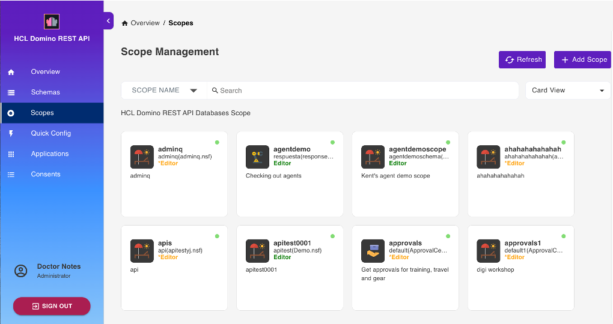

# Scope Management

Select **Database Management - Activation** from the home page or **Scopes** from the side navigation pane to access the **Scope Management** page.

## View available scopes

The **Scope Management** page shows the available scopes.

You can arrange the scopes in **Stack View**, **Card View**, **Alphabetical View**, or **NSF View**. There is also a provision to search through the list either via **Scope Name** or **NSF Name**.

## Add a scope

!!!tip
    A scope points to a schema that's contained in a database. A database can have many schemas for different use cases and a schema can be pointed to by more than one scope.

1. On the **Scope Management** page, click **Add Scope** to add a database.

      

2. Under **Available Schema**, select the schema that the scope will belong to.
3. Under **Add New Scope**, fill in the form and click **Add**.

    - For the **Server** field, enter the name of the server the scope is available on, or leave it blank for the current server. The value of the entered name must be either the server's hierarchical name or in canonical format. See the following examples for reference:

        - MyServer/MyOrg
        - CN=MyServer/O=MyOrg

    - For the **Maximum Access Level**, the default is **Editor**. You can set it to another value to set the scope's maximum access anyone using the scope has. 

!!!note
    The **Maximum Access Level** prevents an app that has inherited a user's access rights when the user grants the app access from unauthorized altering of schemas or access control lists.  To know more about what each access level allows and to whom the access level is assigned, see [Access levels in the ACL](https://help.hcltechsw.com/domino/14.0.0/admin/conf_accesslevelsintheacl_c.html).
   
## Edit a scope

1. On the **Scope Management** page, click the scope that you want to edit. 
2. In the **Edit Scope** pane, edit the details that you want to change.
3. Click **Update**.

!!!note
    You can only edit the **Description**, **Server**, **Maximum Access Level**, and **Scope Icon**. 

## Delete a scope

1. On the **Scope Management** page, click the scope that you want to delete.
2. In the **Edit Scope** pane, click **Delete**. 
3. In the delete confirmation dialog, click **Yes**. 
