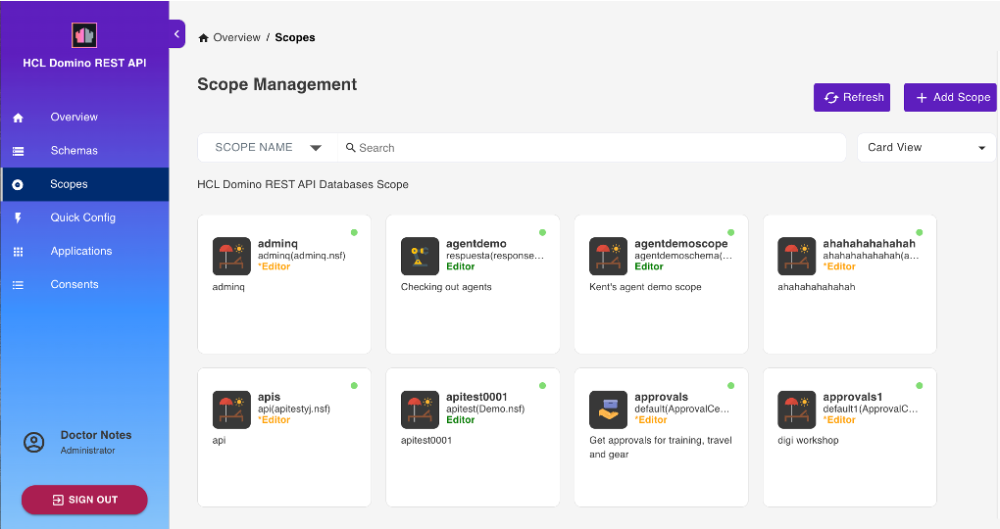
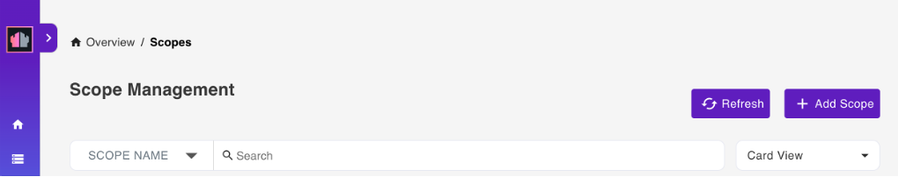
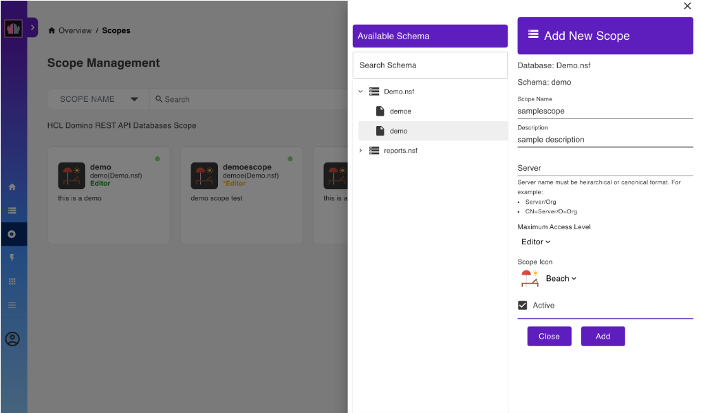

# Scope Management

## Overview

The **Scope Management** page in the **Admin UI** lets you manage scopes. A scope is a name or identifier used to access a Domino database via the REST API, where each scope points to a specific schema in the database. A database can have many schemas for different use cases and a schema can be pointed to by more than one scope.

For more information about scopes, see [Schema and Scope](../schemacomponents/schemascope.md) and [Scopes](../schemacomponents/scopes.md).

## Access Scope Management

1. Log in to the **Admin UI**.
2. On the home page, select **Database Management - Activation** to open the **Scope Management** page.

    You can also access the **Scope Management** page by clicking **Scopes** in the side navigation pane.

## View available scopes

On the **Scope Management** page, you can see existing scopes in different layouts:

- Stack View
- Card View
- Alphabetical View
- NSF View

Use the **Search** field and the search filter to find scopes by **Scope Name** or by **NSF Name**.

## Add a scope

A Domino administrator typically creates scopes after a developer has created the corresponding schema.

1. On the **Scope Management** page, click **Add Scope**

    

2. Under **Available Schema**, select the schema to associate with the new scope.
3. Under **Add New Scope**, fill in the fields:

    - **Scope Name** — Enter a name for the scope.
    - **Description** — Describe what this scope represents.
    - **Server** — Enter the name of the Domino server where this scope will be available or leave blank to use the current server.

        The server name must be either the server's hierarchical name, for example MyServer/MyOrg or in canonical format, for example CN=MyServer/O=MyOrg.

        --8<-- "scopenote.md"

    - **Maximum Access Level** — Select the level of access permitted through this scope, with the default set to *Editor*. This setting defines the maximum level of access available via the Domino REST API but does not override the database ACL. A user’s effective access is determined by the lower of their assigned ACL permissions and the scope’s configured maximum access level.

        !!! note

            The **Maximum Access Level** prevents an app that has inherited a user's access rights when the user grants the app access from unauthorized altering of schemas or access control lists.  To know more about what each access level allows and to whom the access level is assigned, see [Access levels in the ACL](https://help.hcltechsw.com/domino/14.0.0/admin/conf_accesslevelsintheacl_c.html).

    - **Scope Icon** - Choose an icon to help visually identify the scope.

4. Click **Add** to create the scope.

## Edit a scope

To modify an existing scope:

1. On the **Scope Management** page, click the scope you want to update.
2. In the **Edit Scope** pane, update the fields that you need to change. You can edit the following fields:

    - Description
    - Server
    - Maximum Access Level
    - Scope Icon

3. Click **Update** to save your changes.

## Delete a scope

1. On the **Scope Management** page, click the scope you want to delete.
2. In the **Edit Scope** pane, click **Delete**.
3. In the confirmation dialog, click **Yes**.

Deleting a scope removes its API access mapping but does not delete the underlying schema or database. Ensure no client applications depend on this scope before deleting it.

<!--
Select **Database Management - Activation** from the home page or **Scopes** from the side navigation pane to access the **Scope Management** page.

## View available scopes

The **Scope Management** page shows the available scopes.

You can arrange the scopes in **Stack View**, **Card View**, **Alphabetical View**, or **NSF View**. There is also a provision to search through the list either via **Scope Name** or **NSF Name**.

## Add a scope

!!!tip
    A scope points to a schema that's contained in a database. A database can have many schemas for different use cases and a schema can be pointed to by more than one scope.

1. On the **Scope Management** page, click **Add Scope** to add a database.

      

2. Under **Available Schema**, select the schema that the scope will belong to.
3. Under **Add New Scope**, fill in the form and click **Add**.

    - For the **Server** field, enter the name of the server the scope is available on, or leave it blank for the current server. The value of the entered name must be either the server's hierarchical name or in canonical format. See the following examples for reference:

        - MyServer/MyOrg
        - CN=MyServer/O=MyOrg

        --8<-- "scopenote.md"

    - For the **Maximum Access Level**, the default is **Editor**. You can set it to another value to set the scope's maximum access anyone using the scope has. 

!!!note
    The **Maximum Access Level** prevents an app that has inherited a user's access rights when the user grants the app access from unauthorized altering of schemas or access control lists.  To know more about what each access level allows and to whom the access level is assigned, see [Access levels in the ACL](https://help.hcltechsw.com/domino/14.0.0/admin/conf_accesslevelsintheacl_c.html).
   
## Edit a scope

1. On the **Scope Management** page, click the scope that you want to edit. 
2. In the **Edit Scope** pane, edit the details that you want to change.
3. Click **Update**.

!!!note
    You can only edit the **Description**, **Server**, **Maximum Access Level**, and **Scope Icon**. 

## Delete a scope

1. On the **Scope Management** page, click the scope that you want to delete.
2. In the **Edit Scope** pane, click **Delete**. 
3. In the delete confirmation dialog, click **Yes**. 

-->