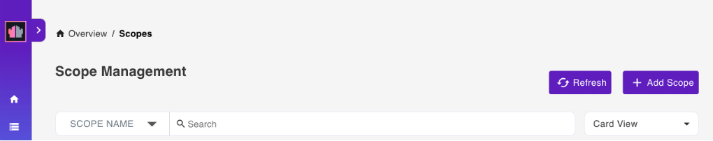

# Scope Management

Select **Database Management - Activation** from the home page or **Scopes** from the side navigation pane to access the **Scope Management** page.

## View available scopes

The **Scope Management** page shows the available scopes.

You can arrange the scopes in **Stack View**, **Card View**, **Alphabetical View**, or **NSF View**. There is also a provision to search through the list either via **Scope Name** or **NSF Name**.

## Add a scope

!!!tip
    A scope points to a schema that's contained in a database. A database can have many schemas for different use cases and a schema can be pointed to by more than one scope.

1. On the **Scope Management** page, click **Add Scope** to add a database.

      

2. Under **Available Schema**, select the schema that the scope will belong to.
3. Under **Add New Scope**, fill in the form and click **Add**.

!!!note
    You can set the **Maximum Access Level** of the scope to control the maximum access anyone using the scope should have. This prevents an app, which has inherited a user's access rights when the user grants app access, from unauthorized altering of schemas or access control lists. By default, the set maximum access level is **Editor**. To know more about what each access level allows and to whom the access level is assigned, see [Access levels in the ACL](https://help.hcltechsw.com/domino/12.0.2/admin/conf_accesslevelsintheacl_c.html){: target="_blank" rel="noopener noreferrer"}.     

## Edit a scope

1. On the **Scope Management** page, click the scope that you want to edit. 
2. In the **Edit Scope** pane, edit the details that you want to change.
3. Click **Update**.

!!!note
    You can only edit the **Description**, **Server**, **Maximum Access Level**, and **Scope Icon**. 

## Delete a scope

1. On the **Scope Management** page, click the scope that you want to delete.
2. In the **Edit Scope** pane, click **Delete**. 
3. In the delete confirmation dialog, click **Yes**. 
