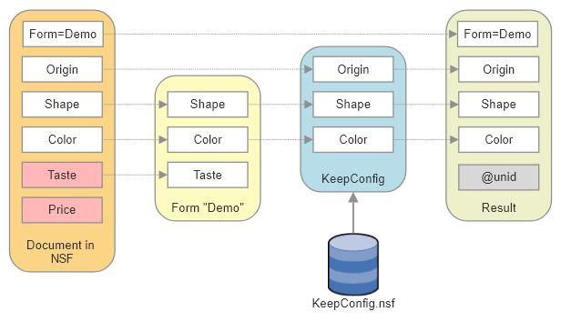
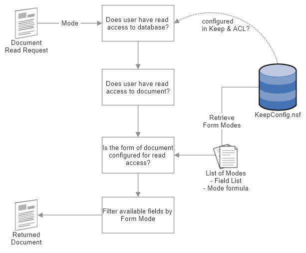
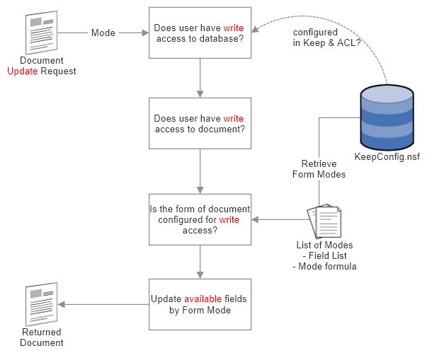
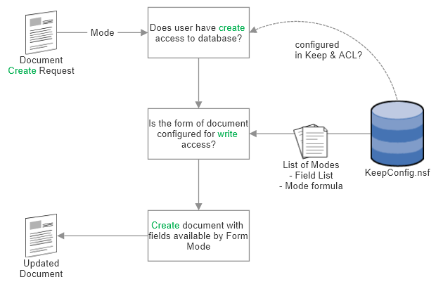
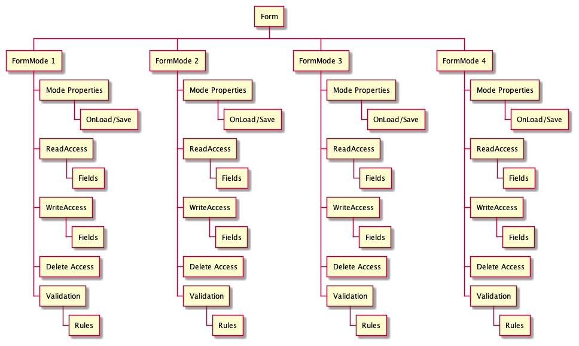

# The Barbican

> _A [barbican](https://en.wikipedia.org/wiki/Barbican) (from Old French: barbacane) is a fortified outpost or gateway, such as an outer defense of a city or castle, or any tower situated over a gate or bridge which was used for defensive purposes._

The Barbican in Domino REST API decides what a given user can read from or write to a document. The following constraints apply:

- Documents can only be read when they have a `Form` item that is configured in `keepconfig` to allow access.
- Only the fields that are configured can be created, read, or updated.
- _Exception_: If NO fields are configured in `keepconfig`, all fields on the form can be accessed. As a best practice, define fields to constitute the schema for the document at this mode. A warning is logged to the console, if fields are not set. On write access, this ensures unexpected fields are not submitted.
- An item in a document can be accessed only if there is a matching field on the form or a field configured in `keepconfig`.

The Barbican functions as the schema definition for the Domino REST API.

### Reading documents

{: .scale-img-eighty-percent }

### Updating documents

{: .scale-img-eighty-percent }

### Creating documents

{: .scale-img-eighty-percent }

### Form Modes

Form Modes are used to manage access to documents. Domino REST API only allows access to documents that have a `Form` item. The content of the Form item determines the form definition used to decide access.

When a form is not configured, documents with that form item are not accessible via Domino REST API. A form configuration has one or more **Form Modes** to determine access.

Each mode, specified in JSON as a series of flags and formulas, that determine access. Currently we make use of the [`@Formula` language](https://help.hcltechsw.com/dom_designer/12.0.0/basic/H_NOTES_FORMULA_LANGUAGE.html), but we might extend the options in future.

Using a configuration, rather than code in an individual application shifts preserving integrity to the Domino server, an important step to roll out Single Page WebApps or mobile apps without the need for extended application server infrastructure

| Item                | Sample Value                                                        | Explanation                                                                                            |
| ------------------- | ------------------------------------------------------------------- | ------------------------------------------------------------------------------------------------------ |
| modeName            | default                                                             | The first mode always is called `default`. It is used when creating new documents with that form       |
| computeWithForm     | false                                                               | Should form formulas be executed when loading / saving a document. Mainly used for existing form logic |
| strictInput         | true                                                                | data types specified in the form must match submitted data types (no check on load)                    |
| allowAnyField       | false                                                               | Bypass field list (formulas still apply - WIP)                                                         |
| onLoad              |                                                                     | Formula to execute before a Note gets converted to JSON                                                |
| onSave              | @SetField(\"Status\";\"Submitted\")                                 | formula that gets executed after JSON has been converted to a Note, before save runs                   |
| readAccessFields    | [ "Approver", "Subject", "Requestor", "DueDate", "Status", "Body" ] | Array of field names that are readable if present in the document                                      |
| readAccessFormula   | @IsMember(\"[RaiseRequest]\"; @UserNamesList)                       | Formula to determine if this read **mode** is available for the current document and user              |
| writeAccessFields   | [ "Approver", "Subject", "Requestor", "DueDate", "Status", "Body" ] | Array of field names that can be updated **Note**: they are case sensitive, JSON wants it like that    |
| writeAccessFormula  | Status==""                                                          | Formula to determine if this **write** mode is available for the current document and user             |
| deleteAccessFormula | @False                                                              | Formula to determine if the current document could be deleted by the user with delete access           |
| validationRules     | Array of formula/message pairs                                      | Validation on a database level                                                                         |

## Validation Rules

Validation rule allow to ensure business rules to be enforce regardless of client (other application, web app, mobile app, curl). Domino REST API used the [`@Formula` language](https://help.hcltechsw.com/dom_designer/12.0.0/basic/H_NOTES_FORMULA_LANGUAGE.html) for them

| Field   | Example                                                    | Purpose                             |
| ------- | ---------------------------------------------------------- | ----------------------------------- |
| formula | @IsMember(status;\"Submitted\":\"Approved\":\"Rejected\")  | `@Formula` with a true/false result |
|         | DueDate < @Today                                           |
| message | Status must be either 'Submitted','Approved' or 'Rejected' | Static message to be returned       |
|         | You can't backdate requests                                |

## Example

Let's take a simple example of the approval workflow, where the requestor submits an expense report for approval to understand this better.

The requestor has read and write access to the subject, body, and amount fields of the expense report. The requestor fills in the details and the request then goes to the approver. The approver has different access rights to the different fields of the same form. The approver only has read access to the subject, body, and amount fields but read and write access for updating the approval status. Now, add an auditor in the same scenario. The auditor has only read access to subject, body, amount, and approval status field. The auditor, however, has read and write access to fill in the audit status, which is non-editable for either the requestor or the approver.

This assigning of access to documents to different users, based on their roles, can easily be done using Form Modes. Managing the Form Modes can be done via the Project Domino REST API Admin GUI.

### Further readings

Check the pages about the [Admin UI](../references/usingwebui/index.md) and go through the [Tutorials](../tutorial/index.md).
