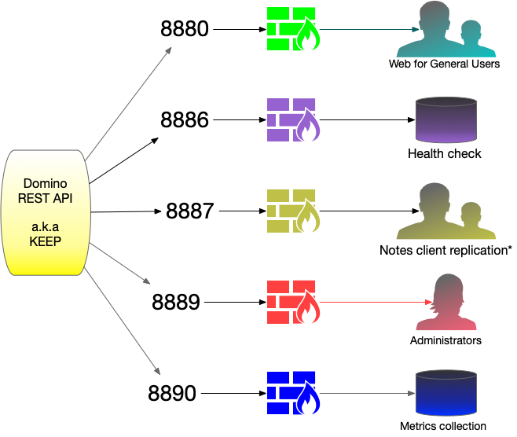

# Ports

Domino REST API uses four ports which have different purposes and warrant different access/security settings. By dividing Domino REST API access across more than one port, an administrator can take advantage of access security provided by the operating system and/or firewall.

The ports are specified in `config.json` but can be overwritten using environment variables. See the page on [configuration parameters](../references/parameters.md) for details.

## Data PORT (8880)

This is the main port used by Domino REST API to interact with API users. This port should be exposed to all users and be secured by https, either on Domino REST API or using a proxy. All access to data requires authentication.

## Healthcheck Port (8886)

Healthcheck is to check whether Domino REST API is up. It's a standard approach for Docker and Kubernetes environments, so any automated tooling that manages your containers can periodically check and automatically take action if the tool (in this case Domino REST API) is no longer working. It has a single endpoint, "/health" which responds with information about whether all parts of Domino REST API are responding - the eventbus, main Domino REST API server, Domino REST API management server, Domino REST API metrics server and access to a Domino database. It has separate security, it's own username and password. This follows the same approach as the management server, but it's a completely separate user. None of the users that have access to the rest of Domino REST API will have access to the healthcheck port, and the healthcheck user will not have access to other areas of Domino REST API.

## Management Port (8889)

The management port allows access to Domino REST API runtime behavior, such as the current configuration via `/config`, runtime info via `/info`, or Domino REST API shutdown/restart. It must **not** be exposed to normal users, only exposed to the administrator network.

A typical configuration is to block access to Port 8889 from anything but `localhost`. An administrator who wants to interact with the management port would use an `ssh` session to access the server and use `curl` to access the management endpoints.

## Port for Prometheus Metrics (8890)

Domino REST API provides metrics in Prometheus format on Port 8890. When you don't collect metrics, block access to this port. When you do collect them, open access to this port to the collecting server or servers only.

## Additional Information

To learn more on how to secure the ports to encrypt the communication between any client and the Domino REST API server in a production environment, see [Secure ports](../tutorial/installconfig/configuration/secureport.md).