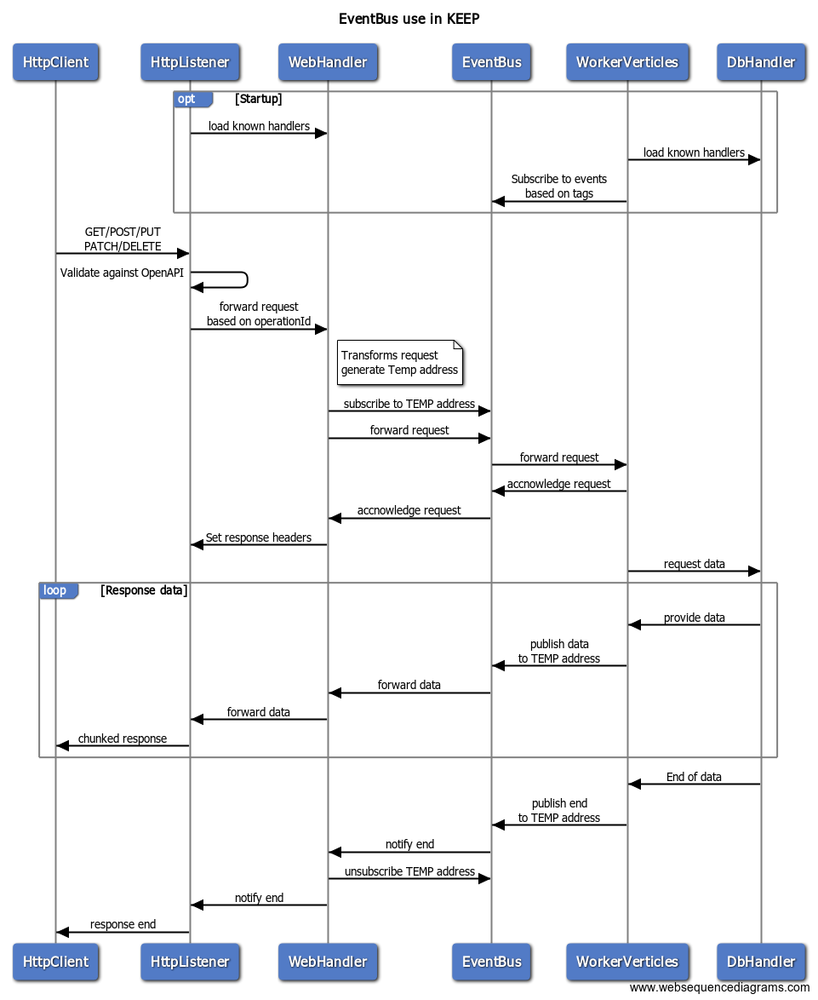
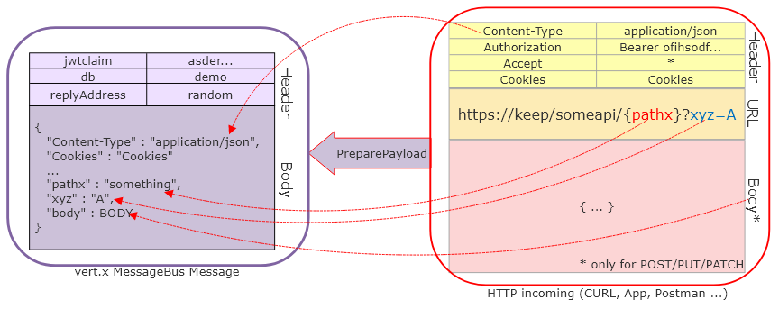

# EventBus

The [Vert.x](https://vertx.io) EventBus is the nervous system of Domino REST API. Vert.x relies on an internal EventBus that can operate in a request/reply or a broadcast mode. For simulating a flowable (from reactive principles), we follow a pattern:

- When the HttpListener receives a request from the HttpClient, it forwards it to the WebHandler based on the OperationId.
- The WebHandler generates a temporary address to listen for results and forwards the request to the EventBus.
- The EventBus relays the request to the WorkerVerticle.
- The WorkerVerticle sends an acknowledgment to the EventBus and requests the DbHandler to perform an action.
- The DbHandler sends data to the temporary address in batches, until all the data is sent to the HttpListener.
- The HttpClient starts interacting with data as soon as it receives it. The data is received in batches.
- The header determines if it is Data, Error, or completion. (See below.)
- Once all the data is sent, the DbHandler sends 'end of data' notification back to the EventBus.

## Flowchart



```bash
title EventBus use in KEEP

participant HttpClient
participant HttpListener
participant WebHandler
participant EventBus
participant WorkerVerticles
participant DbHandler
opt Startup
   HttpListener->WebHandler: load known handlers
   WorkerVerticles->DbHandler: load known handlers
   WorkerVerticles->EventBus: Subscribe to events\nbased on tags
end

HttpClient->HttpListener: GET/POST/PUT\nPATCH/DELETE
HttpListener->HttpListener: Validate against OpenAPI
HttpListener->WebHandler: forward request\nbased on operationId
note right of WebHandler: Transforms request\ngenerate Temp address
WebHandler->EventBus: subscribe to TEMP address
WebHandler->EventBus: forward request
EventBus->WorkerVerticles: forward request
WorkerVerticles->EventBus: acknowledge request
EventBus->WebHandler: acknowledge request
WebHandler->HttpListener: Set response headers
WorkerVerticles->DbHandler: request data
loop Response data
    DbHandler->WorkerVerticles: provide data
    WorkerVerticles->EventBus: publish data\nto TEMP address
    EventBus->WebHandler: forward data
    WebHandler->HttpListener: forward data
    HttpListener->HttpClient: chunked response
end
DbHandler->WorkerVerticles:End of data
WorkerVerticles->EventBus: publish end\nto TEMP address
EventBus->WebHandler: notify end
WebHandler->EventBus: unsubscribe TEMP address
WebHandler->HttpListener: notify end
HttpListener->HttpClient: response end
```

### Anatomy of the EventBus message

EventBus uses header values to transport the meta data.
The body (usually JSON) has a "payload" property with the requested data.



## Initial request header

Below are the values in the initial request sent over the EventBus
using [`EventBus.request()`](https://vertx.io/docs/apidocs/io/vertx/core/eventbus/EventBus.html#request-java.lang.String-java.lang.Object-io.vertx.core.eventbus.DeliveryOptions-io.vertx.core.Handler-)

- db: The Domino REST API alias name of the requested database (`MAIL` for Quattro)
- jwtclaim: The JWT string the user authenticated with
- appId: (Optional) Id of the calling server app
- appSecret: (Optional) secret of the calling server app
- operationId: The operationId as defined in OpenApiSpec
- replyAddress: Address the handler will listen for replies

## Initial reply

- status: Could be "failure" or "success"
- cause: String with explanation of potential failure
- statuscode: Suggested HTTP Response code
- ErrorClass: Type of error based on `com.hcl.domino.keep.exceptions`

See also the `DeliveryOpts` class

## Data replies

Data reply is similar to the initial reply but with more options in `status`:

- `data`: Actual data in body
- `complete`: No more data to expect, no data in body
- `failure` : as above, stating what went wrong

## Reactive wrapper

To simplify the creation of handler and requesters, helper classes are built.
They encapsulate the process back and forth on the EventBus following the [Reactive](http://reactivex.io/) pattern. This allows for flexible pre/post processing of data sent over the EventBus.

## TODO: more on the wrapper

The wrapper classes can be found in the package `com.hcl.domino.keep.eventbus`
