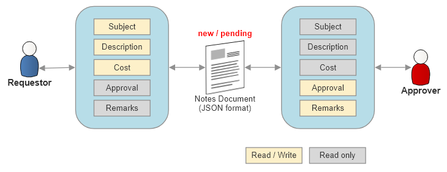
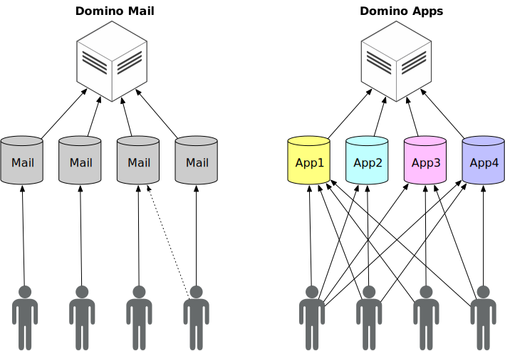

# Introducing the Domino REST API

## What can the Domino REST API do for you?

The HCL Domino REST API provides a secure REST API with access to HCL Domino servers and databases.

Domino REST API runs on Domino and/or your Notes Client on Windows/Linux/Mac. Someone with previous working experience of Notes and Domino can [quickly get started](../tutorial/quickstart.md) with Domino REST API.

Domino REST API is based on industry standards, allows Notes and Domino to be accessed from other platforms, follows standard APIs, is extendable and uses the Notes and Domino security model. Domino REST API also puts the power in the hands of the developer to work using their preferred programming language.

Domino REST API is designed to re-establish Domino as a world class, modern, standards-compliant, cloud native and enterprise-level collaboration platform. It adds contemporary [REST APIs](https://www.redhat.com/en/topics/api/what-is-a-rest-api) to Notes and Domino, enabling a modern programming experience with the tools of your choice.

Classic Domino applications are document-oriented and often based on an approval model: documents flow through a business lifecycle and are approved at each stage. Domino developers develop a separate user interface for each approval state that is used by the people who perform the actions for that state.

<!-- prettier-ignore -->
!!! tip "Where is the **actual** API documentation?"
    We use an [OpenAPI](https://www.openapis.org) based API specification. Its documentation can be seen after starting Domino REST API and opening its URL (depending on your Domino server URL). This way you can be sure to always look at the specification running on your server, current and accurate.

Domino REST API moves access control out of the code and into the configuration. But it means control stays with those who need to support the data, not those who consume the data. Domino REST API grants granular access for actions like read or write depending on what the document data is and who is viewing it. This approach ensures that the correct person can perform the correct action on the document and its data. Most importantly, it means control over data quality remains with those who need to support the data, not those who provide and consume the data.

For example, in the case of an expense report filed by an employee, the approver and the employee can only edit the fields that correspond to their role. An approver might be able to approve and add a remark only and an employee might be able to provide a subject, description, and cost only.

This granular access managed through configurations is what makes Domino REST API unique.

Also, in Domino REST API, we built modern REST APIs that are designed to bring Notes and Domino forward in the current market. Domino REST API adds OpenAPI specified REST APIs to Domino and allows the latter to talk to any server or client over http, https, or http/2. Using Domino REST API, any application that talks https can access the data from a Domino database, hence extending the availability of this data beyond the Notes client.

For example, the data in a Domino database that could earlier be viewed only in a Notes client, can now be viewed on mobile applications as well using the Domino REST API. Refer to the [use cases](usecases.md) for more examples.

The Domino REST API are secure and standards-compliant, making them the right choice for your Notes and Domino ecosystem.

<!-- prettier-ignore -->
!!! info
    Much like the architectural keep that fortifies the castle, Project Domino REST API adds to the existing functionalities provided by Notes and Domino.

<!-- prettier-ignore -->
Domino REST API can run on your developer desktop, where you can evaluate it from your Notes client. Domino REST API is available on Windows (client & server), Linux (server), Docker (server) and macOS (client) as add-on for Notes and Domino 12.0.2 and later.

Domino REST API caters to Domino mail as well as Domino applications, irrespective of the difference in the way they work. While Domino mail allows one-to-one mapping between users and mail files (with only occasional exceptions), Domino applications allow multiple users to access the same application. Domino REST API looks beyond this difference and serves both Domino mail as well as Domino applications.

## What applications does Domino REST API support?

Domino REST API is designed to work with:

- Desktop applications with direct access to the Domino server, written in any language, for example Java, C#, Rust, [Electron](https://www.electronjs.org/), [Jupyter](https://jupyter.org/), [Python](https://www.python.org/) etc.
- Browser-based applications hosted on Domino REST API or elsewhere, written in HTML and JavaScript, for example [ReactJS](https://reactjs.org/), [VueJS](https://vuejs.org/), [Svelte](https://svelte.dev/), [Angular](https://angular.io/), [VanillaJS](http://vanilla-js.com/) etc.
- Application-server-based applications, for example [NodeJS](https://nodejs.org/en/), [HCL DX](https://www.hcltechsw.com/dx), [Spring](https://spring.io/projects/spring-framework), [SpringBoot](https://spring.io/projects/spring-boot), [Vaadin](https://vaadin.com), [Vert.x](https://vertx.io), [Quarkus](https://quarkus.io), [PHP](https://www.php.net/), [Wordpress](https://wordpress.com/).
- Command Line Interfaces (CLI), starting with but not limited to [curl](../references/usertools/curl.md).
- [OData](https://www.odata.org) aware applications (e.g. SAP, Salesforce, Microsoft Excel, [Tableau](https://help.tableau.com/current/pro/desktop/en-us/examples_odata.htm) etc).
- LowCode environments like [HCL Volt MX](https://www.hcltechsw.com/volt-mx), [NodeRED](https://nodered.org/) or others.

### Domino REST API is secure

Domino REST API is secure by default since it inherits all the [security features](../references/security/index.md) of Notes and Domino. All access to the database is authenticated using [JSON Web Token (JWT)](https://jwt.io/) and [Scopes](../references/security/authentication.md). Identity can be provided using Domino credentials and/or your Enterprise IdP (Identity Provider) like Keycloak or Active Directory. The databases or forms and views that can be accessed are explicitly listed. Security extends to a field level read/write control by the [Barbican](../topicguides/barbican.md).

### Modern Java API (Java 8++)

Project Domino REST API uses redesigned Java APIs named Domino JNX (Domino Java Next), which follow industry standards and best practices.

### Public API based on OpenAPI 3.0

We follow the [API first](https://swagger.io/resources/articles/adopting-an-api-first-approach/) design with full interactive documentation. Our public APIs follow the standards set by OpenAPI 3.0. The OpenAPI specifications you see in Swagger/Redoc on the server are used dynamically by Domino REST API to validate requests, so you know they are up-to-date.

### Extensible architecture

Domino REST API has an extensible architecture that allows it to serve multiple API versions from a Domino server. We currently support admin, core, CI/CD and PIM APIs but Domino REST API can be extended to add more APIs.

### Web GUI for Schema, Scope and App management

We provide a [Web UI](../references/usingwebui/index.md) that facilitates managing schemas, scopes, and applications.

### Design, admin and data

Along with the application design and admin features, Domino REST API allows CRUD operations on documents, retrieval of collections (aka views and folders), execution of queries and submission of access control,and design and code, while maintaining and extending Domino’s security model.
