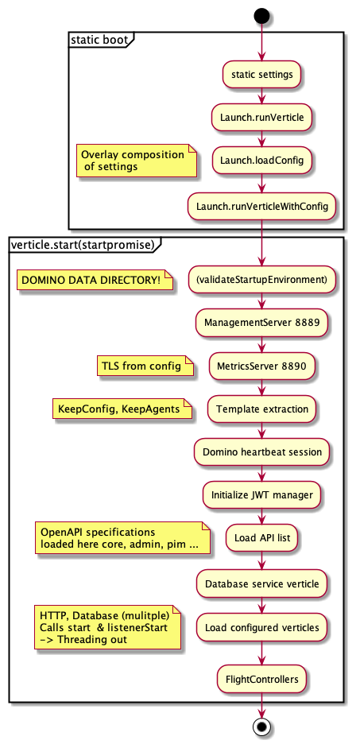
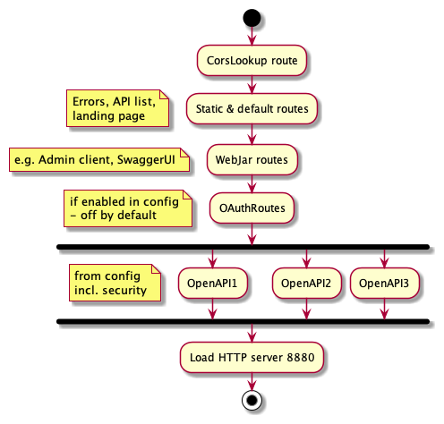
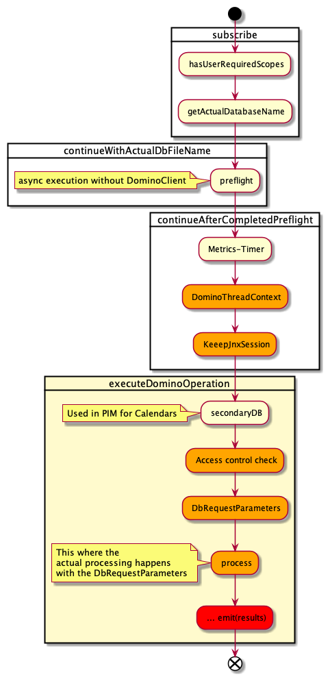

## Selected Flows in the Domino REST API Architecture

To fully understand Domino REST API, it is helpful to know the main flows, Domino REST API has three of them:

- Domino REST API Boot
- Loading of OpenAPI defined routes
- serving requests on the loaded routes

## Domino REST API Boot

## Loading of OpenAPI defined routes

## Serving requests on the loaded routes

### Accepting requests on HTTP

Request get put on the EventBus after successful acceptance.

### Processing requests from EventBus

Actual database communication happens here:

