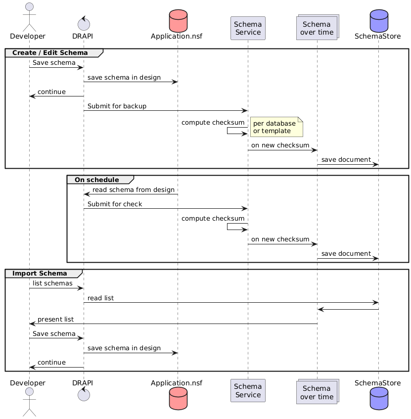

# Schema Backup

Domino REST API supports schema backup. The following diagram explains the process flow for different scenarios.

## Create or Edit Schema

- Domino REST API saves the schema in the application database and submits the schema to the schema service for backup when a developer creates or edits a schema.
- The Schema Service computes the checksum per database or template and then saves the schema to the SchemaStore based on the new checksum.

## On Schedule

- Domino REST API reads the schema from the application database on a set schedule and then submits the schema to the Schema Service for a check.
- The Schema Service computes the checksum and then saves the schema to the SchemaStore based on the new checksum.

## Import Schema

- Domino REST API reads the schemas from the SchemaStore based on the received list of schemas, and then presents the list of schemas to the developer.
- Domino REST API then saves the presented schemas in the application database.
