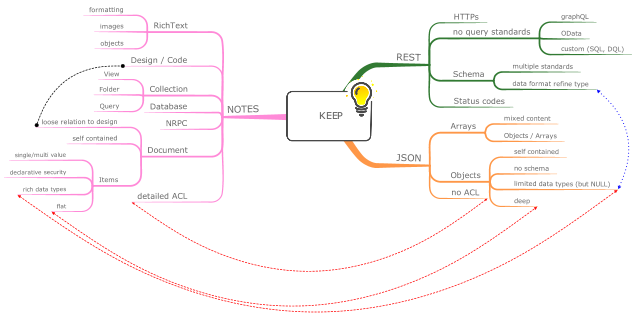
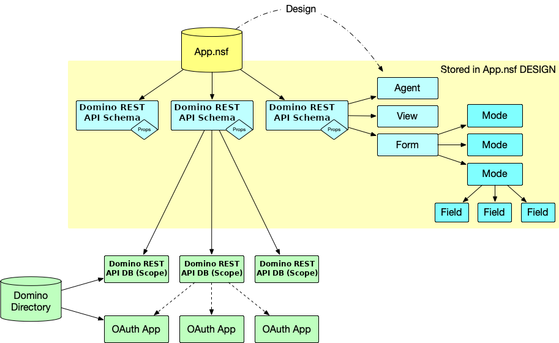

# Understanding HCL Domino REST API

HCL Domino REST API is the middleware connecting Notes & Domino to a contemporary REST like API consuming and producing mostly JSON data. Each element has its own set of properties, you might call them quirks, that required considerations and decisions. After all, designing functionality is balancing tradeoffs between competing approaches.

## A Note can contain ANYTHING, an API shouldn't

A document note (a.k.a. a document) in a Notes database can contain any number of items (colloquially referred to as _fields_ - which is actually inaccurate) that are fully self contained, describing their datatype, cardinality (single value, multi-value) and content. There is no fixed relationship to any form containing defining fields.

By _convention_, documents contain an item with the name `Form` pointing to what the document tentatively might contain. **Tentative!** The document might not contain items for each field in the referred form, might contain items created by actions, agents, or external code without a matching field in the form or items which don't match the data type of the field definition.

Furthermore, a document might be viewed with different forms and/or change the value of its form item during its lifetime.

These free for all capabilities aren't suitable to be exposed in an API. An API that states "You will get something JSON, but we can't tell what" is of limited use. Therefore, we considered how to define the shape of data to expose. Our initial approach was to just use the form design at runtime, but found this too limiting. Now the _Scope and Schema management UI_ (a.k.a. AdminUI) uses form design as input for a schema definition that's close to [JSON Schema](https://json-schema.org). Our resulting decisions/constrains are:

- We use the value of the `form` item to link a document to 1:n schemas.
- Documents without a `form` item aren't available in the API, but can contribute to views/forms.
- If a form item value has no matching schema definition, it's not available in the UI.
- There are 1:n schemas for any enabled *form*. In Domino REST API, they're referred to as `mode` or `formMode`.
- You can create a schema for an non-existing form using the API. This is valid since we use the value of a document's form item rather than the form itself.
- Which mode is available to a given user is determined by an `@Formula` that can include item values, UserName, Groups and roles for its computation. This allows to map permissions and workflows on an API level.
- Reading and writing coerces note item values into the ones defined in the schema. Multi-value fields are delivered as array, while single values as scalar, regardless of item content.

## Security is declared, not computed

[Notes' security](https://wissel.net/blog/2014/02/domino-development-back-to-basics-part-6-better-safe-than-sorry-security.html) uses ACL entries and special item types `Reader`, `Name` and `Author` to define access permissions. Since this is near and dear to all applications, the API needs to support this:

- The schema's format containing values like `date-time` or `int64` got extended to include `readers`, `names`, `authors` and `richtext`. This allows for appropriate data mappings.
- JSON's boolean data type is mapped to 0 and 1.

## Who are you? It depends

Domino provides its own source of identity, the Domino directory. However this isn't the only option in use in customer environments. Furthermore, applications need to access data **on your behalf**. To accommodate this Domino REST API uses [JWT](https://jwt.io) tokens, defined [scopes](../references/usingdominorestapi/scopes.md) and an [OAuth 2.0](https://oauth.net/2/) compliant authorization service:

- Authorization is provided using a JWT token defining permitted scope and user identity.
- Direct login is provided for users, it can be deactivated.
- Third-party JWT can be configured to be trusted, so your corporate [IdP](https://en.wikipedia.org/wiki/Identity_provider) can be used to issue valid JWT.
- The API allows to configure OAuth applications providing `client_id` and `client_secret` to empower user authorizing API access to a defined scope.
- The management (8889), metrics (8890), and healthcheck (8886) endpoints use identities that are stored in `identities : { ... }` in Domino REST API's configuration. Out of the box, none are configured.

## Databases, schemas and scopes

- A database contains 1:n schema files in its design file resources.
- Each schema contains 0:n form definitions. 0 if you only want to read view/folder data.
- Each form definition contains 1:n modes. The first mode is called `default`, which is used on document creation.
- When using [ODATA](https://www.odata.org) access, a mode `odata` is required.
- The field definitions are based on JSON schema.
- Each schema in an NSF database can be mapped to one or more scopes in the directory.
- The scope is the name used in `?dataSource=` as public access name. You shouldn't change scope names after they get used. However, you can change which schema they map to any time.
- Each scope can be mapped to **one** schema at a time.
- Each OAuth app can store multiple scopes it wants to access. Created by admin, not by the calling application.
- In the OAuth cycle, if an application requests an undefined scope or an unknown callback, the request gets denied.

## Rich Text

Before [diving into details](../references/usingdominorestapi/richtext/index.md), a quick trip down the IT history lane. [Rich Text (RTF)](https://en.wikipedia.org/wiki/Rich_Text_Format) was specified by Microsoft in 1987. Notes/Domino uses a similar specification. It's essentially a container format designed to host [plain text](https://www.youtube.com/watch?v=_mZBa3sqTrI), formatted text, images, attachments, embedded objects and layout information. It's [white space sensitive](https://twitter.com/jordwalke/status/1272431278868987904), a fancy term for: being able to "format" something by hitting the space key repeatedly.

The container formats today that resemble these capabilities are [ECMA-376 (ISO/IEC-29500)](https://www.ecma-international.org/publications-and-standards/standards/ecma-376/) (a.k.a Office Open XML), [ISO/IEC 26300:2006](http://www.oasis-open.org/committees/download.php/19274/OpenDocument-v1.0ed2-cs1.pdf) (a.k.a Open Document Format), which are both XML based and [MIME (RFC 1341)](https://datatracker.ietf.org/doc/html/rfc1341) which is widely used in eMail. The XML formats, mainly used in word processors aren't native to the web, while MIME doesn't prescribe (it's **multipurpose** after all) its content parts **and** isn't native to web browsers.

Based on this mismatch of source and target environment we designed your option [dealing with Rich Text](../references/usingdominorestapi/richtext/index.md) in Domino REST API.

## Roles

- **Domino developer**: creates the **schema** that defines what data can be accessed in an NSF database.
- **Domino administrator**: creates and activates the **scope** that defines how the data can be accessed. Also creates (optional) OAuth compatible applications with `client_id` and `client_secret` properties.
- **VoltMX administrator**: configures Volt MX's foundry middleware to interact with Domino REST API using the foundry Domino REST API adapter.
- **Application developer**: develops applications leveraging Domino REST API Endpoints, VoltMX services and front-end tools like VoltMX Iris, VSCode or any tools and framework of choice.

Read more about them in [Domino REST API Roles](../references/usingdominorestapi/roles.md).

## On the todo list

We're not done yet:

- Schema doctor comparing schema to form to flag inconsistencies
- Form / document scan: check if documents contain edge cases
- More options of the JSON schema
