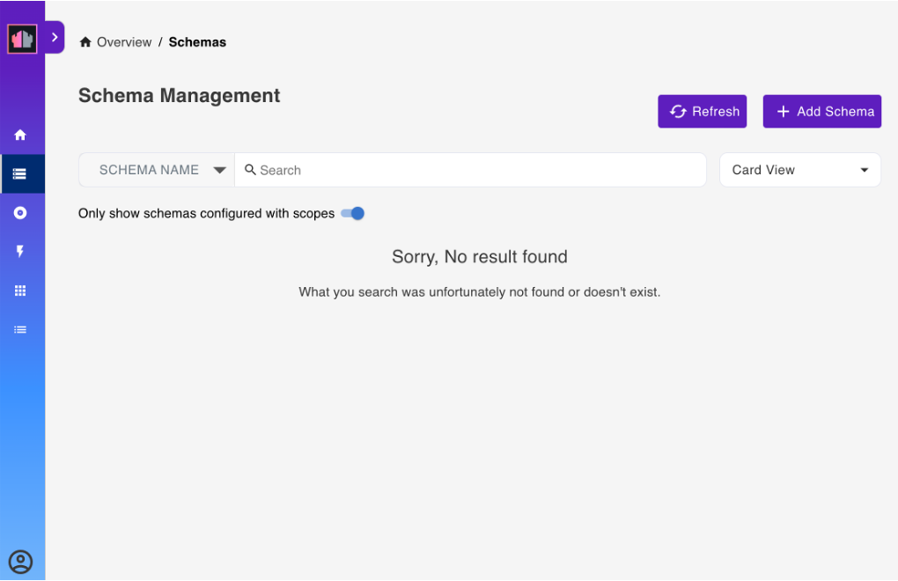
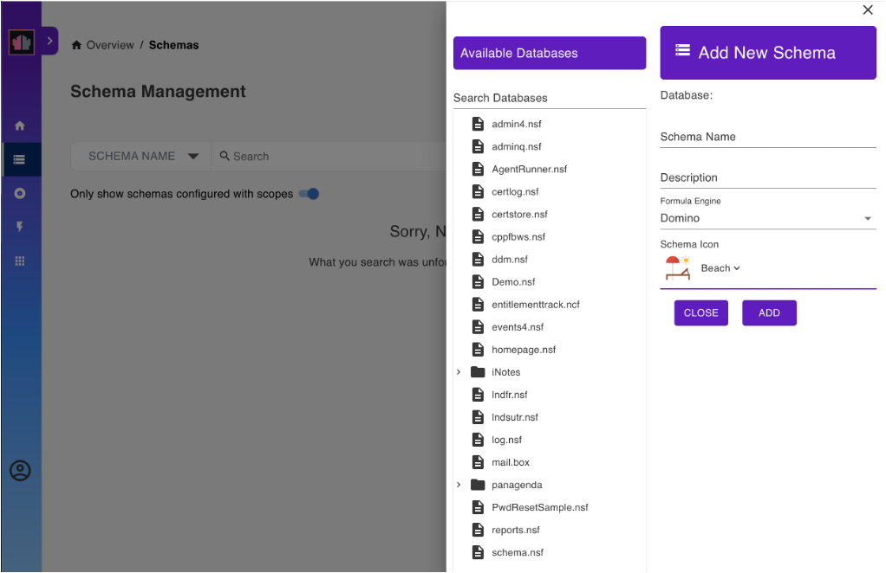
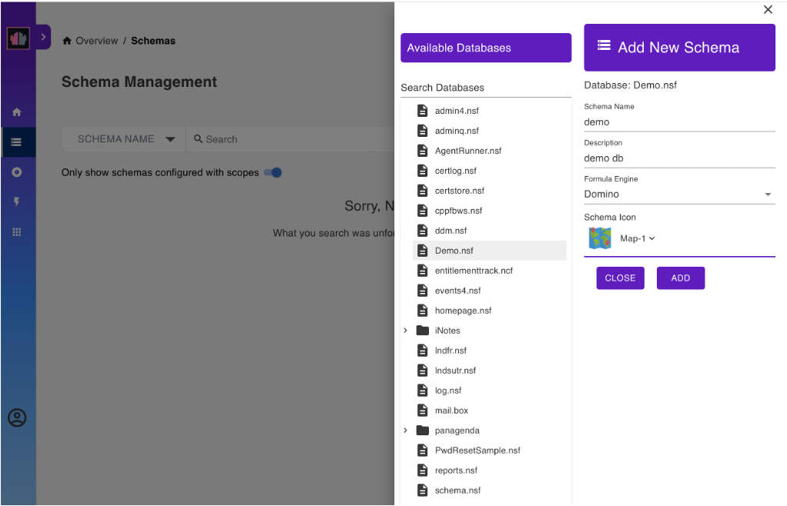
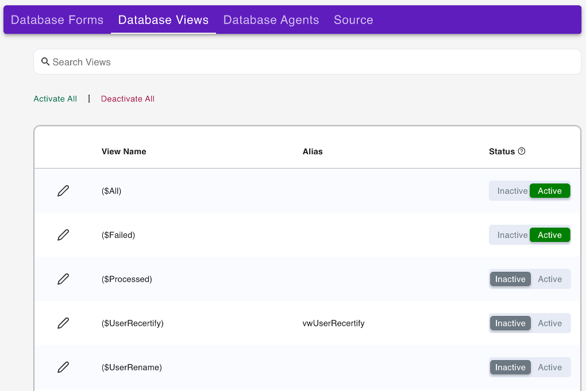

# Using Admin UI

This tutorial shows how to use the Admin UI to configure and use a database for Domino REST API. Download the database `Demo.nsf` from [Resources](../references/downloads.md) and follow along. Anything you can do with the Admin UI you can also do using Postman, curl, SwaggerUI or similar tools. See how to do each of the tasks in this tutorial using [Postman and Curl](./postmancurl.md) and using [SwaggerUI](./swagger.md).

<!-- prettier-ignore -->
!!! note
    The screenshots may vary. The screenshots are based on latest Domino REST API snapshots. Make sure you're up-to-date.

## Prepare database access

Download `Demo.nsf` from [Resources](../references/downloads.md) and save it in the Notes data directory.

## Login

Go to the Domino REST API Admin UI. 

> _For example `http://restapi.myhost.com:8880/admin/ui`, replacing the host with your Domino REST API's host._

On the login page, enter the administrator username and password, and then click **LOG IN**.

## Landing

A successful login would lead to this landing page:

## List available schemas

Click **Database Management - Rest API** in the landing page. This opens the **Schema Management** page.

## Add a schema

1. In the **Schema Management** page, click **Add Schema**. This opens a menu as shown below:

      

2. Under **Available Databases**, select `Demo.nsf`.
3. Under **Add New Schema**, fill up the form and then click **Add**.

      

This creates a schema that defines what views, folders, document, and agents can be accessed through the Domino REST API.

<!-- prettier-ignore -->
!!! note
    If the **Only show schemas configured with scopes** toggle is turned on, you can't see the created schema because it doesn't have a scope yet.

## Create a scope

To set up a scope:

1. Go back to the landing page by clicking **Overview**.
2. Click **Database Management - Activation**. This opens the **Scope Management** page.

      

3. Click **Add Scope**. This opens a menu as shown below:

      

4. Under **Available Schema**, click `Demo.nsf`. This shows a list of schemas that uses `Demo.nsf` as a database.
5. Select the schema you created earlier, and then fill out the form in **Add New Scope**.

      

6. Click **Add**. This creates a scope.

You can use this to access a schema via the Domino REST API. One NSF can be made available under more than one scope, such as with different security settings.

## Manage created schema

Go back to the **Schema Management** page, and click the schema you created earlier. This takes you to the page shown below:

This page allows you to set various configurations to your schema.

## Manage database forms

1. Click **Database Forms** from the menu bar. This lists all the forms available for the schema.

      

2. From the list of **Unconfigured Forms**, click a form to configure.
3. In the **Configure** dialog, click **Yes** to configure the form with default settings.

The selected form is now listed under **Configured Forms**.

**To make changes to the configured form:**

1. Select the form to load the **Access Mode** page for the form.

      

2. Under **Show fields from**, which shows the fields that can be added to the form, hover over a field item and click the **+** icon. This adds the field in the form. Repeat this for all.
3. Click **Save**.

## Manage database views

1. Click **Database Views** from the menu bar. This lists all the views for the selected database.

      

2. Click a view to activate. This moves the selected view under **Activated Views**.
3. Click **Save**.

<!-- prettier-ignore -->
!!! note
    Clicking a view under **Activated Views** undoes the selection.

## Manage database agents

1. Click **Database Agents** from the menu bar. This lists all the agents for the selected database.

      

2. Click an agent to activate. This moves the selected agent under **Activated Agents**.
3. Click **Save**.

<!-- prettier-ignore -->
!!! note
    Clicking an agent under **Activated Agents** undoes the selection.

## Logout

To log out, click the profile icon and then select **Sign Out**.

## Additional information

Refer to the [SwaggerUI tutorial](./swagger.md) for a UI-driven tutorial for creating a document and more.
