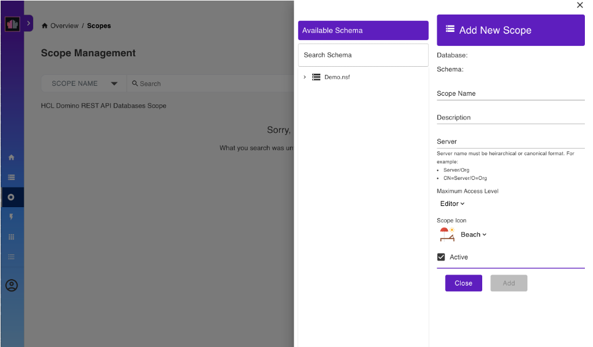
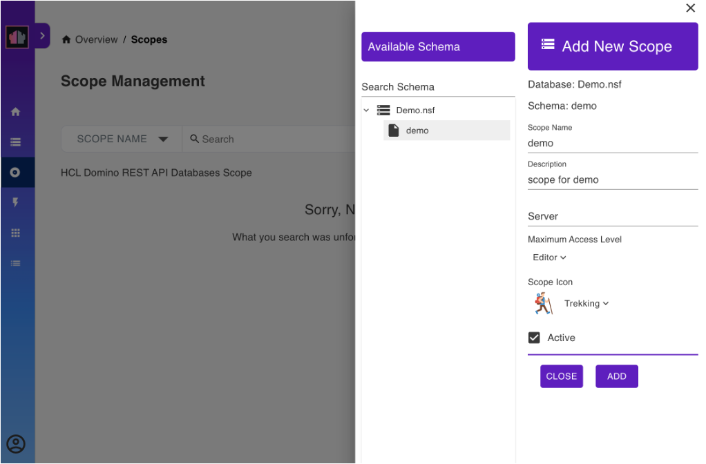
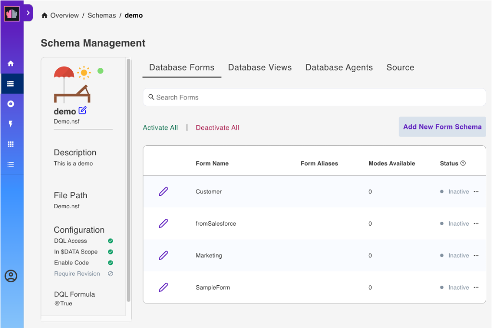

# Using Admin UI

## Overview

This tutorial provides step-by-step instructions for using the Admin UI to configure and manage a Domino database. It covers the preparation of database access, logging in, creation of schemas and scopes, configuration of database forms, views, and agents, and logging out.

## Prepare database access

You can download and use the example Domino database `Demo.nsf` to complete this tutorial.

1. Download `Demo.nsf` from [Resources](../references/downloads.md).
2. Save the `Demo.nsf` file in the Notes data directory.

## Video tutorial

You can watch the video for a visual walkthrough of using the Admin UI. The steps in the video closely follow the instructions in this topic and intend to serve as a visual reference to enhance your understanding. The video shows you the instructions for logging in to the Admin UI, creating schemas and scopes, managing database forms, views, and agents, and configuring activated forms.

<iframe width="600" height="400" src="../assets/video/drapivideo1.mp4" title="Using Admin UI"></iframe>

## Log in to Admin UI

1. Open your web browser and navigate to the Admin UI URL.

    For example: `http://<your-host>:8880/admin/ui`

    Replace `<your-host>` with the actual hostname or IP address of your Domino REST API server.

2. Enter your administrator username and password on the login page.
3. Click **LOG IN WITH PASSWORD** to proceed.

    For more information on other log in options, see [Log in options](../references/usingwebui/index.md).

A successful login would lead to this landing page:

{: style="height:70%;width:70%"}

!!! tip

    Starting with the Domino REST API v1.1.2 release, you can click **Overview** on the landing page, indicated by the red arrow in the image, to open the Domino REST API functional diagram. Clicking parts of the functional diagram directs you to corresponding topics in the documentation.

## Create a schema

Schemas define what views, folders, documents, and agents you can access through the Domino REST API.

**To create a schema:**

1. On the landing page, click **Database Management - Rest API**. This opens the **Schema Management** page.
2. On the **Schema Management** page, click **Add Schema**.

    {: style="height:70%;width:70%"}

3. In the **Add New Schema** dialog, click **Create Schema**.

    {: style="height:50%;width:50%"}

4. In the **Create Schema** dialog:

    1. Select `Demo.nsf` from the **Database** drop-down list.
    2. Select an **Icon**.
    3. Enter a **Schema Name** and a **Schema Description**.
    4. Click **Save Schema**.

The created schema is now shown on the **Schema Management** page.

!!! note

    If the **Only show schemas configured with scopes** toggle is turned on, you can't see the created schema because it doesn't have a scope yet.

## Create a scope

A scope enables access to a schema via the Domino REST API. One Domino database can be made available under multiple scopes, such as with different security settings.

**To create a scope:**

1. In the side menu, click **Scopes**.

    {: style="height:70%;width:70%"}

2. On the **Scope Management** page, click **Add Scope**.

    {: style="height:70%;width:70%"}

    This opens a pane as shown below:

    {: style="height:70%;width:70%"}

3. Under **Available Schema**, click `Demo.nsf`. This shows a list of schemas that uses `Demo.nsf` as a database.
4. Select the schema you created earlier.
5. Under **Add New Scope**, fill in the form and click **Add**.

    For the **Server** field, enter the name of the server the scope is available on, or leave it blank for the current server. The value of the entered name must be either the server's hierarchical name or in canonical format. See the following examples for reference:

    - MyServer/MyOrg
    - CN=MyServer/O=MyOrg

    --8<-- "scopenote.md"

    For the **Maximum Access Level**, the default is **Editor**. You can set it to another value to set the scope's maximum access anyone using the scope has.

{: style="height:70%;width:70%"}

!!! note

    The **Maximum Access Level** prevents an app that has inherited a user's access rights when the user grants the app access from unauthorized altering of schemas or access control lists.  To know more about what each access level allows and to whom the access level is assigned, see [Access levels in the ACL](https://help.hcltechsw.com/domino/14.0.0/admin/conf_accesslevelsintheacl_c.html).

## Manage database forms

**To activate a form:**

1. In the side menu, click **Schemas** to go to the **Schema Management** page.
2. Click the schema you created earlier. This takes you to the page shown below:

    {: style="height:70%;width:70%"}

    This page allows you to set various configurations to your schema.

3. Click **Database Forms** from the menu bar. This lists all the forms available for the schema.
4. Select the form that you want to activate, click the corresponding menu icon beside the form's status, and then select **Activate**.

    {: style="height:70%;width:70%"}

!!! tip

    Clicking the menu icon and selecting **Deactivate** corresponding to a form deactivates the form. In the **Reset Form** dialog, click **Yes** to confirm.

**To make changes to the activated form:**

1. On the **Database Forms** tab, click the pencil icon corresponding to the activated form that you want to edit to load the form **Access Mode** page showing the `default` access mode.
2. Under **Show fields from**, hover over a field item and click the **+** icon to add the field in the form. Repeat this for all the fields you want to add.

    [{: style="height:70%;width:70%"}](../assets/images/AccessMode1.png "Click to open in a new tab"){: target="_blank" rel="noopener noreferrer"}

3. Set the Read or Write access formula for each of the fields in the form.
4. Click **Save**.

To learn more, see [Change form configuration](../references/usingwebui/schemaui.md#change-form-configuration).

## Manage database views

1. Click **Database Views** from the menu bar. This lists all the views for the selected database.
2. Select the view that you want to activate, and then click the corresponding **Active** option under **Status**.

    {: style="height:70%;width:70%"}

!!! tip

    Clicking the **Inactive** option corresponding to a view deactivates the view. On the **Reset Views Columns** dialog, click **Yes** to confirm deactivation of the view.

## Manage database agents

1. Click **Database Agents** from the menu bar. This lists all the agents for the selected database.

    {: style="height:70%;width:70%"}

2. Select the agent you want to activate, and then click the corresponding **Active** option under **Status**.

!!! tip

    Clicking the **Inactive** option corresponding to an agent deactivates the agent.

## Log out

When finished with your configurations, you can log out from the **Admin UI**.

1. In the side menu, click the profile icon.
2. Select **Sign Out** to securely log out of the **Admin UI**.

    {: style="height:70%;width:70%"}

## Additional information

- Everything you can perform via the Admin UI can also be done using Postman, curl, or Swagger UI. For more information, see the following tutorials:

    - [Using Postman and curl](./postmancurl.md)
    - [Swagger UI](./swagger.md)

- Screenshots in the UI may vary depending on the version of Domino REST API you are using.

<!--
This tutorial shows how to use the Admin UI to configure and use a database for Domino REST API. Download the database `Demo.nsf` from [Resources](../references/downloads.md) and follow along. Anything you can do with the Admin UI you can also do using Postman, curl, Swagger UI, or similar tools. See how to do each of the tasks in this tutorial using [Postman and Curl](./postmancurl.md) and using [Swagger UI](./swagger.md).

!!! note
    The screenshots may vary. The screenshots are based on latest Domino REST API snapshots. Make sure you're up-to-date.

{: target="_blank" rel="noopener noreferrer"}

<iframe width="600" height="400" src="../assets/video/drapivideo1.mp4" allowfullscreen="true" title="Using Admin UI"></iframe>

## Prepare database access

Download `Demo.nsf` from [Resources](../references/downloads.md) and save it in the Notes data directory.

## Login

Go to the Domino REST API Admin UI. 

> _For example `http://restapi.myhost.com:8880/admin/ui`, replacing the host with your Domino REST API's host._

On the login page, enter the administrator username and password, and then click **LOG IN WITH PASSWORD**.

See other [log in options](../references/usingwebui/index.md) to learn more.

## Landing

A successful login would lead to this landing page:

!!!tip
    Starting with the Domino REST API v1.1.2 release, you can click **Overview** on the landing page, indicated by the red arrow in the image, to open the Domino REST API functional diagram. Clicking parts of the functional diagram directs you to corresponding topics in the documentation.

## List available schemas

Click **Database Management - Rest API** in the landing page. This opens the **Schema Management** page.

## Add a schema

1. In the **Schema Management** page, click **Add Schema**.

    

2. In the **Add New Schema** dialog, click **Create Schema**.

    {: style="height:70%;width:70%"}

3. In the **Create Schema** dialog:

    1. Select `Demo.nsf` from the **Database** drop-down list.
    2. Select an **Icon**.
    3. Enter a **Schema Name** and a **Schema Description**.
    4. Click **Save Schema**.

This creates a schema that defines what views, folders, document, and agents you can access through the Domino REST API.

!!! note
    If the **Only show schemas configured with scopes** toggle is turned on, you can't see the created schema because it doesn't have a scope yet.

## Create a scope

1. Go back to the landing page by clicking **Overview**.

    

2. Click **Database Management - Activation**. This opens the **Scope Management** page.

    

3. Click **Add Scope**. This opens a pane as shown below:

    

4. Under **Available Schema**, click `Demo.nsf`. This shows a list of schemas that uses `Demo.nsf` as a database.
5. Select the schema you created earlier.
6. Under **Add New Scope**, fill in the form and click **Add**.

    For the **Server** field, enter the name of the server the scope is available on, or leave it blank for the current server. The value of the entered name must be either the server's hierarchical name or in canonical format. See the following examples for reference:

    - MyServer/MyOrg
    - CN=MyServer/O=MyOrg

    --8<-- "scopenote.md"

    For the **Maximum Access Level**, the default is **Editor**. You can set it to another value to set the scope's maximum access anyone using the scope has.

!!!note
    The **Maximum Access Level** prevents an app that has inherited a user's access rights when the user grants the app access from unauthorized altering of schemas or access control lists.  To know more about what each access level allows and to whom the access level is assigned, see [Access levels in the ACL](https://help.hcltechsw.com/domino/14.0.0/admin/conf_accesslevelsintheacl_c.html).

You can use the scope to access a schema via the Domino REST API. One NSF can be made available under more than one scope, such as with different security settings.

## Manage created schema

Go back to the **Schema Management** page, and click the schema you created earlier. This takes you to the page shown below:

This page allows you to set various configurations to your schema.

## Manage database forms

1. Click **Database Forms** from the menu bar. This lists all the forms available for the schema.
2. Select the form that you want to activate, click the corresponding menu icon beside the form's status, and then select **Activate**.

    

!!!tip
    Clicking the menu icon and selecting **Deactivate** corresponding to a form deactivates the form. In the **Reset Form** dialog, click **Yes** to confirm.

**To make changes to the configured form:**

1. On the **Database Forms** tab, click the pencil icon corresponding to the configured form that you want to edit to load the form **Access Mode** page showing the `default` access mode.
2. Under **Show fields from**, hover over a field item and click the **+** icon to add the field in the form. Repeat this for all the fields you want to add.

    {: target="_blank" rel="noopener noreferrer"}

3. Set the Read or Write access formula for each of the fields in the form.
4. Click **Save**.

To learn more, see [Schema Management](../references/usingwebui/schemaui.md#change-form-configuration).

## Manage database views

1. Click **Database Views** from the menu bar. This lists all the views for the selected database.
2. Select the view that you want to activate, and then click the corresponding **Active** option under **Status**.

    

!!!tip
    Clicking the **Inactive** option corresponding to a view deactivates the view. On the **Reset Views Columns** dialog, click **Yes** to confirm deactivation of the view.

## Manage database agents

1. Click **Database Agents** from the menu bar. This lists all the agents for the selected database.

    

2. Select the agent you want to activate, and then click the corresponding **Active** option under **Status**.

!!! tip
    Clicking the **Inactive** option corresponding to an agent deactivates the agent.

## Logout

To log out, click the profile icon and then select **Sign Out**.

## Additional information

Refer to the [Swagger UI tutorial](./swagger.md) for a UI-driven tutorial for creating a document and more.

-->