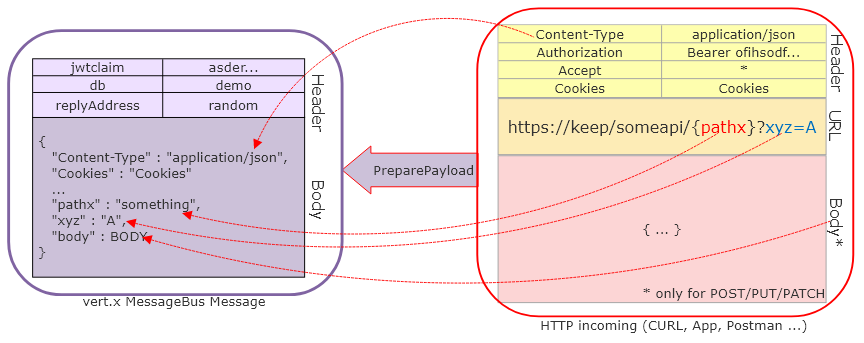
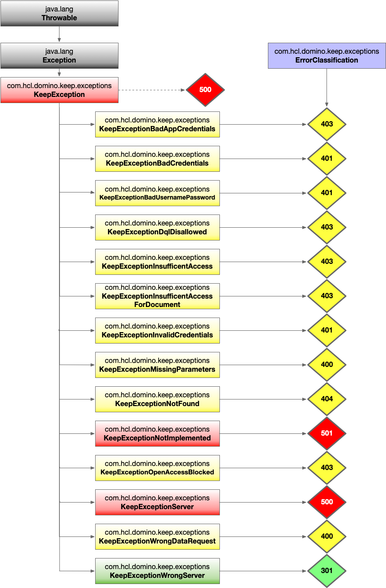

# Implement business logic

To implement the functionality, two Java classes are involved. One is a handler class that takes in the http request and forwards it on the Eventbus. The other is a dbrequest class that performs the database interaction.

For the most common use case of JSON in/out, the default handler performs all the necessary actions, no custom code is required.



## Handlers

The handler is part of the initial REST processing which includes:

- checking the validity of the JWT Token
- checking the conformance to the API specification (all mandatory fields present, reject extra fields when specified so in the API)
- gather all parameters and body for the EventBus
- prepare response type chunked for Array or blob returns

All that are taken care of.

## DBRequests

There are two OperationIDs to take care of: `getApprovals` and `submitDecision`. They both act on the database specified in the `dataSource` query parameter and accept / return JSON data. There is some overlap in utility methods needed, we shall entertain a utility class for that. Both extend the abstract class `AsyncDominoJNXJson`, which only needs the method `process` to be implemented.

## Primer on DbRequestParameters<?>

The class provides convenient access to everything needed to implement a custom functionality:

| Property / Method        | Type           | Purpose                                            |
| ------------------------ | -------------- | -------------------------------------------------- |
| `client`                 | DominoClient   | Access to the Domino API                           |
| `db` or `db()`           | DominoDatabase | the database specified in dataSource               |
| `incoming`               | JSON Object    | All parameters, headers, body                      |
| `factory`                | Keepfactory    | Access to helper objects & methods                 |
| `session` or `session()` | KeepJNXSession | EntryPoint for regular operations, user, other dbs |
| emit(JsonObject)         | void           | Sending data back, can be called more than once    |

There are a few more, check the JavaDoc for details.

In a nutshell, the `process` method needs to call `emit()` at least once or throw an error. When the return type is an array, it can call `emit()` multiple times.

### Errors to throw

While you can throw any [Exception](https://docs.oracle.com/en/java/javase/17/docs/api/java.base/java/lang/Exception.html) to terminate a failed operation, DRAPI has a set of Exception classes that determine how the exception maps to a http status code.

{: style="height:80%;width:80%"}

### GetApprovals

The `process` method can look like this:

```java

final static String APPROVAL_VIEW_NAME = "PendingApprovalByApprover";

  @Override
  public void process(DbRequestParameters<JsonObject> request) throws Exception {

    final String approver = request.session.getUserName();
    final DominoCollection view = request.db.openCollection(APPROVAL_VIEW_NAME)
        .orElseThrow(() -> new KeepExceptionWrongDataRequest("database is not approval enabled"));

    final CollectionSearchQuery searchQuery = view.query()
        .readColumnValues()
        .selectByKey(approver, true);

    List<CollectionEntry> result = searchQuery.collectEntries(0, Integer.MAX_VALUE);

    result.stream()
        .map(this::entryToJson)
        .filter(Optional::isPresent)
        .map(Optional::get)
        .forEach(request::emit);

  }
```

A helper method `entryToJson` converts the `CollectionEntry` into a JsonObject that gets emitted back to HTTP as part of the resulting array.

??? tip "Style: Optional over null"

    Nobody likes [null](https://www.infoq.com/presentations/Null-References-The-Billion-Dollar-Mistake-Tony-Hoare/)(PointerExceptions). So as a style decision, DRAPI doesn't return `null` (unless it's broken), but Java's [Optional](https://www.baeldung.com/java-optional), that makes intend in the code more visible.

    Instead of

    ```java
    SomeObject some = someFunction();
    if (some == null) {
        doTheNullCase();
    } else {
        doTheGoodCase(some);
    }
    ```

    You would write more distinct code:

    ```java
    // When you have a default fallback
    SomeObject some = someOptional().orElse(makeDefault());
    // When no value raises an error
    SomeObject some = someOptional().orElseThrow(new ShitHappenedException());
    // When you only are interested in an existing result
    someOptional().ifPresent(this::doTheGoodCase);
    // Java > 8 has more options, check them out
    ```

```java
  static final List<String> COLUMN_NAMES =
      Arrays.asList("requestor", "value", "status", "subject", "submission");

   Optional<JsonObject> entryToJson(final CollectionEntry source) {
    final JsonObject result = new JsonObject();
    final List<String> missing = new ArrayList<>();
    final String unid = source.getUNID();
    result.put("unid", unid);
    COLUMN_NAMES.forEach(colName -> {
      final Object colValue = source.get(colName);
      if (colValue != null) {
        result.put(colName, colValue);
      } else {
        missing.add(colName);
      }
    });
    // We don't send incomplete records
    if (missing.isEmpty()) {
      logger.trace("Record {} processed {}", unid, source.toString());
      return Optional.of(result);
    }
    logger.error("record {} has misssing columns: {}", unid, missing);
    return Optional.empty();
  }
```

### SubmitDecision

The code is similar. You check if the document exists and is in a state to be approved by the current user, record the decision in the ApprovalLog central database, and update the document.

```java
 @Override
  public void process(DbRequestParameters<JsonObject> request) throws Exception {

    request.validate();

    final String unid = request.incoming.getString("unid");
    final String status = request.incoming.getString("status");
    final Optional<String> delegee = Optional.ofNullable(request.incoming.getString("delegee"));

    final Document doc = this.isTheRequestGoodToGo(request.session, request.db, unid, status);
    final Date now = new Date();

    try (Database approvalLog = request.session.getDatabaseDomino("ApprovalLog.nsf")) {
      // Write to log
      Document logEntry = approvalLog.createDocument();
      logEntry.replaceItemValue("Form", "logentry");
      logEntry.replaceItemValue("unid",unid);
      logEntry.replaceItemValue("StatusOld",doc.getItemValue("status"));
      logEntry.replaceItemValue("StatusNew",status);
      logEntry.replaceItemValue("Approver",request.session.getUserName());
      delegee.ifPresent(d -> logEntry.replaceItemValue("Delegee", delegee));
      logEntry.replaceItemValue("TransactionDate",now);
      logEntry.save();

      // Now update document
      if (delegee.isPresent() && "delegated".equals(status)) {
        doc.replaceItemValue("Approver",delegee.get());
        doc.replaceItemValue("Status","pending");
      } else {
        doc.replaceItemValue("Approver",request.session.getUserName());
        doc.replaceItemValue("Status",status);
      }
      doc.save()
    } catch (Exception e) {
      logger.error(e.getMessage());
      throw e;
    }

    JsonObject happyResult = new JsonObject()
        .put("StatusCode", "200")
        .put("Status", String.format("Decision %s recorded for %s",status,unid));

    request.emit(happyResult);

  }

    Document isTheRequestGoodToGo(final KeepJnxSession session, final Database db, final String unid, final String status)
      throws KeepException {
    Document doc = session.validateDocumentAccessRequest(db, unid, DocumentAccess.WRITE, this.getRequestId());
    String docStatus = doc.get("Status", String.class, "Unknown");
    String approver = doc.get("Approver", String.class, "Unknown");
    if ("approved".equals(docStatus) || "rejected".equals(docStatus)) {
      throw new KeepExceptionWrongDataRequest("Request is already %s", docStatus);
    }
    if (!session.getUserName().equals(approver)) {
      throw new KeepExceptionWrongDataRequest("Request can only be approved by %s", approver);
    }
    return doc;
  }
```

## Testing

Compile the Jar and throw it into DRAPI's `libs` folder. Restart DRAPI and it should show up.
Test using curl or Bruno

## Next

Proceed to [access control](accesscontrol.md).

<!--## Let's connect

"feedback.md"-->
